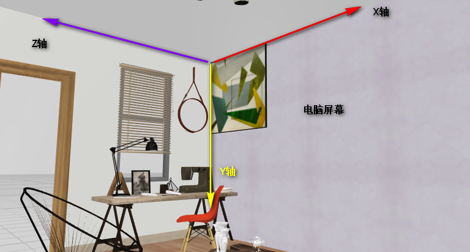

# 01-2D转化-介绍及2D坐标系

* X正方向：水平向右；
* Y正方向：垂直向下；


# 02-2D转化-位移-语法

* 语法：

```css
    /* 1.单个使用 */
    /* 固定的PX值：正值，向右移动； */
    /* transform: translateX(100px); */
    /* 百分数：相对于自身宽高 */
    /* transform: translateX(200%); */
    /* transform: translateY(100%); */

    /* 2.合起来写 */
    /* transform: translate(100px, 100px); */
    /* transform: translate(-100px, -100px); */
    /* transform: translate(-50%, -50%); */
    /* transform: translate(50px, 100%); */
```

* 与定位区别：
  * 定位会脱标，可能会影响到其他盒子的布局，translate不会影响（微调一个盒子的位置）
  * 定位会使行内元素变为块级元素，translate完全不对行内生效；


# 03-2D转化-位移-居中方案

* **语法：不用关心自身盒子宽高**

```css
/* 2.移动  不用关心盒子的本身的宽高  */
position: absolute;
/* 相对于父亲 宽高 */
top: 50%;
left: 50%;
/* 相对于自身 宽高 */
transform: translate(-50%, -50%);
```


# 04-2D转化-旋转-语法

# 05-2D转化-旋转-下拉三角案例

* 语法：正值，顺时针旋转；

```
transform: rotate(180deg);
```

* 补充：伪元素；
  - 为什么叫伪元素：页面HTML结构中没有元素，但是页面中却真实存在；
  - 常用：做小图标引用；字体图标引入，手动实现小图标；
  - 特点：
    - **content属性不能丢；**content:"";‘’；
    - 行内元素；
    - div::before:hover不能这样用；用法：div:hover::before
    - **伪元素只能用在双标签上使用；**


# 


# 06-2D转化-中心点(了解)-语法

* 语法：可以影响旋转的效果；

```css
      /* transform-origin: 200px 200px;
      transform-origin: 0 100%; */
      /* transform-origin: left bottom; */
      /* 第二个参数 默认变为50% */
      transform-origin: 0;
```


# 07-2D转化-缩放-语法

* 语法：

```css
/* 长度、宽度方向 缩放 */
transform:scale(2,3);

/* 长度、宽度方向 缩放为同一个比例*/
transform:scale(2);
transform:scale(0.5);
```

* 特点：
  * transform :后面所有的属性都不会影响其他盒子的位置
  * 缩放：使下面的文字，CSS属性，子元素都会被跟着缩放


# 08-2D转化-综合-语法

* 语法：不能上下写，因为会覆盖层叠

```css
      /* CSS 覆盖层叠 */
      /* transform: translateX(400px);
      transform: rotate(90deg); */


      /* 一般情况下，移动写在旋转的前面 */
      /* transform: translateX(400px) rotate(90deg); */

      /* 特别情况：旋转写在移动前面，旋转会改变盒子初始化轴向 了解 */
      transform: rotate(90deg) translateX(400px);
```


# 09-动画-定义

* 语法：

```css
@keyframes 动画名称 {
	from {
		/* css code*/
	}
	to {
	
	}
}

div {
    /* 2.调用 */
    animation-name: dong_hua;
    /* 3.执行时间 duration 持续时间*/
    animation-duration: 2s;
}
```


# 10-动画-序列

* 语法：时间节点，实现更为细致的控制

```css
    @keyframes dong_hua {
      0% {
        transform: translate(0, 0);
        border-radius: 50%;
      }
      50% {
        transform: translate(800px, 0);
        border-radius: 0;
      }
      100% {
        /* transform: translate(0, 600px); */
        
        /* transform 一定是基于上个状态的变化 */
        transform: translate(800px, 600px);
        border-radius: 50%;
      }
    }
```


# 11-动画-属性

* 语法：

```css
      /* 4.速度变化 */
      /* 默认值：ease 慢-快-慢 */
      /* linear :匀速 !!! */
      /* animation-timing-function: linear; */
      /* animation-timing-function: ease-in-out; */
      /* steps() 把上面的一大步，拆为8小步完成*/
      /* 应用场景：分为小步去完成 */
      /* animation-timing-function: steps(3); */

      /* 5.动画延迟 等待 */
      /* animation-delay: 4s; */


      /* 6.次数 默认执行一次*/
      /* animation-iteration-count: 2; */
      /* infinite: 无限*/
      /* animation-iteration-count: infinite; */


      /* 7.方向 */
      /* reverse :100-0 */
      /* 默认：0-100 */
      /* animation-direction: reverse; */
      /* 0-100-0 */
      /* animation-direction: alternate; */


      /* 8.动画结束或等待的状态设置 */
      /* forwards:前面 动画结束的时候要停留在100% 状态 */
      /* animation-fill-mode: forwards; */
      /* backwards：动画在等待的时候，让元素停留在0%节点，而不是初始化状态 */
      /* animation-fill-mode: backwards; */
      /* both: forwards+ backwards */
      /* animation-fill-mode: both; */
```

* 重点：

```css
/* 速度曲线：steps(n) linear 匀速*/ 
animation-timing-function:linear 


/* forwards:向前，动画结束的时候，停留在向前的那个状态（100%）*/
animation-fill-mode:forwards;
```


# 12-动画-简写

* 语法：

```css
animation: name duration timing-function delay iteration-count direction fill-mode; 
```

* 要求：把简写上每个位置上说明，能说出背后是啥意思即可；

* 面试：一定要把每个属性过一次；


# 13-动画-案例-大数据热点


# 14-动画-案例-奔跑大熊(上)-向前动

* 水平居中：

```css
 position: absolute;
 left: 50%;
 transform: translateX(-50%);
```


# 15-动画-案例-奔跑大熊(下)-自己动

* 遇到分帧图
  * 动画节点：2个；
  * 节点设置：设置背景图片的位置移动；需要让它整体图片全部移动出除出去；
  * 速度曲线：steps(n); 设置几张分帧的图；

* 组动画：逗号隔开

```css
animation: name_1 5s linear,name_2 2s linear;
```


# 16-前缀-了解


# 17-3D转化-介绍及3D坐标系




# 18-3D转化-位移-语法

* 语法：

```css
      /* X Y 宽高 */
      /* transform: translateX(100%); */

      /* Z */
      /* transform: translateZ(100px); */
      /* 设置百分数，没有厚度属性，没有效果 */
      /* transform: translateZ(100%); */

      /* 3D 简写 */
      /* transform: translate3d(100px, 100px, 100px); */
```


# 19-3D转化-视距-语法

* 语法：

```css
perspective: 300px;
```

* 作用：近大远小的效果；
* 加在body：以body的视角进行观测下面所有的子元素，形成统一的透视感；
* 值的大小：越小，变化越剧烈；


# 20-3D转化-旋转-语法

* 左手工具：把大拇指朝向自己眼睛，四个手指弯曲的方向，顺时针方向；
* 语法：

```css
      /* transform: rotateX(45deg); */
      /* transform: rotateY(45deg); */
      /* transform: rotateZ(45deg); */
      /* 了解 */
      /* transform: rotate3d(1, 1, 0, 45deg); */
```


# 21-3D转化-旋转-语法-案例-翻转盒子

# 22-3D转化-3D呈现-语法

* 语法：

```css
transform-style: preserve-3d; 
```

* 与视距的区别：
  * 视距：近大远小的透视感，body形成统一的透视感
  * 3D呈现：给子元素做3D转化，开启一个3D空间；亲HTML结构 上下级的父亲上；


# 23-3D转化-缩放(了解)-语法

* 语法：

```css
/* 宽 缩放 */
transform: scaleX(1);
/* 高 缩放 */
transform: scaleY(1);

/* 厚度 缩放？没有厚度 */
transform: scaleZ(1);

/* 宽，高 缩放一倍，厚度放大两倍 ,Z轴方向缩放没有效果*/
transform: scale3d(1,1,2)
```


# 24-3D转化-案例-立方体

# 25-总结

* 2D：
  * 移动：设置PX，百分数（自身的宽高）；**绝对的上下左右居中解决方案；**
  * 旋转：rotate(45deg)
  * 缩放：scale(2)，宽高方向都是使用同一个缩放比；
  * 简写：rotate(45deg) 写在移动前面，改变盒子初始化轴向；

* 动画：
  * 定义：@keyframes 动画名称 {}
  * 动画序列：时间节点，0%  100%；里面正常写CSS代码；
  * 属性重点：
    * timing-function：速度曲线，
      * linear，
      * steps() :遇到分帧图；
    * fill-mode：forwards 向前，动画结束的时候，停留在100%节点上；

```css
animation: name duration timing-function delay iteration-count direction fill-mode;

animation-play-state  没有写在简写里面，不常用；
```

* 3D：
  * 移动z轴方向：设置%没有效果，没有厚度；
  * 旋转：左手工具，把大拇指的朝向你自己眼睛，四个手指弯曲的方向就是顺时针方向；
  * 缩放Z轴方向：没有效果，没有厚度；
  * 视距：
    * 作用：近大远小的透视感；
    * 加给谁：
      * body：管理下面所有的子元素，形成统一的透视感。一般情况下加在body上；
      * 各自的父亲：管理父亲下面的所有的子元素，形成各自父亲单独的透视感觉；
    * 值的大小：越小，变化越为剧烈；
  * 3D呈现：
    * 作用：给亲生的子元素，开启3D空间，子元素做3D转化才能被观测到；
    * 加给谁：HTML结构上 上下级的父亲；


