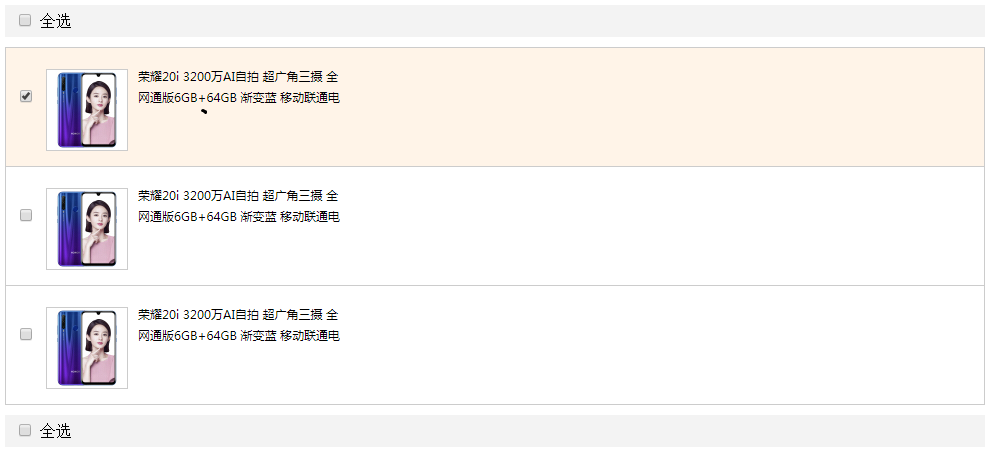
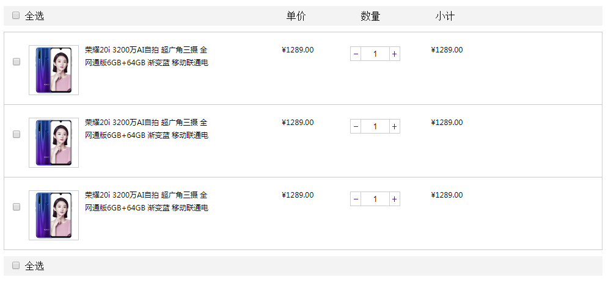
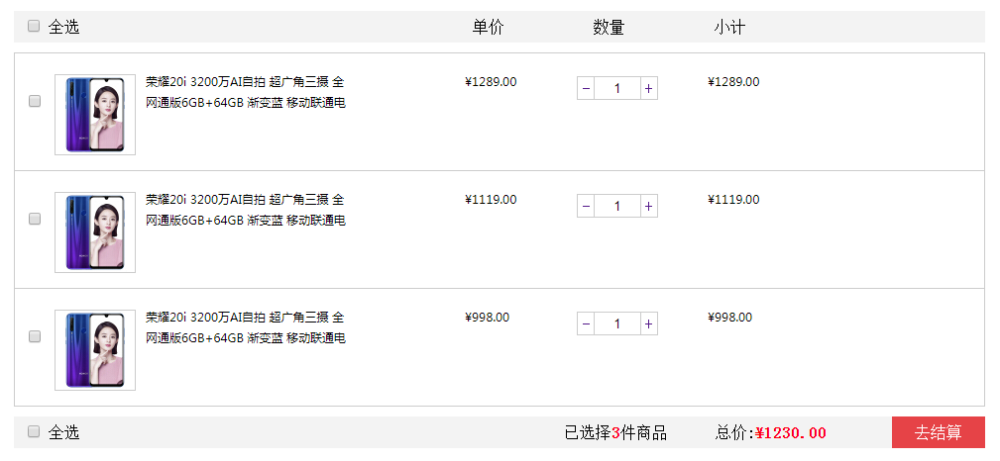
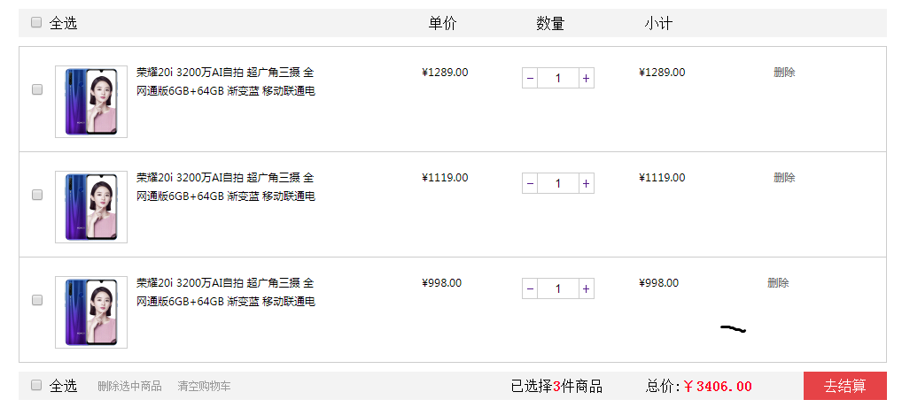

# jQuery02

### jQuery属性操作

> 1. ##### 获取元素的固有属性
>
> ```js
> 固有属性：元素本身自带的属性
> 
> 语法：
> 	jq对象.prop()
> 例如：
> 	$('a').prop('href')    --->  获取a标签的href属性值
> ```
>
> 2. ##### 设置或修改元素的属性
>
> ```js
> 语法：
> 	jq对象.prop('属性名', '属性值');
> 例如：
> 	$('a').prop('title','测试文字')   ---> 设置a标签的title属性中的值
> 
> 思考： 如何通过jq方式获取复选框或者单选框的状态？
> ```
>
> 3. ##### 获取元素的自定义属性
>
> ```js
> 语法：
> 	jq对象.attr('属性名');
> ```
>
> 4. ##### 设置或修改元素的自定义属性
>
> ```js
> 语法：
> 	jq对象.attr('属性名', '值');
> ```
>
> 5. ##### 数据缓存 data()【了解】
>
> ```js
> 通过该方法可以在元素身上获取值和保存值，不会修改html结构，但是如果刷新页面，之前的数据会被移除
> 
> 语法：
> 	 jq对象.data('属性名')   		---> 获取
> 
> 	 jq对象.data('属性名','值')      ---> 设置
> 
> 注意：
> 	 如果通过data()方法获取元素的自定义属性值的时候，自定义属性名前面的 'data-'省略不写
>      
>      
>  例如：
>  	$(document).ready(function(){
>       $("#btn1").click(function(){
>         $("div").data("greeting", "Hello World");
>       });
>       $("#btn2").click(function(){
>         alert($("div").data("greeting"));
>       });
>     });
> ```
>
> 6. ##### 课堂案例（全选效果）
>
> 

### jQuery操作内容文本

> 1. ##### 获取和设置标签中的内容
>
>    ```js
>    语法：
>    	jQ对象.html()      ---> 获取标签中的所有内容，包括html标签
>    	jQ对象.html('值')  ---> 设置标签中的内容，包括html标签
>    
>    总结：
>    	html() 相当于原生js中的  innerHtml
>    ```
>
> 2. ##### 获取和设置标签中的文本内容
>
>    ```js
>    语法：
>    	jQ对象.text()  		 ---> 获取标签中的文本内容，不包括html标签
>    
>    	jQ对象.text('值')	    ---> 设置标签中的文本内容，不包括html标签
>    
>    
>    总结：
>    	 text() 相当于原生js中的  innerText
>    ```
>
> 3. ##### 获取和设置表单控件中的值
>
>    ```js
>    语法：
>    	 jQ对象.val()			  ---> 获取表单控件中的值
>    	 
>    	 jQ对象.val('值')		 ---> 设置表单控件中的值
>    
>    总结：
>    	 val()  相当于原生js中的   value
>    ```
>
> 4. ##### 购物车案例（数量增加）
>
>    
>
>    ```js
>    备注信息：
>    	1. 通过 jQ对象.parents(‘选择器’) 可以返回指定祖先元素  
>        2. 通过  toFixed(number) 可以返回指定位数的小数，如果要保留2位小数就写2
>        3. 表单控件中的值发生修改，触发 change事件
>    ```

### jQuery操作元素

> 1. ##### 遍历元素
>
>    ```js
>    注意： jq中默认的隐式迭代只能给元素设置相同的样式，如果需要设置不同样式需要通过遍历的方式实现
>    
>    语法1：
>    	jQ对象.each(function(index, domElement){ });
>    
>    备注：
>    	1. 第一个参数代表每一个元素的索引值
>     2. 第二个参数代表的是一个dom对象，不是jq对象
>     3. 如果要使用jq中的方法，必须要将对象转化为jq对象
>    ```
>
>    ```js
>    语法2：
>    	$.each(object, function(index, element){})
>    
>    备注：
>    	1. object表示要遍历哪个对象，一般在程序是一个数据【数组，对象】
>     2. index，表示数据的索引值
>     3. element 表示数据中的值
>    
>    例如：
>    
>    	 //遍历程序中的数据
>    	 var ary = ['a','b', 'c'];
>    	 $.each(ary, function(i,element) {
>             console.log(i, element);
>         })
>         //可以遍历程序中的jq对象
>         $.each($('li'), function(i, element){
>             console.log(i, element);
>         })
>    	 ....
>    ```
>    
>```js
>    $.each  和  jQ对象.each 的区别使用：
>       	1. 如果要遍历页面中的元素使用 jQ对象.each
>    	2. 如果要遍历程序中的数据使用 $.each
> ```
>    
>2. ##### 课堂案例计算总和
> 
>
>    
>3. ##### 创建元素
> 
>```js
>     语法：
>     	$('<li></li>');
>    ```
>    
>4. ##### 添加元素
> 
>```js
>      ☞ 添加子元素
>      	 
>         $('父元素').append(创建的元素)	  ---> 将创建的元素添加到父元素的末尾
>    	 $('父元素').prepend(创建的元素)  ---> 将创建的元素添加到父元素的开始
>      
>      ☞ 添加兄弟元素
>      
>      	 $('元素').after(创建的元素)	---将创建的元素添加到目标元素的后面
>         $('元素').before(创建的元素)  ---将创建的元素添加到目标元素的前面
>    ```
>    
>5. ##### 删除元素
> 
>```js
>      	$('元素').remove()     ---- 将元素自己删除掉
>        $('元素').empty()      ---- 将该元素中的所有子元素移除掉
>        $('元素').html('')     ---- 将该元素中的所有子元素移除掉
>    ```
>    
>6. ##### 课堂案例
> 
>

### jQuery大小和位置操作

> 1. ##### 获取元素大小
>
>    | 语法                                  | 用法                                             |
>    | :------------------------------------ | :----------------------------------------------- |
>    | width() \| height()                   | 获取元素的宽度和高度                             |
>    | innerWidth() \| innerHeight()         | 获取元素的宽度和高度，包含padding值              |
>    | outerWidth()\| outerHeight()          | 获取元素的宽度和高度，包含padding值和border值    |
>    | outerWidth(true) \| outerHeight(true) | 获取元素的宽度和高度，包含padding，border,margin |
>
>    ```js
>    如果以上方法没有设置值，代表获取
>    如果以上方法设置值，代表修改值
>    注意:
>    	在设置值的时候不需要带单位
>        
>    例如：
>    	 $('div').width(300)  
>    ```
>
> 2. ##### 获取元素位置
>
>    - offset()
>
>      ```js
>      语法：
>      	$('元素').offset()
>      
>      	$('元素').offset({left: 值, top: 值})  给当前元素设置位置
>      
>      总结：
>      	1. offset()是用来获取当前元素距离文档的距离，与父元素无关。
>         2. offset()返回的是一个对象
>      ```
>
>    - position()
>
>      ```js
>      语法：
>      	$('元素').position()
>      
>      总结：
>      1. position() 返回被选元素相对于带有定位的父级偏移坐标，如果父级都没有定位，则以文档为准
>      2. position() 只能获取值，不能设置值
>      ```
>
>    - scrollTop() | scrollLeft()
>
>      ```js
>      语法：
>      	$('元素').scrollTop()    设置|返回元素内容区域滚动出去的垂直距离
>        $('元素').scrollLeft()   设置|返回元素内容区域滚动出去的水平距离
>      
>      总结：
>      1. 元素滚动事件scroll
>      ```
>
>    - ##### 返回顶部案例
>
>      ```js
>      备注：
>      	如果要设置动画效果，文档不可以设置动画效果，只要页面中的元素才可以设置动画效果
>      	animate动画中有一个属性 scrollTop
>      ```
>
>    - ##### 电梯导航案例

