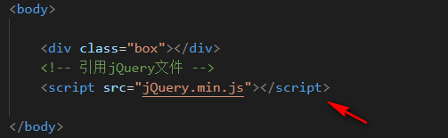
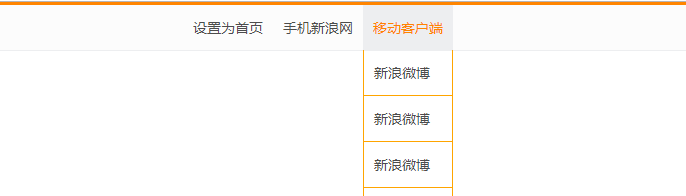
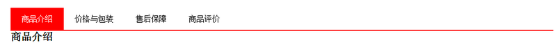
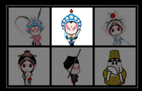

# jQuery

## 今日目标

> - #### 能够说出什么是jQuery
>
> - #### 能够说出jQuery的优点
>
> - #### 能够简单的使用jQuery
>
> - #### 能够说出DOM对象和jQuery对象的区别

## 认识jQuery

> - #### javaScript库
>
>   ```
>   ☞仓库：可以把很多东西放到这个仓库里面。找东西只需要到仓库里面查找到就可以了。
>   
>   ☞JavaScript库：即 library，是一个封装好的特定的集合（方法和函数）。从封装一大堆函数的角度理解库，就是在这个库中，封装了很多预先定义好的函数在里面，比如动画animate、hide、show，比如获取元素等。
>   
>   ☞简单理解： 就是一个JS 文件，里面对我们原生js代码进行了封装，存放到里面。这样我们可以快速高效的使用这些封装好的功能了。
>   
>   比如 jQuery，就是为了快速方便的操作DOM，里面基本都是函数（方法）。
>   ```
>
> - #### jQuery概念
>
>   ```
>   ☞jQuery 是一个快速、简洁的 JavaScript 库，其设计的宗旨是“write Less，Do More”，即倡导写更少的代码，做更多的事情。
>   
>   ☞j 就是 JavaScript；   Query 查询； 意思就是查询js，把js中的DOM操作做了封装，我们可以快速的查询使用里面的功能。
>   
>   ☞jQuery 封装了 JavaScript 常用的功能代码，优化了 DOM 操作、事件处理、动画设计和 Ajax 交互。
>   学习jQuery本质： 就是学习调用这些函数（方法）。
>   
>   jQuery 出现的目的是加快前端人员的开发速度，我们可以非常方便的调用和使用它，从而提高开发效率
>   ```
>
> - #### jQuery优点
>
>   - 轻量级。核心文件才几十kb，不会影响页面加载速度
>   - 跨浏览器兼容。基本兼容了现在主流的浏览器
>   - 链式编程、隐式迭代
>   - 对事件、样式、动画支持，大大简化了DOM操作
>   - 支持插件扩展开发。有着丰富的第三方的插件，例如：树形菜单、日期控件、轮播图等
>   - 免费、开源

## jQuery基本使用

> - #### jQuery官网下载地址（https://jquery.com/）
>
>   - ##### jQuery版本介绍及下载地址（<https://code.jquery.com/>）
>
>  ```js
>     1. jQuery目标最新的版本是 v3.4.1【该版本不兼容IE6，7，8但是官网主要维护更新的版本】
>     2. jQuery v2版本 【不兼容IE6,7,8，不再维护】
>     3. jQuery v1版本 【兼容IE6,7,8,不再维护】
>  ```
>
> - #### 下载 v3.4.1版本
>
> ```
>   1. Download the compressed, production jQuery 3.4.1【用于生产环境且压缩过后的】
>   2. Download the uncompressed, development jQuery 3.4.1【用于开发环境未压缩】
> ```
>
> - #### jQuery使用步骤
>
>   - ##### 在网页中通过script标签引用下载好的jQuery文件
>
>  
>
>   - ##### 基本使用
>
>  ```javascript
> 1. 在THML结构后使用
>         $(选择器).方法()
>         例如：
>         $('div').hide()
>  
> 2. 在HTML结构之前使用
>    
>        $(function(){
>           //入口函数：当页面中的DOM元素都加载完成后就执行该处代码
>           //jQuery代码
>        })
>    
>        或者
>        $(document).ready(function(){
>           //入口函数：当页面中的DOM元素都加载完成后就执行该处代码
>           //jQuery代码
>        })
>  
> 3. jQuery中的入口函数与js中的load事件是有差异的：
>     ☞ js中的load事件是整个页面都加载完成后包括外部的资源文件都加载完毕后才执行
>     ☞ jQuery中的入口函数是整个文档加载完成后就立即执行代码
>    ```

## jQuery($)介绍

> - #### $是jQuery的一个别名
>
>   ```js
>   例如：
>   	$('div').hide()  ===》 jQuery('div').hied()
>   ```
>
> - #### $是jQuery中的顶级对象
>
>   ```js
>   通过 $('div') 将dom对象包装成一个jQuery对象。
>   ```

## jQuery对象和DOM对象之间的转化

> - ##### DOM对象
>
>   ```js
> 1. 通过原生js获取到的对象就是DOM对象
>   
>   例如： var  mydiv = document.querySelector('div');   maydiv 就是一个dom对象
>   ```
>
> - ##### jQuery对象
>
>   ```js
> 1. 通过jQuery方式获取的对象就是jQuery对象
>   
>   例如：  var mydiv = $('div');   mydiv就是一个jQuery对象
>   ```
>
> - ##### 将DOM对象转为jQuery对象
>
>   ```js
>    语法：
>    	$(DOM对象)
>   
>    例如：
>    	 var  mydiv = document.querySelector('div'); ===> DOM对象
>   	 var  div = $(mydiv);  ===> div 就是jQuery对象
>   ```
>
> - ##### 将jQuery对象转为DOM对象
>
>   ```js
>    将jQuery对象转化为Dom对象的原因：
> 1. jQuery并没有将js中所有的方法和属性封装，所以js原生中的一些方法和属性jQuery是不支持的
>       
>    jQuery获取到的对象是以伪数组形式存储的【也就是jQuery中是以数组形式存储的每一个DOM对象】
>    
>    jQuery对象转DOM对象的方式：
>    
>    	$('div')[索引]
>   	$('div').get(索引)
>   ```

## jQueryAPI

> - #### 选择器（选中页面中的标签）
>
>   - ##### 基础选择器
>
>  ```jQuery
>   语法：   $('css选择器') 
>  ```
>
> |     名称     |           用法            |         描述         |
> | :----------: | :-----------------------: | :------------------: |
> |   ID选择器   |         $('#id')          |   获取指定ID的元素   |
> | 通配符选择器 |          $('*')           | 获取页面中所有的元素 |
> |   类选择器   |        $('.class')        |   获取同一类名元素   |
> |  标签选择器  |        $('标签名')        |     获取对应标签     |
> |  并集选择器  | $('选择器,选择器,选择器') |     获取多个元素     |
> |  交集选择器  |      $('标签.class')      |     获取指定元素     |
>
>   - ##### 层级选择器
>
> |    名称    |         用法         |            描述            |
> | :--------: | :------------------: | :------------------------: |
> | 子代选择器 |  $('选择器>选择器')  |  获取父元素中的直接子元素  |
> | 后代选择器 | $('选择器   选择器') | 获取父元素中的所有后代元素 |
>
>   - ##### 筛选选择器（结构选择器）
>
> |    名称    |     用法      |            描述            |
> | :--------: | :-----------: | :------------------------: |
> |   :first   | $('li:first') |       获取第一个元素       |
> |   :last    | $('li:last')  |      获取最后一个元素      |
> | :eq(index) |  $(li:eq(1))  | 获取第n个元素，索引从0开始 |
> |    :odd    |  $('li:odd')  |    获取索引是奇数的元素    |
> |   ：even   | $('li:even')  |    获取索引是偶数的元素    |
>
>   - ##### 筛选方法
>
> |            语法             |           用法           |                   说明                   |
> | :-------------------------: | :----------------------: | :--------------------------------------: |
> | parent()\|parents([选择器]) |     $('li').parent()     |        获取当前元素的直接父级元素        |
> |     children(selector)      |  $('ul').children('li')  |  效果和子代选择器一样，获取直接子元素li  |
> |       find(selector)        |    $('ul').find('li')    |    效果和后代选择器一样，获取后代元素    |
> |     siblings(selector)      | $('.one').siblings('li') | 获取当前元素指定兄弟元素，不包括当前元素 |
> |          nextAll()          |   $('.one').nextAll()    |      获取当前元素之后的所有同级元素      |
> |         prevtAll()          |   $('.one').prevtAll()   |      获取当前元素之前的所有同级元素      |
> |       hasClass(class)       | $('div').hasClass('nav') | 判断当前元素是否有某个类名，存在返回true |
> |          eq(index)          |      $('li').eq(2)       |       相当于:eq选择器，索引从0开始       |
>
> - #### 操作样式
>
>   - ##### $(选择器).css('属性',’值‘);
>
>  ```
>  jQuery对象.css('属性','值');
>  ```
>
> ```js
> 隐式迭代：
> 遍历内部 DOM 元素（伪数组形式存储）的过程就叫做隐式迭代。
> ```
>
>   - ##### 课堂案例（下拉菜单）
>
> 
>
> - ##### JQ中的排他思想
>
> ```javascript
> $(this).siblings().css({属性: 值})
> ```
>
>   - ##### 课堂案例（淘宝案例）
>
> 
>
> ```js
> ☞链式编程：jQuery内部利用了js的对象来实现。
> ☞实现链式编程的核心，是对象中的每一个方法都会返回当前对象。
> 
> 备注： 获取当前元素的索引位置   Jquery对象.index()
> ```
>
>   - ##### 获取CSS样式
>
> ```js
> $('div').css('属性名')    获取对应属性的值
> ```
>
>   - ##### 设置多个属性样式
>
> ```js
> $('div').css({'属性'：'值','属性'：’值‘})  同时设置多个样式
> $('div').css('属性','值')  设置单个样式
> 
> 注意：
>  	 1. 设置样式过程中，属性名必须设置引号（以对象形式设置样式除外）
>      2. 值如果是数字，可以不用设置引号
> ```
>
> - ##### 操作类样式
>
> ```js
>   1. 添加类
> $('div').addClass('类名‘);
>            
>   2. 删除类
> $('div').removeClass('类名');
> 
>   3. 切换类
> $('div').toggleClass('类名');
> 
> 注意：
>   	1. 原来DOM中 className 可以覆盖原来的类
>     2. Jq中addClass不会覆盖原来的类
> ```
>
>   - ##### tab栏切换案例
>
> 
>
> - #### jQuery动画
>
>   - ##### 显示隐藏
>
> ```js
> 语法：
> ☞show([speed, [easing], [fn]])   --->参数可以省略
>         	1. speed : 设置动画速度（slow,normal,fast,自定义时间）
>         	2. easing: 设置切换效果（默认是swing）,linear
>         	3. fn ： 回调函数，在动画执行完以后执行的函数
>    
> ☞hide([speed, [easing], [fn]])   --->参数可以省略
>         	1. speed : 设置动画速度（slow,normal,fast,自定义时间）
>         	2. easing: 设置切换效果（默认是swing）,linear
>         	3. fn ： 回调函数，在动画执行时候执行的函数
>       
> ☞toggle([speed, [easing], [fn]])   --->参数可以省略
>         	1. speed : 设置动画速度（slow,normal,fast,自定义时间）
>         	2. easing: 设置切换效果（默认是swing）,linear
>         	3. fn ： 回调函数，在动画执行时候执行的函数
> ```
>
>   - ##### 滑动
>
> ```json
> ☞ slideDown([speed, easing, fn])
>     	1. speed : 设置动画速度（slow,normal,fast,自定义时间）
>         2. easing: 设置切换效果（默认是swing）,linear
>         3. fn ： 回调函数，在动画执行时候执行的函数
>   
> ☞ slideUp([speed, easing, fn])
>     	1. speed : 设置动画速度（slow,normal,fast,自定义时间）
>         2. easing: 设置切换效果（默认是swing）,linear
>         3. fn ： 回调函数，在动画执行时候执行的函数
>   
> ☞ slideToggle([speed, easing, fn])
>     	1. speed : 设置动画速度（slow,normal,fast,自定义时间）
>         2. easing: 设置切换效果（默认是swing）,linear
>         3. fn ： 回调函数，在动画执行时候执行的函数
> ```
>
> ```js
> - 小米案例（slideDown，slideUp，slideToggle）
> ```
>
> ```js
> ☞ 事件切换：hover(fn(), fu())
>       	1. 第一个回调函数代表鼠标进入时候触发的事件（相当于mouseenter）
>       	2. 第二个回调函数代表鼠标离开时候触发的事件（相当于mouseleave）
> 	注意：
> 		✔ 如果只写一个fn，那么代表同时触发鼠标进入和离开
> 		
> ☞ 动画排队效果（多次进入离开）
> 
> ☞ 停止排队（stop()）: 必须写到动画前面
> ```
>
>   - ##### 淡入淡出
>
> ```js
> ☞ fadeIn([speed, easing, fn])
>     	1. speed : 设置动画速度（slow,normal,fast,自定义时间）
>         2. easing: 设置切换效果（默认是swing）,linear
>         3. fn ： 回调函数，在动画执行时候执行的函数
>   
> ☞ fadeOut([speed, easing, fn])
>     	1. speed : 设置动画速度（slow,normal,fast,自定义时间）
>         2. easing: 设置切换效果（默认是swing）,linear
>         3. fn ： 回调函数，在动画执行时候执行的函数
>   
> ☞ fadeToggle([speed, easing, fn])
>     	1. speed : 设置动画速度（slow,normal,fast,自定义时间）
>         2. easing: 设置切换效果（默认是swing）,linear
>         3. fn ： 回调函数，在动画执行时候执行的函数
>   
> ☞ fadeTo([speed, opacity, easing, fn])
>     	1. speed : 设置动画速度（slow,normal,fast,自定义时间） 【必须写】
>     	2. opacity: 设置透明度0-1之间  【必须写】
>         3. easing: 设置切换效果（默认是swing）,linear
>         4. fn ： 回调函数，在动画执行时候执行的函数
> ```
>
>     - ##### 高亮显示案例
>
> 
>
>   - ##### 自定义动画
>
> ```js
> ☞animate(params,[speed],[easing],[fn])
>       1. params：要设置动画的CSS属性	【要以对象的形式设置CSS样式】
>       2. speed： 动画速度("slow","normal", or "fast")或表示动画时长的毫秒数值(如：1000) 
>       3. easing: 动画切换效果"linear" 和 "swing".
>       4. fn: 动画完成后执行的一个回调函数
> ```
>
>     - ###### 手风琴案例
>

