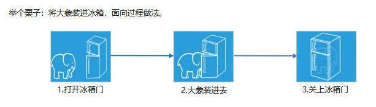

JS高级

# JavaScript面向对象

## 1.1两大编程思想：

### 	1、面向过程

​	**面向过程：POP(Process-oriented programming)**

> 面向过程就是分析出解决问题所需要的步骤，然后用函数把这些步骤一步一步实现，使用的时候再一个一个的依次调用就可以了。

​	**大象放到冰箱：打开冰箱==》放入大象==》关上冰箱**



### 	2、面向对象

​	**面向对象：OOP (Object Oriented Programming)**

> ​	面向对象是把事务分解成为一个个对象，然后由对象之间分工与合作。

​		大象，冰箱：都看成对象功能

**面向对象和过程区别**

​		面向过程：小项目

​		面向对象：多人合作大项目

​		**比如：**

​			一个人盖小狗窝，直接和泥，方砖，修饰既可

​			但是盖高楼的话，需要打地基，需要运输材料，需要财务结算等，此时不需要等，个做个的，效率高【模块完成】

## 1.2面向对象三大特性

- 封装性【已经把扫把功能准备好，负责开即可】
- 继承性【继承与拖拉机，会开拖拉机就会弄这个，继承自拖拉机】
- 多态性【可以放到一起，也可以单独拿下来，而且那个扫把坏了换哪个不影响其他的】push()

/

## 面向对象和过程优缺点

​	**面向过程：**

​		优点：性能比面向对象高，步骤练习紧密

​		缺点：不好维护，不易多次使用及扩展		

​	**面向对象：**

​		优点：易维护，可复用，可扩展，灵活性高	

​		缺点性能没有面向过程高

​		缺点性能没有面向过程高

> 面向过程就是一份蛋炒饭，味道均匀，但是假如有的人不喜欢吃鸡蛋，没办法分开
>
> 面向对象就是一个盖浇饭，但是味道不均匀，而不想吃某种味道，可以分开
>
> 简单程序面向过程，复杂程序用面向对象

# ES6中的类和对象

ES5：没有类，ES6：类

ES：ECMAscript

类是在ES6中新加进入的，学会区分类和对象的概念

类：泛指一类

对象：类中的具体的某个实例，【属性和方法的集合体】

**类：抽象**

​	类模拟抽象的，泛指的，对象是具体的

​	面向对象模拟现实世界，更贴近实际生活，生活照分为抽象事物和具体事物

​	比如：手机【两层含义：具体某个手机，和笼统的概念手机】

​	1、抽取，把对象的属性和行为封装成一个类

​	2、对类进行实例化, 获取类的对象

例如：人有身高，体重等，但是具体的某个人也有这个属性

**练习了解类和对象**

​	人==>姚明

​	电影明星==》周星驰

**对象：具体**

​	对象：类中的具体的某个实例【属性和方法的集合体】

​	现实生活中：万物皆对象，对象是一个具体的事物，看得见摸得着的实物。例如，一本书、一辆汽车、一个人可以是“对象”

​	在JavaScript 中，对象是一组无序的相关属性和方法的集合，所有的事物都是对象，例如字符串、数值、数组、函数等。

**对象是由属性和方法组成的：**

​	属性：对象有什么【访问】【语法：对象.属性】

​	方法：对象做什么【执行】【语法：对象.方法()】


​	属性：事物的特征，在对象中用属性来表示（常用名词）

​	方法：事物的行为，在对象中用方法来表示（常用动词）


**面向对象的思维特点:**

​	 1.抽取（抽象）对象共用的属性和方法组织(封装)成一个类(模板)

​	 2.对类进行实例化, 获取类的对象


## 类class

> 在ES6中新增加了类的概念，可以使用class关键字声明一个类，之后以这个类来实例化对象。【构造函数实例化对象】

- 类抽象了对象的公共部分，它泛指某一大类（class）

## 创建类

```javascript
语法：class 类名 {属性和方法}【构造函数语法糖】

注意类名首字母大写

类要抽取公共属性方法，定义一个类

```


```javaScript
class Star {
};

var ldh = new Star();

类就是构造函数的语法糖
```
## 类constructor构造函数

语法：

```javascript
class Star {
	constructor (uname,age){
		this.uname = uname;
		this.age = age;
	}
}

属性：放到constructor，构造函数里面
```

```
注意：类里面的方法不带function，直接写既可

类里面要有属性方法，属性方法要是想放到类里面，我们用constructor构造器

构造函数作用：接收参数，返回实例对象，new的时候主动执行，主要放一些公共的属性
```


> constructor() 方法是类的构造函数(默认方法)，用于传递参数,返回实例对象，通过new命令生成对象实例时，自动调用该方法。
>
> 注意：每个类里面一定有构造函数，如果没有显示定义, 类内部会自动给我们创建一个constructor() ，
>
> 注意：this代表当前实力化对象，谁new就代表谁

------


## 类添加方法

语法：注意方法和方法之间不能加逗号

```javascript

class Star {

	constructor () {}

	sing () {}

	tiao () {}

}
```


```javascript
class 类名 { constructor(){}   方法名(){} }

注意：类中定义属性，调用方法都得用this
```

> 注意：方法之间不能加逗号分隔，同时方法不需要添加function 关键字

**总结：类有对象的公共属性和方法，用class创建，class里面包含constructor和方法，我们把公共属性放到constructor里面，把公共方法直接往后写既可，但是注意不要加逗号**

# 类的继承

## **extends**

```javascript
语法：

​	class Father {}

​	class Son extends Father{}

注意：是子类继承父类
```

## **super关键字**

我们应用的过程中会遇到父类子类都有的属性，此时，没必要再写一次，可以直接调用父类的方法就可以了

<u>super关键字用于访问和调用对象父类上的函数。可以调用父类的构造函数，也可以调用父类的普通函数</u>

```javascript
当子类没有constructor的时候可以随意用父类的，但是如果子类也含有的话，constructor会返回实例，this的指向不同，不可以再直接使用父类的东西
```

**调用父类构造函数**

```
class F { constructor(name, age){} }

class S extends F { constructor (name, age) { super(name,age); } }

注意: 子类在构造函数中使用super, 必须放到this 前面(必须先调用父类的构造方法,在使用子类构造方法
```

**调用父类普通函数**

```
class F { constructor(name, age){} say () {} }

class S extends F { constructor (name, age) { super(name,age); } say () { super.say() } }

注意：如果子类也有相同的方法，优先指向子类，就近原则

```

**总结：super调用父类的属性和方法，那么查找属性和方法的原则就近原则**

如果子类不写东西，那么直接继承父类就可以用 

但是如果子类有自己的构造函数和父类同名的方法，此时不可以直接用父类的东西，需要用super调用父类的方法和构造函数


## 三个注意点

- 在ES6中类没有变量提升，所以必须先定义类，才能通过类实例化对象.
- 类里面的共有属性和方法一定要加this使用.【this，对象调用属性和方法】按钮练习
- 类里面的this指向问题. 
- constructor 里面的this指向实例对象, 方法里面的this 指向这个方法的调用者

```
class Button {
17.
	constructor () {
		var btn = document.querySelector('input');
		btn.onclick = this.cli;
	}

	cli () {
		console.log('点击了');
	}

}

var anniu = new Button();
```

## 类里面的this指向

- 构造函数的this指向实例对象

- 普通函数的this是调用者，谁调用this是谁

  

```javascript
	<input type="button" value="点击">
	var that;
		class F {
			constructor (name, age) {
				this.name = name;
				this.age = age;
				// console.log(this);
				that = this;
				this.btn = document.querySelector('input');
				this.btn.onclick = this.cli;
			}

			cli () {
				console.log(this);
			}

			say () {
				console.log(this);
			}
		}

		var obj = new F('刘德华',22);
```

# tab栏案例

this执行==》构造函数，new的对象，方法：this,调用者

**面向对象版tab 栏切换**

```javascript
1.tab栏切换的主要思路是：

2.点击当前li 添加liactive 类其余li移除类

3.根据当前li 的索引号当前section 添加类，其余section 删除类

4.这里可以把添加放入切换函数里面

5.新增一个清除类函数，专门移除其余li和section 类

6.注意里面this 指向问题
```

**面向对象版tab 栏切换添加功能**

```
1.点击+ 可以实现添加新的选项卡和内容

2.第一步: 创建新的选项卡li 和新的内容section

3.第二步: 把创建的两个元素追加到对应的父元素中.

4.以前的做法:  动态创建元素createElement, 但是元素里面内容较多, 需要innerHTML赋值,在appendChild追加到父元素里面.

5.现在高级做法:   利用insertAdjacentHTML() 可以直接把字符串格式元素添加到父元素中

6.appendChild不支持追加字符串的子元素, insertAdjacentHTML支持追加字符串的元素7.insertAdjacentHTML(追加的位置,‘要追加的字符串元素’)  

8.追加的位置有: beforeend插入元素内部的最后一个子节点之后

9.该方法地址:  https://developer.mozilla.org/zh-CN/docs/Web/API/Element/insertAdjacentHTML
```


类和对象：

​	类：泛指

​	对象：类里面的具体的实例

​	创建类：class 类名 {} 

​			    new 类名

​	构造函数：属性，方法

​	继承：extends，super

​	this：在构造函数中，指向实例对象，在方法里面就是指向调用者

​	


this：当前对象

btn.onclick = function () {this}：this事件源

function fn () {this}：this：window

构造函数：实例对象

类里面方法：调用者


.