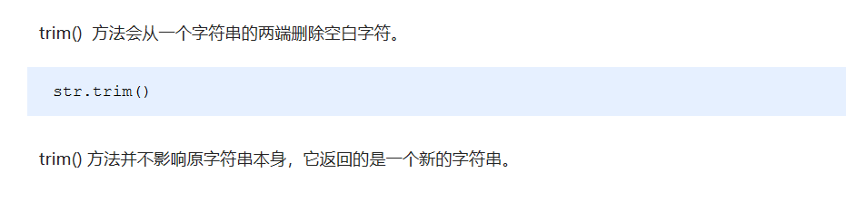
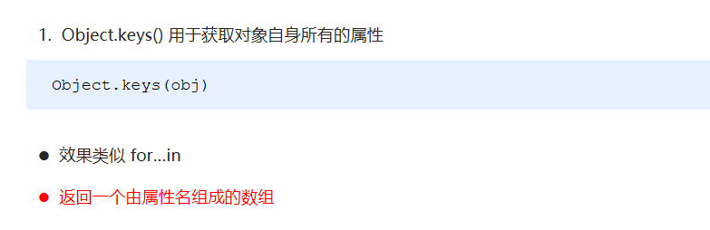
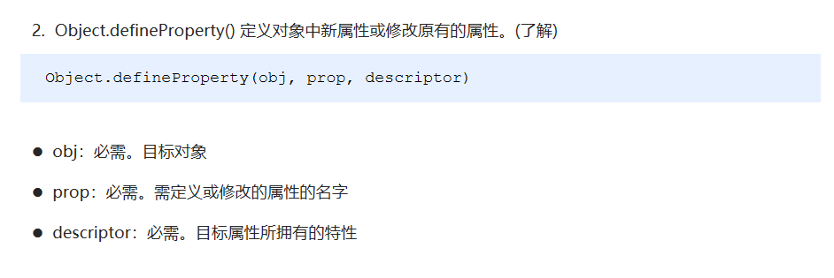
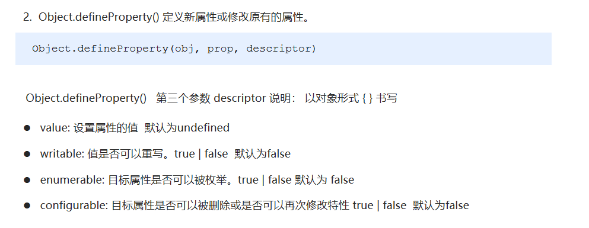

# 概述

## 构造函数和原型

```js
在典型的OOP 的语言中（如Java），都存在类的概念，类就是对象的模板，对象就是类的实例，但在ES6之前，JS 中并没用引入类的概念。

ES6，全称ECMAScript6.0 ，2015.06 发版。但是目前浏览器的JavaScript 是ES5 版本，大多数高版本的浏览器也支持ES6，不过只实现了ES6 的部分特性和功能。

在ES6之前，对象不是基于类创建的，而是用一种称为构建函数的特殊函数来定义对象和它们的特征。

```

## 创建对象可以通过以下三种方式：

- 对象字面量
- new Object()【构造函数】
- 自定义构造函数

# 构造函数和原型

```javascript
构造函数是一种特殊的函数，主要用来初始化对象，即为对象成员变量赋初始值，它总与new一起使用。我们可以把对象中一些公共的属性和方法抽取出来，然后封装到这个函数里面。
function Fn () {}
```

**在JS 中，使用构造函数时要注意以下两点：**

1.构造函数用于创建某一类对象，其首字母要大写

2.构造函数要和new 一起使用才有意义

```
练习判断构造函数还是普通函数
```

**new在执行时会做四件事情**

1. 在内存中创建一个新的空对象。
2. 让this指向这个新的对象。
3. 执行构造函数里面的代码，给这个新对象添加属性和方法。
4. 返回这个新对象（所以构造函数里面不需要return）。

## 静态成员和实例成员

```
JavaScript 的构造函数中可以添加一些成员，可以在构造函数本身上添加，也可以在构造函数内部的this 上添加。通过这两种方式添加的成员，就分别称为静态成员和实例成员。
```

- 静态成员：在构造函数本身上添加的成员称为静态成员，只能由构造函数本身来访问
- 实例成员：在构造函数内部创建的对象成员称为实例成员，只能由实例化的对象来访问

```javascript
function Person (uname, age) {
			this.uname = uname;
			this.age = age;

		this.say = function () {
			console.log(123);
		}

}

	var obj = new Person('张三丰',22);	
	console.log(obj.uname);

	// console.log( Person.uname );
	Person.leibie = '人';

	console.log(Person.leibie);
	console.log(obj.leibie);
```

**构造函数小问题：**

```
当实例化对象的时候，属性好理解，属性名属性值，那么方法是函数，函数是复杂数据类型

那么保存的时候是保存地址，又指向函数，而每创建一个对象，都会有一个函数，每个函数都得开辟一个内

存空间，此时浪费内存了，那么如何节省内存呢，我们需要用到原型

方法放到构造函数里面，如果多次实例化，会浪费内存
```

```js
function Star (uname, age) {
	this.uname = uname;
	this.age = age;
	this.sing = function () {
		console.log(this.name + '在唱歌');
	}
}

var ldh = new Star('周星驰', 22);
var ldh = new Star('刘德华', 22);
```

> 

## 构造函数原型prototype

什么是原型对象：就是一个属性，是构造函数的属性，这个属性是一个对象，我们也称呼，prototype 为原型对象。

每一个构造函数都有一个属性，prototype

作用：是为了共享方法，从而达到节省内存

**注意：每一个构造函数都有prototype属性**

例如：大家来学校上学，有的开车，有的汽车，有的开飞机，等等，此时浪费，那么准备一个大巴车，方便有节省

> 构造函数通过原型分配的函数是所有对象所共享的。
>
> JavaScript 规定，每一个构造函数都有一个prototype 属性，指向另一个对象。注意这个prototype 就是一个对象，这个对象的所有属性和方法，都会被构造函数所拥有。我们可以把那些不变的方法，直接定义在prototype 原型对象上，这样所有对象的实例就可以共享这些方法。

```javascript
function Star (uname, age) {

​		this.uname = uname;
​		this.age = age;
​		// this.sing = function () {
​		// 	console.log(this.name + '在唱歌');
​		// }

​	}
​	Star.prototype.sing = function () {
​		console.log(this.uname + '在唱歌');
​	}

​	var zxc = new Star('周星驰', 22);
​	var ldh = new Star('刘德华', 22);
​	// console.log( Star.prototype );
​	ldh.sing();
​	zxc.sing();
```

**总结：所有的公共属性写到构造函数里面，所有的公共方法写到原型对象里面**

 疑问：为何创建一个对象，都可以自动的跑到原型对象上找方法

因为每一个对象都有一个属性，对象原型，指向原型对象

## 对象原型：____proto____

主要作用：指向prototype

对象都会有一个属性 __proto__ 指向构造函数的 **prototype** 原型对象，之所以我们对象可以使用构造函数  **prototype** 原型对象的属性和方法，就是因为对象有__proto__ 原型的存在。

> ```javascript
> 注意：____proto____是一个非标准属性，不可以拿来赋值或者设置【只读属性】
> ```

- ```
  1.____proto____对象原型和原型对象prototype 是等价的
  
  2.____proto____对象原型的意义就在于为对象的查找机制提供一个方向，或者说一条路线，但是它是一个非标准属性，因此实际开发中，不可以使用这个属性，它只是内部指向原型对象prototype
  ```

  


**总结：每一个对象都有一个原型，作用是指向原型对象prototype**

**统一称呼：____proto____原型，prototype成为原型对象**


## constructor  构造函数

> <u>**记录是哪个构造函数创建出来的**</u>
>
> 指回构造函数本身

原型（__proto__）和构造函数（**prototype**）原型对象里面都有一个属性**constructor**属性，**constructor**我们称为构造函数，因为它指回构造函数本身。constructor 主要用于记录该对象引用于哪个构造函数，它可以让原型对象重新指向原来的构造函数。一般情况下，对象的方法都在构造函数的原型对象中设置。如果有多个对象的方法，我们可以给原型对象采取对象形式赋值，但是这样就会覆盖构造函数原型对象原来的内容，这样修改后的原型对象constructor  就不再指向当前构造函数了。此时，我们可以在修改后的原型对象中，添加一个constructor 指向原来的构造函数。

**总结：constructor  主要作用可以指回原来的构造函数**


原型对象：prototype，方法

对象原型：____proto____，指向原型对象

构造函数：constructor：指回构造函数


## 构造函数、实例、原型对象三者之间的关系


**思考：如果传入一个对象给原型对象添加方法呢**

```javascript
Star.prototype = {
    sing : function () {},
    dance: function () {}
};

此时会覆盖原先prototype中的内容，传入一个新的对象，那么此时就不知道构造函数是哪个了
所以我们要指回构造函数：constructor：构造函数
```

构造函数，原型对象，对象原型


上午回顾：

​		构造函数，原型对象，对象原型

​		创建对象：字面量【{}】，构造函数Object，自定义构造函数

​		静态成员，实例成员

​		把属性都放到构造函数中

​		原型对象：prototype，构造函数的一个属性，把方法都放到原型对象上

​		实例对象：对象原型____proto____，指向原型对象

​		构造函数：constructor，指回构造函数

## 原型链

```
作用：提供一个成员的查找机制，或者查找规则
```


## JavaScript 的成员查找机制(规则)

```
当访问一个对象的属性（包括方法）时，首先查找这个对象自身有没有该属性。

如果没有就查找它的原型（也就是__proto__指向的prototype 原型对象）。

如果还没有就查找原型对象的原型（Object的原型对象）。

依此类推一直找到Object 为止（null）。

__proto__对象原型的意义就在于为对象成员查找机制提供一个方向，或者说一条路线。

// console.log(Star.prototype.__proto__.__proto__);
// console.log(Object.prototype);

```

## 扩展内置对象

```
可以通过原型对象，对原来的内置对象进行扩展自定义的方法。比如给数组增加自定义求偶数和的功能。
```

```js
console.log( Array.prototype );
	// 添加求和方法
	Array.prototype.sum = function () {
		var sum = 0;
		for (var i = 0; i < this.length; i++) {
			sum += this[i];
		}
		return sum;
	}

	var arr = [1,2,3];
	console.log( arr.sum() );

	var newArr = [6,7,8,9];
	console.log( newArr.sum() );
```

# 继承

```
ES6之前并没有给我们提供extends 继承。我们可以通过构造函数+原型对象模拟实现继承，被称为组合继承。
```

```js
call()

调用这个函数, 并且修改函数运行时的this 指向

fun.call(thisArg, arg1, arg2, ...);call把父类的this指向子类

thisArg ：当前调用函数this 的指向对象

arg1，arg2：传递的其他参数

```

**利用构造函数实现子类的继承：**

## **属性的继承**

```js
function Father (uname,age) {
    // this指向父类的实例对象
    this.uname = uname;
    this.age = age;
    // 只要把父类的this指向子类的this既可
}
function Son (uname, age,score) {
    // this指向子类的实例对象
    // this.uname = uname;
    // this.age = age;
    // Father(uname,age);
    Father.call(this,uname,age);
    this.score = score;
}
Son.prototype.sing = function () {
    console.log(this.uname + '唱歌')
}
var obj = new Son('刘德华',22,99);
console.log(obj.uname);
console.log(obj.score);
obj.sing();
```

## **方法的继承：**

**实现方法把父类的实例对象保存给子类的原型对象**
>一般情况下，对象的方法都在构造函数的原型对象中设置，通过构造函数无法继承父类方法。核心原理：

> ① 将子类所共享的方法提取出来，让子类的prototype 原型对象= new 父类()
> ② 本质：子类原型对象等于是实例化父类，因为父类实例化之后另外开辟空间，就不会影响原来父类原型对象
> ③ 将子类的constructor重新指向子类的构造函数
```js
function Father () {

}
Father.prototype.chang = function () {
	console.log('唱歌');
}

function Son () {

}
// Son.prototype = Father.prototype;
Son.prototype = new Father();
var obj = new Son();
obj.chang();

Son.prototype.score = function () {
	console.log('考试');
}

// obj.score();
// console.log(Son.prototype);
console.log(Father.prototype);
```

**注意：一定要让Son指回构造函数**

```
实现继承后，让Son指回原构造函数

Son.prototype = new Father();

Son.prototype.constructor = Son;
```

**总结：用构造函数实现属性继承，用原型对象实现方法继承**

课程回顾：

​	创建对象：字面量，构造函数，自定义构造函数

​	new执行：1开空间，2this指向，3执行代码，4返回这个对象

​	静态成员和实例成员

​	原型对象：prototype，构造函数属性，方法

​	对象原型：____proto____指向原型对象

​	构造函数：constructor，指回构造函数本身

​	原型链：提供查找成员机制

​	继承：ES5：组合继承【构造函数，原型对象】

​			属性：Father.call(this,参数,参数);

​			方法：子类的原型对象 = 父类的实例对象；把子类的原型对象指回构造函数constructor


# 类的本质

```
class本质还是function

类的所有方法都定义在类的prototype属性上

类创建的实例,里面也有__proto__ 指向类的prototype原型对象

所以ES6的类它的绝大部分功能，ES5都可以做到，新的class写法只是让对象原型的写法更加清晰、更像面向对象编程的语法而已。

所以ES6的类其实就是语法糖.

语法糖:语法糖就是一种便捷写法.   简单理解, 有两种方法可以实现同样的功能, 但是一种写法更加清晰、方便,那么这个方法就是语法糖
```

```
	class Star {}
	console.log( typeof Star );
	var obj = new Star();
	console.log(obj.__proto__);
	console.log(Star.prototype);
```

# ES5 中的新增方法

```
ES5 中给我们新增了一些方法，可以很方便的操作数组或者字符串，这些方法主要包括：

数组方法

字符串方法
```

## 数组方法：

```
迭代(遍历)方法：forEach()、map()、filter()、some()、every()；

这些方法都是遍历数组的
```

> **forEach()**

```js
array.forEach(function(currentValue, index, arr){})

currentValue：数组当前项的值
index：数组当前项的索引
arr：数组对象本身
```

```js
var arr = ['red','blue','yellow','orange'];

arr.forEach(function (elm,i,arrAbc) {
	console.log(elm,i,arrAbc);
});
```

> **filter()**

```js
array.filter(function(currentValue, index, arr){
    return 返回条件
})

filter() 方法创建一个新的数组，新数组中的元素是通过检查指定数组中符合条件的所有元素,主要用于筛选数组

注意它直接返回一个新数组

currentValue: 数组当前项的值

index：数组当前项的索引

arr：数组对象本身

return：回调函数里面添加return添加返回条件
```

```js
var arr = [100,66,99,123,333,33,44,66];
	var reArr = arr.filter(function (elm, a, n) {

	// console.log(elm,a, n);
	return elm % 2 == 0;

	});

	console.log(reArr);
```

> **some()**

```js
array.some(function(currentValue, index, arr){
    return 条件
}) 【注意：找到或者满足条件立刻停止】

some() 方法用于检测数组中的元素是否满足指定条件. 通俗点查找数组中是否有满足条件的元素

注意它返回值是布尔值, 如果查找到这个元素, 就返回true , 如果查找不到就返回false.

如果找到第一个满足条件的元素,则终止循环. 不在继续查找.

currentValue: 数组当前项的值

index：数组当前项的索引

arr：数组对象本身
```

```js
var arr = [100,200,300,400];
var re = arr.some(function (elm,i,arr) {
		// console.log(elm,i,arr);
		console.log(i);
		return elm >= 200;
	});
console.log(re);
```

## 字符串方法



## 对象方法





