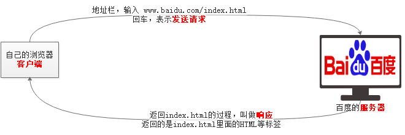
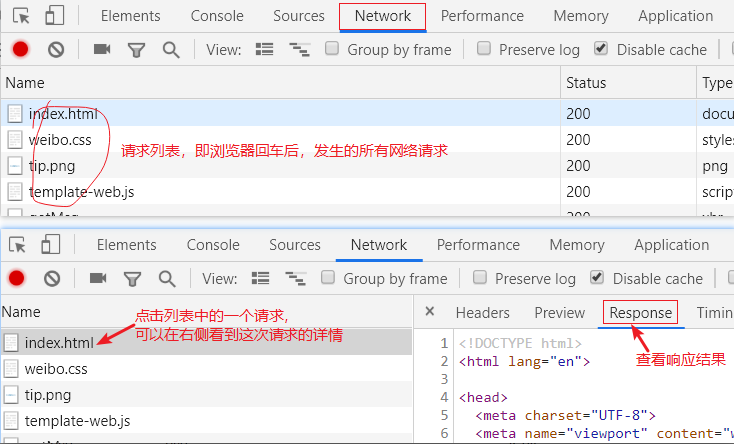
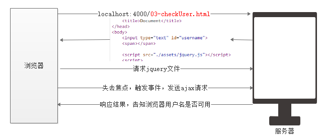

## 上网的过程

打开 浏览器

地址栏，输入网址

回车

最终，看到页面

## 了解上网的过程


## 细化上网的过程



- 客户端（client）
    - 向服务器发送请求的一个工具
    - 最常见的客户端工具就是浏览器。后面没有特殊说明，老师所说的客户端就是浏览器，浏览器就是客户端
- 服务器（server）
    - 本质上，也是一个电脑
    - 作用
        - 存储网页。开发好的网页都应该放到服务器上
        - 提供服务，可以把客户端请求的页面返回给客户端
- 请求
    - 客户端向服务器“索要”页面的动作。
- 响应
    - 即回应，服务器为客户端提供页面的过程
- 资源
    - 服务器上存储的各种文件都叫做资源（比如，HTML文件、css文件、图片文件、音频视频文件等等）


## 浏览器工具

单词：

request：请求

response：响应




## 了解服务器

Web服务器的作用：

- 存储Web资源，资源的概念很广，这里先理解为服务器上的html文件、css文件、js文件、图片文件等等。
- 提供Web服务，理解为能够接收并处理客户端的请求，并做出回应

Web服务器和普通计算机的区别

- 除了硬件设施的区别之外，`Web服务器 === 普通计算机 + 服务器软件`

### 服务器软件

- Apache
- IIS
- Nginx
- ...
- 自己编写一个软件或程序（上课使用的就是老师写的一个程序）

## 搭建web服务器

- 

注意事项：

1. 服务不能重复开启，即不能多次执行 `node app.js` 
2. 关闭服务器，在终端中，按 `Ctrl + C`
3. 快捷键 `Ctrl + ~` 可以快速打开关闭终端
4. 关闭终端面板，并不表示关闭服务器

## 服务器软件使用规范

1. 服务器上的文件不能随便放
    - 必须放到 `ajax/public` 文件夹里面
2. 通过域名或IP找服务器
    1. IP也叫做IP地址。
    2. IP永远不会重复，它表示网络中的计算机的位置
    3. 域名和IP的作用相同，都可以找到网络中的计算机。域名比IP只是好记。

3. 如何访问自己的服务器
    1. 飞秋上看自己的IP（不推荐）
    2. 使用通用的IP地址，`127.0.0.1` ，它永远指向自己的计算机
    3. 使用通用的域名，`localhost`，它永远指向自己的计算机

## 初识Ajax

Ajax是一门技术，可以实现客户端和服务器交互的技术。简单来说，可以实现发送请求，也可以接收服务器响应的结果。

Ajax是通过执行一段JS代码来发送请求，并接收响应结果的技术。

## 接口介绍

- 是什么？
    - 就是一个网址
- 有什么用？
    - 发送ajax请求的时候，可以为url添接口地址
    - 方便获取数据的一个网址
- 哪里来的？
    - 后端同学提供的，前端同学目前来说，不用关心。
- 有哪些接口可用
    - 后端同学设计完接口之后，会提供给我们一个接口文档。具体看文档

## 接口文档

```js
$.ajax({
    type: '请求方式',
    url: '接口地址',
    data: '请求参数',
    dataType: '响应数据格式',
    success: function (result) {
        // result 表示服务器返回的结果
    }
});
```

请求参数的写法：

- 字符串

```js
data: '参数=值&参数=值....'
```

- 对象

```js
data: {参数: '值', 参数: '值', ...}
```

## 验证用户名

实现过程分析：

- 不再是刷新页面就发送Ajax请求了，应该在input失去焦点时，发送验证用户名的Ajax请求
- 需要验证的用户名不能写死，应该是用户在文本框中输入的值
- 服务器返回的结果，不应该直接console.log了，应该判断后，在页面中给出提示

具体代码：

```html
<input type="text" id="username">
<span></span>

<script src="./assets/jquery.js"></script>
<script>
    // 1. 注册 input的失去焦点事件
    $('input').blur(function () {
        var uname = $(this).val(); // 获取输入框中的值
        // 2. 发送ajax请求，验证用户名
        $.ajax({
            type: 'GET',
            url: '/common/checkUser',
            data: {username: uname},
            // data: 'username=' + uname, // username=xxx
            dataType: 'json',
            success: function (result) {
                console.log(result);
                // 3. 在span标签中给出提示
                $('span').text(result.msg);
            }
        });
    });
</script>
```

执行过程：



