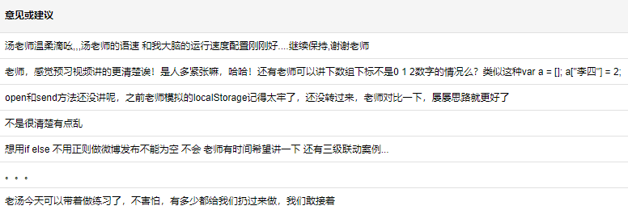
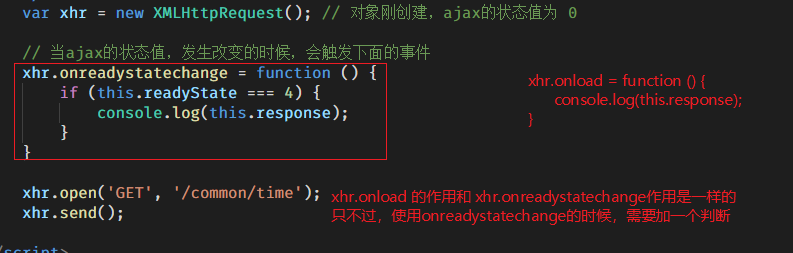

## 反馈建议与意见

- 会使用$.ajax() 方法

```js
$.ajax({
    type: '请求方式', // 可选的值有GET和POST，默认是GET
    url: '接口地址', // 必填
    data: '请求参数', // 两种写法， 'aa=xxxx&bb=yyyy'    {aa: 'xxxx', bb: 'yyyy'}
    dataType: '响应数据格式', // 绝大多数都是json、默认是text，如果指定这项，jQuery内部会自动处理响应结果
    success: function (res) {
        // 当请求响应成功了，会执行这个函数，并且形参res就是服务器返回的结果
    },
    beforeSend: function () {
        // 请求开始之前，需要做什么，写到这里
    },
    complete: function () {
        // 请求结束（无论请求成功还是失败），需要做什么，写到这里
    }
});
```

- 转变思想
    - 不能直接以文件的方式打开服务器上的资源了，比如使用客户端向服务器发送请求，从而得到服务器响应的结果
    - 必须使用服务器




## 原生的Ajax请求

### 基本语法

- GET

    ```js
    // 原生的Ajax请求，使用的是 XMLHttpRequest 对象提供的API（属性和方法）
    
    // 1. 实例化 XMLHttpRequest 对象，request单词的意思是请求
    var xhr = new XMLHttpRequest();
    // 2. 调用open方法，设置请求的方式和url
    xhr.open('GET', '/common/time');
    // 3. 调用send方法，发送请求   ---> 到这一步，才表示发送ajax请求
    xhr.send();
    // 4. 当请求响应过程结束，然后接收服务器响应的结果
    xhr.onload = function () {
        console.log(xhr.response);
    }
    ```

    - 如果有请求参数

        - 请求参数要拼接到url后面即可

            ```js
            xhr.open('GET', '/common/checkUser?username=lisi');
            ```

            

- POST

    ```js
    // 1. 创建xhr对象
    var xhr = new XMLHttpRequest();
    // 2. 调用open方法，设置请求方式和url
    xhr.open('POST', '/message/addMsg');
    // 3. 设置一个请求头，固定的一行代码
    xhr.setRequestHeader('Content-Type', 'application/x-www-form-urlencoded');   
    // 4. 调用send，发送请求
    xhr.send('name=xxx&content=xxx');
    // 5. 设置onload事件，接收服务器相应的结果
    xhr.onload = function () {
        console.log(this.response);
    }
    ```

    

### GET和POST的区别

- 意义
    - GET：请求一般用于获取服务器上的资源，这种请求不会改变服务器上的资源
    - POST：一般用于提交数据给服务器，这种请求有可能会改变服务器上的资源
- 写法
    - 请求参数位置不同
    - POST请求多了一行代码

### 小案例

接口中的请求参数id，和下图中的文件名是一个意思。

- id = 0 ,表示获取所有的省
- id = 105 ，表示获取河北省下属的市
- id = 105001， 表示获取石家庄市下属的县


### 浏览器的问题

#### readyState和onreadystatechange

xhr.onload 事件，属于XHR对象新增的一个属性，IE6、IE7、IE8不支持onload。低版本的浏览器可以使用onreadystatechange事件来代替。

- onreadystatechange事件
    - 会触发多次
    - 触发时机
        - 当readyState属性值（ajax的状态）改变的时候（0-->1、 1-->2 ....），会触发
        - 接收的数据量发生变化了，也会触发
- readyState属性
    - 表示ajax的执行状态，值分别是0/1/2/3/4 ，共计5个值



#### IE缓存问题

- 产生原因
    - 两次或多次ajax的GET请求，url地址完全一致
- 解决办法
    - 让每次请求的url不一致

### 其他API

#### 创建xhr对象的兼容写法

- var xhr = new XMLHttpRequest();
- var xhr = new ActiveXObject('Microsoft.XMLHTTP');   // IE6 IE7 的写法

#### responseType属性

类似于 $.ajax() 中的 dataType。

指定该属性，会把JSON等格式的数据转成JS数据（对象、数组等）


### 原生Ajax小结

至此，我们学习了很多 XHR 对象的 属性和方法 （统称API）。其实这些API分属不同的XHR版本。

- XHR 1 版 API -- 最初的XHR对象提供的API，基本上兼容所有的浏览器
    - open -- 设置请求方式、请求url、同步或异步
    - send -- 发送请求
    - readyState -- ajax的状态，值（0，1，2，3，4）
    - onreadystatechange -- 当readyState的值改变的时候，或当接收的数据发生改变的时候都会触发
    - responseText：-- 用于接收服务器返回的 `文本类型` 的结果
- XHR 2.0 新增API，基本上不再支持IE6、IE7、IE8
    - onload（2014年新增） -- 当请求响应成功了，会触发
    - onprogress -- 当响应的数据，正在接收中，会触发。数据量比较大的话，可能会触发多次，可以使用它做一个进度条
    - onloadstart -- 当请求开始的时候，会触发
    - onloadend -- 当请求结束的时候，会触发
    - response ：可以接收任何的响应结果
    - responseType（2012年新增）：配合response使用的一个属性

> 实际开发中，原生的Ajax使用的概率非常少。一般都使用封装好的库，比如 jQuery中的 $.ajax()

## 同步和异步

### 异步

==所以异步操作的**本质**是同一个时间点，有多个操作同时执行了；耗时操作（定时器）并不会阻塞后面代码的执行。==

- 同一个时间点，执行了多个操作
- 耗时操作不会阻塞后续代码的执行

### 同步

同一个时间点，只能执行一个操作。前面的代码没有执行完毕，后续代码都不能执行。

## 封装

```js
/*
type: 请求方式
url: 请求接口地址
data: 请求参数
cb: 用于处理服务器响应结果的回调函数。cb取自单词 callback
*/
function ajax (type, url, data, cb) {
    var xhr = new XMLHttpRequest();

    var params = null;
    // 判断是否是GET方式
    if (type === 'GET') {
        // 把url和data拼接到一起，形成 /common/checkUser?username=xxx
        url = url + '?' + data;
    }
    xhr.open(type, url);

    // 判断是GET还是POST请求
    if (type === 'POST') {
        xhr.setRequestHeader('Content-Type', 'application/x-www-form-urlencoded');
        // 重置 aaaaa = data
        params = data;
    }

    xhr.send(params);

    xhr.onload = function () {
        // console.log(this.response)
        cb(this.response);
    }
}

/* function chuli (res) {
            console.log(res);
        } */

ajax(
    'POST', 
    '/message/addMsg', 
    'name=xxx&content=yyy', 
    function (res) {
        console.log(res);
    }
);
```


回调函数是处理异步请求结果的最佳方案。

## 小结

- 原生的Ajax写法
    - GET （4个步骤）
    - POST（5个步骤）
    - GET和POST写法上的区别
        - POST多了一行代码
        - 请求参数的位置不一样

- 浏览器问题
    - onreadystatechange事件配合readyState，完成获取响应结果的任务，代替onload事件
    - IE缓存问题（产生原因、解决办法）
- API小结
    - XHR1.0 版本
        - open
        - send
        - onreadystatechange
        - readyState
        - responseText
    - XHR2.0新增
        - onload
        - responseType
        - response
        - onprogress/onloadstart/onloadend ....

- 同步和异步
    - 异步：同一个时间点，可以执行多个操作。耗时操作不会阻塞后续代码的执行。
    - 同步：同一个时间点，只能执行一个操作。耗时操作肯定会阻塞后续代码的执行。

- 封装
    - 把需要变化的位置，设置为形参即可
    - 处理异步请求的结果，必须使用回调函数。


FormData

模板引擎

综合案例