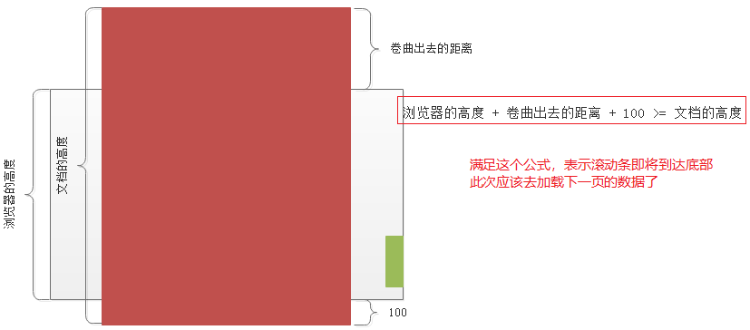

## 回顾

- readystate change事件的不同触发时机
    - 当readyState的值变化的时候（0-->1  1-->2  2-->3  3-->4）
    - readyState的值没有变化，但是接收到的数据发生变化的时候，也会触发
- 同步和异步
    - 同步：代码从上到下依次执行，前面的代码没有执行完，后面的代码不能执行。
    - 异步：代码从上到下依次执行，前面的代码没有执行完，不会阻塞后续代码的执行。

## FormData

- 有form表单

    ```js
    // 使用FormData步骤1： 找到form表单，找表单的dom对象
    var fm = document.getElementById('fm');
    // 使用FormData步骤2： 实例化FormData，并传递表单即可，得到的对象里面包含了所有的值
    var formdata = new FormData(fm);
    
    ....
    ....
    xhr.send(formdata);
    ....
    ```

- 请求头的设置

    - 如果提交的数据是纯文件，没有文件上传。需要设置请求头
    - ==使用FormData的时候，不需要自己设置请求头==

- 注意事项
    - 不能让表单提交
        - 设置按钮为button类型
        - JS代码中，通过事件对象阻止表单提交的这种默认行为
    - 表单中各项必须有name属性，因为FormData收集表单数据的时候，就是根据name属性获取的

- 关于文件域的补充

    - 标签的属性
        - multiple  --  设置后，表示允许选择多个文件
        - accept -- 可以上传文件的类型，写法有 `.jpg,.png,.gif` 或 `image/png` 或 `image/*`

    - JS代码中，如果找到文件对象
        - `document.getElementById(文件域的id).files[0]`

- FormData 中的 append方法
    - 作用是，向FormData对象中追加一些值
    - 用法： 
        - `formdata.append('pwd', 'hello');`
        - `formdata.append('pic', document.getElementById('pic').files[0]);`

## 模板引擎


## 综合案例

### 删除

==接口代码有误：将 `ajax/router/members.js` 中的第85的`query`改成`body`。保存之后，重启服务即可。==

关键点：

- 删除的接口，需要会员的id。
    - 在渲染页面的时候，就应该把id渲染到页面中
    - id不应该直接显示出来，所以把id当做 Delete 标签的属性值
- 注册事件的时候，必须使用==事件委托==的方案
- confirm() 是一个提示框。用户点击确定，返回true；用户点击取消，返回false
- 移除元素的时候，注意this指向问题

### 查看详情

- 超链接跳转属于GET请求，如果传递参数，需要在url后面拼接  `detail.html?id=23`

- 获取地址栏的参数：`location.search`

### 预览图片

1. 找到文件对象，==必须通过DOM对象找文件对象==；  
2. 通过 `URL.createObjectURL(文件对象)` 可以得到一个用于访问图片的临时的url
3. 设置预览图片的src属性即可。

### 添加会员

- 注意：一定要按接口写代码
- 表单各项（每个input）的name属性必须设置，因为FormData收集表单数据的时候，是根据name属性获取的
- 表单各项的name属性，必须和接口要求的请求参数一致
- jQuery+FormData的使用
    - 必须加入 `contentType: false` ，目的是不需要设置Content-Type，浏览器会自行处理
    - 必须加入 `processData: false`， 目的是不需要处理formdata数据。

### 懒加载

- 思路

    - 找到何时该去加载下一页的数据

        

    - 如何加载下一页的数据

        - 调用 `/member/list-page` 接口，只不过让请求参数 `page` 的值加 `1` 

- 解决重复加载的BUG
    - 重复加载数据，是因为滚动条不好控制，不小心就滚动多了，会多次调用loadData() 函数
    - 解决办法
        - 进入到loadData中，马上设置flag为false。（flag=false表示不允许调用loadData了）
        - 当前页的数据处理完毕，重置flag为true。