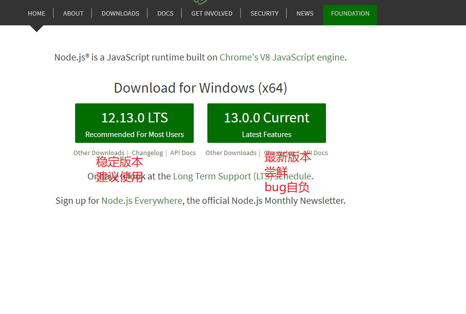
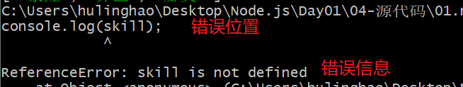
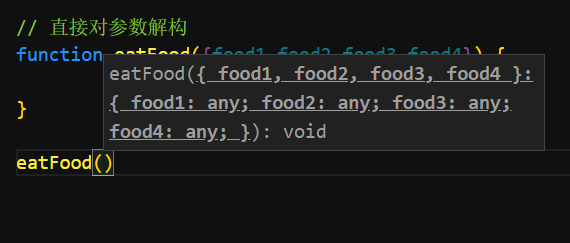

# Node.js - day01

## Node.js课程介绍

1. 安排:
   1. node基本概念
   2. es6新语法
   3. 内置模块,第三方模块(用包)
   4. express框架(web开发的框架,快速写接口,写后台逻辑)
   5. mysql(数据库,增删改查)
   6. 项目(自己写接口,自己调用自己写的接口)
2. 重点:
   1. 了解后台开发干的事情:
   2. 能够写出简单的接口:基本的增删改查
   3. 能够熟练用`npm`的装包,引包,用包
3. 全栈工程师:
   1. 前端+后端

## Node.js基本概念

> 基于chrome v8引擎的 javascript运行环境
>
> 服务端的js

官网: https://nodejs.org/en/ 

中文网: http://nodejs.cn/ 

1. 浏览器中 有一个可以解析 js的 解析器
   1. 解析器:(翻译官)
      1. 把编程语言  翻译为计算机可以识别的 二进制
      2. js---(翻译官v8引擎)->计算机执行
   2. chrome的js解析器(翻译官),v8引擎 目前世界上最快的,js解析器
2. js运行环境:
   1. 通过`node.js`也可以直接运行`js`代码
3. 这个阶段的js代码很大一部分,不需要通过浏览器运行,直接敲命令即可

## Node.js安装

下载地址: https://nodejs.org/en/ 

一直下一步:即可

打开黑窗 

```bash
node -v
```

## js组成

1. 浏览器端:
   1. ECMAScript:js语法,for循环,if else,var...
   2. DOM(文档对象模型):
      1. 约定了操纵dom元素的语法
      2. `dom.style.width`样式中的宽度
      3. `dom.onclick`事件绑定
      4. `dom.appendChild`追加后代
      5. ....
   3. BOM(浏览器对象模型):
      1. 操纵浏览器的语法
      2. `window.alert()`
      3. `window.location.href`
      4. `window.setTimeout`
      5. ....
2. 服务器端(没有浏览器):
   1. ECMAScript:js基础语法,for循环,if else,var....
   2. 学习了bom语法中的一些常用api
      1. `定时器,console 等等`
   3. 模块(类似于之前用的jQ,swiper...)
      1. 内置模块:自带的
      2. 第三方模块:别人写的,下载才可以使用

## Node.js 基本使用-REPL(了解)

1. 打开黑窗
2. 输入`node`回车
3. 写`js代码` 回车运行
4. 循环`步骤3`

REPL

read(读取) eval(解析) print(打印) loop(循环)

用的不多,了解即可,跑一些简单的代码

## Node.js 基本使用-执行js文件

1. 写好一个`js文件`
2. 内部有`node.js`支持的代码
3. 打开黑窗输入`node 文件名` 回车
4. 运行


注意

1. 文件名不能写错,写错提示找不到
2. 文件名不需要打全,写个开头 +`tab`自动提示
3. 黑窗打开的位置 和`js`在一个文件夹下
4. 语法不要写错
5. 路径确保和js文件一致
6. 文件名不要叫`node.js`
7. 报错查看
8. 


在vscode中打开终端

右键文件->在终端中打开->输入命令运行即可

关闭终端的快捷键

ctrl+`   1左边的那个按钮


## ES6 - 基本概念

 `ES6`等同于`ECMAScript 2015`

1. `2015年推出的新的语法规范`
2. 简称`ES6`
3. `ES6`的改变最大,新功能最多

阮一峰ES6教程: http://es6.ruanyifeng.com/ 

不适合新手入门

## var的缺点

1. 变量提升
2. 没有块级作用域`{}`
3. 可以重复声明

## ES6 - let

> 变量声明

1. 没有变量提升
2. 有块级作用域`{}`
3. 不能重复声明
4. 替代`var`
5. 别再写`var`了,用`let`

```javascript
let 变量名 = 值
```

## ES6 - const

> 常量声明

1. 不会提升

2. 有块级作用域

3. 不能重复声明

4. 必须在声明式就赋值

5.  能用const 不用let 能用let 不用 `var`

   


## ES6 - 对象的属性的简化写法

> 更简单的属性赋值

```javascript
const name ="jack"
const person ={
    // 属性名和 值的名字相同
	name:name,
	// 可以写成
	name,
	jump:function(){},
	// 可以写成
	jump(){}
}
```


## ES6 - 模板字符串

> 轻量级的`模板引擎`,原生支持,不用导包

1. 定义的时候使用  `(1左边的符号)
2. 挖坑的语法`${表达式}`
3. 坑中必须有东西
4. 可以换行,简单的模板生成直接使用`模板字符串`即可
5. 复杂的还是用模板引擎


## 易错点

1. 输入了`node`回车 如何退出? `ctrl+c`两次
2. 对象的属性获取语法,还是`对象.属性`或者`对象.方法()`
3. `模板字符串`使用

## ES6 - 函数默认值

> 为函数设置默认值

1. 调用函数时,不传递参数,参数可以有一个默认值
2. 早期会使用短路运算来实现默认值的设置

```javascript
// es6中的默认值
// 参数=默认值
// 不传递参数直接使用默认值,传递了参数使用传递的值
function sayHi(name='路飞',skill='橡胶果实') {
    console.log(name,skill);
}
// sayHi();
sayHi('索隆','迷路');
```


## ES6 - 对象解构(使用频率挺高)

> 更方便的对象属性取值

```javascript
// 定义对象
const person = {
    name:"食戬(jian)之灵",
    desc:"美食番,教你做饭",
    spec:"食物越好吃,衣服就越少"
}
// const name = person.name;
// const desc = person.desc;
// const spec = person.spec;

// 解构赋值
// skill undefined 上面没有定义
// const {name,desc,spec,skill} = person;
// 也可以只获取某一些
const {name} = person;
```


## ES6 - 对象解构实际应用

> 结合函数用起来挺过瘾的

1. 函数的参数解构
   1. 
   2. 实际调用时会有更多的提示
2. 函数的参数解构结合默认值

```javascript
function eatFood({food1="西兰花炒蛋",food2="西红柿炒蛋",food3="韭菜炒蛋",food4="黄瓜炒蛋"}) {
    console.log(food1,food2,food3,food4);
}
```


## ES6 - 数组解构(了解)

> 更快的获取数组中的值

```javascript
// 数组
const cartoonArr = ['喜洋洋','熊出没','铁甲小宝','天线宝宝','海绵宝宝','中华小当家'];

// 取值
// const c1 = cartoonArr[0];
// const c2 = cartoonArr[1];
// console.log(c1,c2);

// 解构
// 获取的顺序 和数组的的元素的对应关系是一致
// 数组大部分时候都是通过下标获取某一个
// 数组的解构用的 不多 了解即可
const [c1,c2,c3,c4,c5,c6] = cartoonArr;

console.log(c1,c2,c3,c4);
```

## 终端补充

1. 多个终端的区别
   1. 终端可以理解为是一个没有界面的    软件
   2. 通过输入内容让他干事情
   3. `cmd`微软早期推出的 功能最少,不太好用
   4. `git bash` 安装了`git`之后自带的,功能强大,支持很多`cmd`没有的命令,`linux`的命令也基本上都支持
   5. `power shell`:微软后续退出的终端,功能牛逼很多,但是还是比`git bash `支持的命令少一些

## ES6 - 对象展开

> ...结合对象使用

```javascript
// 对象
const person = {
    skill:"跳水",
    habbit:"抗冻"
}
const student ={
    sleep:"呼噜呼噜!!",
}

const son ={
    // 写在前面的同名属性会被覆盖
    // skill:"游泳",
    ...person,
    ...student
    //  sleep:"呼噜呼噜!!",
    // skill:"跳水",
    // habbit:"抗冻"
}
```


## ES6 - 数组展开

> ... 结合数组使用

````javascript
// 数组
const vegetables =["西兰花","西红柿","苦瓜","菜花"];
const meats =["牛肉","羊肉","驴肉","鸭肉","鸡肉"]


// 把数组展开
const foods =[...vegetables,...meats];
// const foods =["西兰花","西红柿","苦瓜","菜花","牛肉","羊肉","驴肉","鸭肉","鸡肉"]

console.log(foods);
````

1. 数组不会出现覆盖问题,索引会依次向后

##  ES6 - 箭头函数

> 简单的令人发指的函数写法

1. 省略`function` 变为`=>`
2. 如果形参`只有一个`,可以省略小括号
3. 如果函数体`只有一行`,可以省略大括号
4. 如果函数体`只有一行`,并且`有返回值`
   1. `省略大括号`的同时,必须省略`return`

```javascript
// 函数 无参数,无返回值的函数
// const func1 = function() {
//   console.log('函数1');
// };
// 省略 function
// const func1 = ()=>{
//     console.log('函数1');
// };

// 省略大括号
// const func1 = ()=>console.log('函数1');

// func1();

//有一个参数,无返回值的函数
// const func2 = function(name) {
//   console.log(name + '你好吗!');
// };

// 省略 function
// const func2 = (name) => {
//   console.log(name + '你好吗!');
// };

// 省略 小括号
// const func2 = name => {
//   console.log(name + '你好吗!');
// };

// 省略大括号
// const func2 = name => console.log(name + '你好吗!');

// func2('rose');

// 有一个参数,又返回至的函数
// const func3 = function(name) {
//   return name + ' 哦哈哟!';
// };

// 省略function
// const func3 = (name)=>{
//     return name + ' 哦哈哟!';
//   };
// 省略小括号
// const func3 = name => {
//   return name + ' 哦哈哟!';
// };
// 省略大括号,有返回值时,必须一起省略 return
// const func3 = name => name + ' 哦哈哟!';

// const res = func3('菜花');
// console.log(res);

// 参数有多个,函数体有多行的函数
// const func4 = function(name, age) {
//   console.log(name + ' 阿尼阿瑟哟');
//   console.log(`你竟然${age}岁了`);
// };

// function 省略
const func4 = (name, age) =>
 {
    //  如果非要省略大括号,只有第一行会当做函数内部的代码
  console.log(name + ' 阿尼阿瑟哟');
    // 第二行开始就和上面的函数没有关系了
  console.log(`你竟然${age}岁了`);
};
func4('路飞',18);

```

## ES6 - 箭头函数中的`this`

> 不再是调用的时候确认`this`,变成创建的时候确认`this`

1. 箭头函数的this 在创建时就确定了 是上下文(和他平级的环境中)中的this
2. 可以通过 `babel`的工具把高级的js代码翻译成低版本的js,查看内部的实现套路
3. babel传送门: https://www.babeljs.cn/ 


## Node.js - 内置模块

> 脱离了浏览器的限制,通过内置模块可以实现很多在浏览器中干不了的事情哦

官方文档: http://nodejs.cn/ 

## Node.js - fs模块基本使用

文档地址: http://nodejs.cn/api/fs.html 

1. 文件基本读写会用即可
2. `const fs = require('fs')`
3. `fs.readFile`
4. `fs.writeFile`

## Node.js - 第三方模块

1. 官方的网站(包,模块管家的搜索界面): https://www.npmjs.com/ 
2. 找包 官方的包检索网站`npm`
3. 下包:模板的网页中有命令`npm i xxx`
4. 导包:文档中也有
5. 用包
6. 文档中都可以找到

## 补充清屏的命令

小黑窗中输入`cls`


