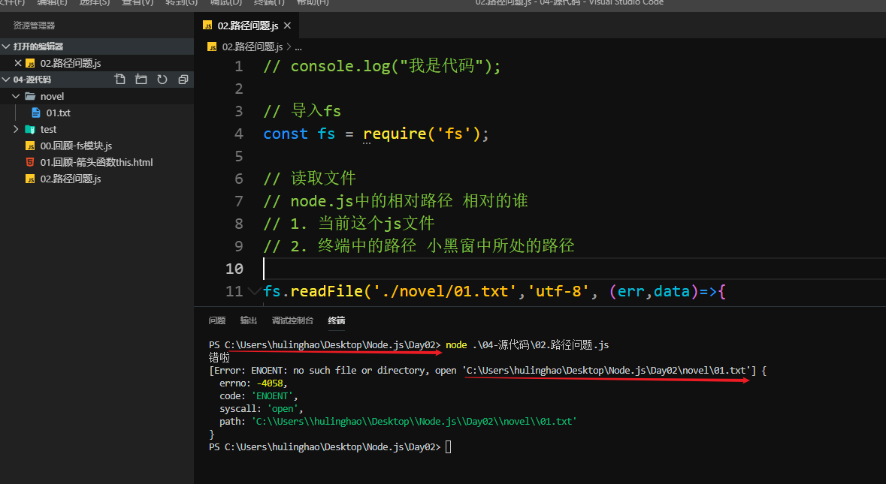
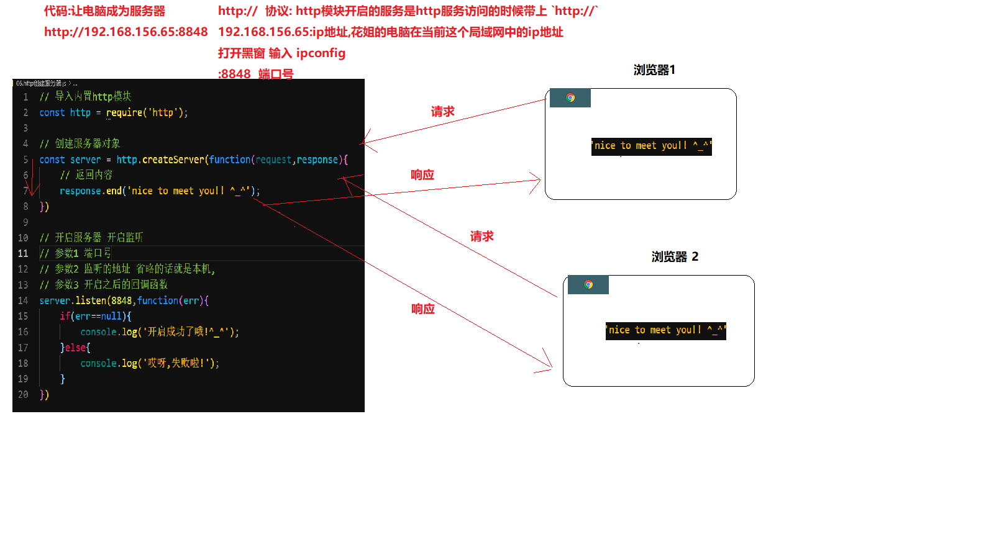

# Node.js -day02

## 回顾

1. Node.js执行代码

   1. 打开`黑窗`(终端):
   2. 输入命令:`node 文件名` 用`node`去执行(解析)某个js文件
   3. 路径:`黑窗和代码的路径是相同`

2. fs模块文件读写

3. 箭头函数的this

   1. 在创建的时候就确定了

   ```javascript
   // 箭头函数 绑定this
   // 箭头函数中的this在创建时就去确定了
   // 是上下文中的this,和他平级的this
   // babel 翻译
   setTimeout(() => {
       console.log('定时器');
       console.log(this);
   });
   
   // 上面的代码 等同于
   // const _this = this;
   // setTimeout(function(){
   //     console.log(_this)
   // })
   ```


## 终端命令:cd

> 在终端中切换路径

可以用来切换路径

```bash
cd 路径
cd ../
cd 文件夹
```


## Node.js中的相对路径

> Node.js中的相对路径相对的是执行环境中(小黑窗)的路径

想要看这个错误,终端中,跳出当前的路径

通过路径去执行代码就可以出现这个错误



```javascript
// console.log("我是代码");

// 导入fs
const fs = require('fs');

// 读取文件
// node.js中的相对路径 相对的谁
// 1. 当前这个js文件
// 2. 终端中的路径 小黑窗中所处的路径

fs.readFile('./novel/01.txt','utf-8', (err,data)=>{ 
    if(err==null){
        console.log(data);
    }else{
        console.log('错啦');
        console.log(err);
    }
 })
```


## 两个路径相关的全局变量

> 通过代码的方式来获取绝对路径

1. 4中的问题可以通过绝对路径来解决,保证一定可以读取到文件
2. 结合这两个全局变量就可以动态的生成绝对路径,避免写死
3. 是node.js中推荐的写法
4. `全局变量`不需要定义,直接就可以使用

```javascript
__dirname // js文件所在文件夹的绝对路径
__filename// js文件的绝对路径
```


## Path模块基本使用

> 专门用来处理路径的模块

文档传送门:http://nodejs.cn/api/path.html

```javascript
path.extname('info/novel.txt');// 获取文件的扩展名 .txt
path.dirname('info/novel.txt');// 获取路径中文件夹的部分 info/
path.join(路径1,路径2,路径3...);// 把多个路径拼接到一起,保证格式正确
```

其中重点掌握`path.join`即可

```javascript
// 使用fs模块和path模块完成文件的读取
// 导入模块 fs
const fs = require('fs');
// 导入模块 path
const path = require('path');

// 生成绝对路径 path.join
const fullPath = path.join(__dirname,'./novel/01.txt');

// 读取文件
fs.readFile(fullPath,'utf-8',(err,data)=>{
    if(err==null){
        console.log(data);
    }
})
```

注意

1. `\`转义符 需要注意
2. `path.join(路径1,路径2)`不要写成 字符串拼接`+`
3. 使用绝对路径的目的是`保证一定可以获取到文件`

## http模块-创建服务器

> 通过它几行代码就可以创建服务器了哦

使用步骤

1. 导包(内置模块,模块名叫`http`)
2. 调用`createServer`方法创建服务器对象
3. 开启服务器(监听端口)`listen`


概念解释:

` http://192.168.156.65:8848/ `

```
http://  协议: http模块开启的服务是http服务访问的时候带上 `http://`
192.168.156.65:ip地址,花姐的电脑在当前这个局域网中的ip地址 
打开黑窗 输入 ipconfig 
:8848  端口号
```

端口:

​	电脑和外部通讯的一个通道

1. 物理端口:
   1. usb口
   2. 网线口
   3. 耳机口
   4. hdmi(显示器,投影仪)
   5. ...
2. 虚拟端口:电脑中的软件和外部通讯的通道
   1. 只要和外部通讯的软件,都会使用某一个虚拟端口
   2. 一个号而已`0开始递增`
   3. 虚拟端口很多
   4. 前`10000`很多都被用了 
   5. 靠后的一般都可以使用,一些比较另类的也没有使用
   6. `8848,8888,4399,3000`
   7. 端口一次只能被一个程序使用


## http模块 - 服务器的交互流程

```javascript
// 导入内置http模块
const http = require('http');

// 创建服务器对象
const server = http.createServer(function(request,response){
    // 返回内容
    response.end('nice to meet you!! ^_^');
})

// 开启服务器 开启监听
// 参数1 端口号
// 参数2 监听的地址 省略的话就是本机,
// 参数3 开启之后的回调函数
server.listen(8848,function(err){
    if(err==null){
        console.log('开启成功了哦!^_^');
    }else{
        console.log('哎呀,失败啦!');
    }
})
```



## http模块-响应英文

> 服务器如何返回内容给浏览器呢?

```javascript
response.end('abc')
```


## http模块-响应中文

> 对于中文需要额外的设置响应头哦

## http模块-响应网页

> 返回一个写好的网页

在`response.end`之前调用

`response.setHeader`设置编码格式，浏览器就可以正常解析内容了

```javascript
// 创建服务器对象
const server = http.createServer(function(request,response){

    // 解决中文乱码 返回一个格式
    // content-type内容类型
    // text/plain 普通文本
    // charset=utf-8 编码格式
    response.setHeader('content-type','text/plain;charset=utf-8');
    // 返回内容
    // response 返回的英文内容可以被正常解析
    // response.end('nice to meet you!! ^_^');
    response.end('怎么老是你！');
})
```

问题

1. 设置header的代码不能乱写
2. 重开终端中`ctrl+c` 不需要选择内容
3. 访问时，写上端口
4. 记得导包哦`http`

## http模块-获取请求url

> 请求是可以携带信息,如何获取这些呢?

1. 在回调函数中可以通过`request.url`获取在url中的信息
2. `request`请求的意思
   1. 会吧请求的信息都保存在这个对象中
   2. `url`就是请求的地址
3. 如果`url`中有中文，可以通过`decodeURI()`进行转码

```javascript
// 导入http模块
const http = require('http');

// 创建服务器
const server = http.createServer((request,response)=>{
    // 打印内容
    // console.log('有人请求我哦！！');
    // 打印请求的地址
    // console.log(request.url);
    // decodeURI url中文解码
    console.log(decodeURI(request.url));
    response.setHeader("content-type",'text/plain;charset=utf-8');
    response.end("辛苦了");
})

// 开启服务器
server.listen(4399,function(err){
    if(err==null){
        console.log('开启成功了哦');
    }
})
```


## http模块 - 根据url响应不同的内容

> 不要都是固定的内容,根据url响应不同的值吧

实现步骤：

1. 获取请求的url`request.url`
2. 根据不同的`url`返回不同的结果

## http模块 - 读取并返回页面

步骤

1. 导包
2. 用包
   1. 创建服务器的时候
      1. 读取写好的页面 并返回


注意：

	1. 如果想要修改用户看到的页面，只需要修改页面的代码即可
 	2. 不需要重新开启服务器
 	3. 目前只能返回`index.html`

## http模块 - 根据url响应不同的文件

步骤

1. 写多一些`if else` 根据不同的值
2. 读取不同的文件并返回

缺点

1. 如果返回的页面有上百个，上百个`if else`

## http模块 - 静态资源服务器

作用

1. 开启服务之后，可以通过浏览器输入`http://地址:端口`访问
2. 如果输入的地址后面还更有网页，可以读取对应的文件并返回
3. 如果请求的是`css`,`js`,`img`也可以正常返回
4. 读取文件是，不要设置编码格式为`utf-8`


## 静态资源服务器 - 访问注意

1. 保证 js文件同级目录下有一个`web`文件夹，内部有网页
2. vscode每次 右键打开终端，会新建一个小黑窗
3. 快速访问自己的服务器
   1. http://localhost    本机
   2. http://127.0.0.1     本地回环地址
4. 让同局域网的人访问必须通过本机`ip`才可以

## http模块 - 获取请求的方法

1. `request.method`获取请求方法
2. 结合请求地址的判断，可以自行不同的逻辑
3. 更为复杂的逻辑，不太适合用原生的编写，比较繁琐

## 第三方模块使用步骤

1. 新建文件夹(不要中文)
2. 初始化  打开终端输入:`npm init -y`或者`npm init` 自行输入
   1. 生成一个`package.json`文件
   2. 文件保存了项目的信息，比如版本，名字，使用的第三方模块名...
   3. `npm init `自行输入每一项（初期用的不多）
3. `npm网站`找包
4. 根据提示 下包 `npm i 包名`
   1. `package.json`中 增加一个`dependencies`把下载的包名，记录进去，和版本信息
   2. 文件夹下多
      1. `node_modules`所有下载的第三方模块都会在里面
      2. `package-lock.json`：模块名，版本号，在线地址等。。
         1. 为了让我们第二次下载的时候速度更快
5. 根据提示 导包
6. 根据提示 用包


第二次下载

1. 保存`package.json`及`package-lock.json`有之前下载的模块名
2. 直接输入`npm i`自动读取用到的模块，并下载

## express 基本使用

1. 新建文件夹非中文输入`npm init -y`
2. 找包
3. 根据提示下包
4. 根据提示用包


## 补充 - 云服务器

1. 个人电脑互联网上无法被访问
2. 除非你有一个公网ip
   1. 互联网可以想象为一个巨大的局域网
3. 不建议用自己的电脑作为服务器放到互联网上
   1. 不安全
4. 买一个专门的服务器
   1. 服务器：电脑，和普通电脑有点区别，配置上，系统上
   2. 系统：
      1. window服务器系统
      2. linux：最为常见
   3. 配置：内存较大，cpu更好一些
   4. 安全性和稳定性会更好
5. 为了让更多人体验互联网应用，有了很多的云供应商
6. 供应商A:有一台超级牛逼的服务器
   1. 装了几百台虚拟机
   2. 卖钱
7. 用户可以根据需求购买云服务器
   1. 本质就是一个供应商 给你的虚拟机
   2. 大部分情况够用
8. 云服务器
   1. 可以在互联网上被访问
   2. 24小时不停机
   3. 如果有人攻击你，云供应商帮你处理
9. 购买推荐：
   1. 找打折的即可
   2. 阿里云：折后90一年，只能买一年，第二年巨贵
   3. 腾讯云：折后10元一个月，可以买3年
      1.  https://cloud.tencent.com/act/campus?fromSource=gwzcw.2432747.2432747.2432747&utm_medium=cpc&utm_id=gwzcw.2432747.2432747.2432747 
      2. 10元一个月可以让你购买三次
      3. 每次最多购买一年
   4. 百度云
   5. 京东云
   6. 华为云
   7. 。。。。
10. 买了之后能干嘛
    1. 有了一台24小时运行的电脑
    2. 抢票
    3. 挂网站
    4. 挂接口

11. 花姐写的接口 
    1.  https://github.com/AutumnFish/testApi 
12. 域名：
    1. 很便宜
    2. 买服务器的时候一般会送，或者搭配购买打折
    3. 冷门的便宜
    4. 热门的巨贵

## 补充 - vscode配色


## 补充 - 电脑卡顿

1. 过热:

   1. 垫高：有一点点用
   2. 买散热器：有多一点点用
   3. 清灰：蛮有用的
   4. 加硅脂：需要一定的动手能力，不太建议自己弄
   5. 新电脑
      1. 超极本，散热本来就不好
      2. 直接找售后

2. 硬盘:

   1. 机械硬盘使用的时候读写速度慢，卡顿的感觉
   2. 买个固态硬盘：
      1. 推荐买256g
      2. 256g:300左右
      3. 主流的牌子基本没问题`三星，金士顿，闪迪，东芝。。。`
   3. 安装：
      1. 找小伙伴帮你，修电脑的
      2. 重新安装系统，把系统装到`固态硬盘`中
   4. 成本：300左右

3. 内存：

   1. 单位时间内允许运行的软件多少
   2. 推荐8g
   3. 上不封顶
   4. 成本:250

   

## 补充 - nodemon(可选)

node 的一个 `全局模块`

当做一个没有图形化界面的软件

安装了之后可以自动检测文件修改，自动重新运行

1.  任意位置执行`npm i nodemon -g`
2. 安装完毕之后
   1. `node xxx`
   2. 换成
   3. `nodemon xxx`


