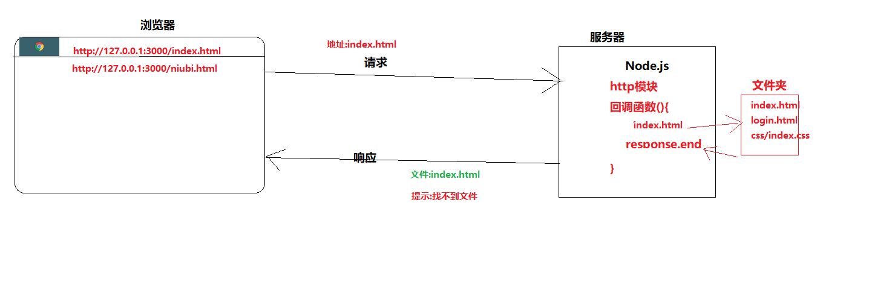
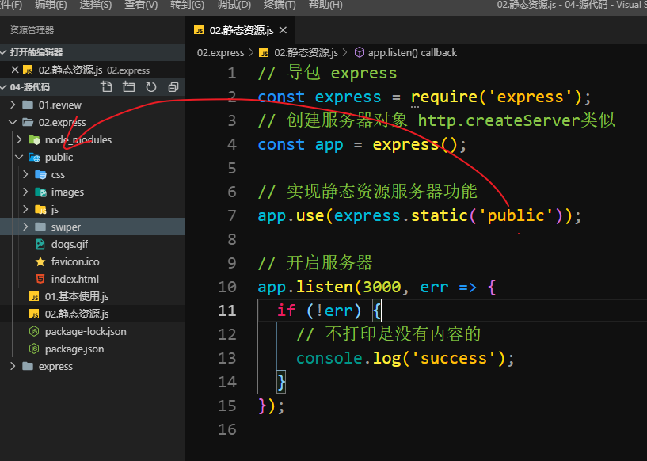
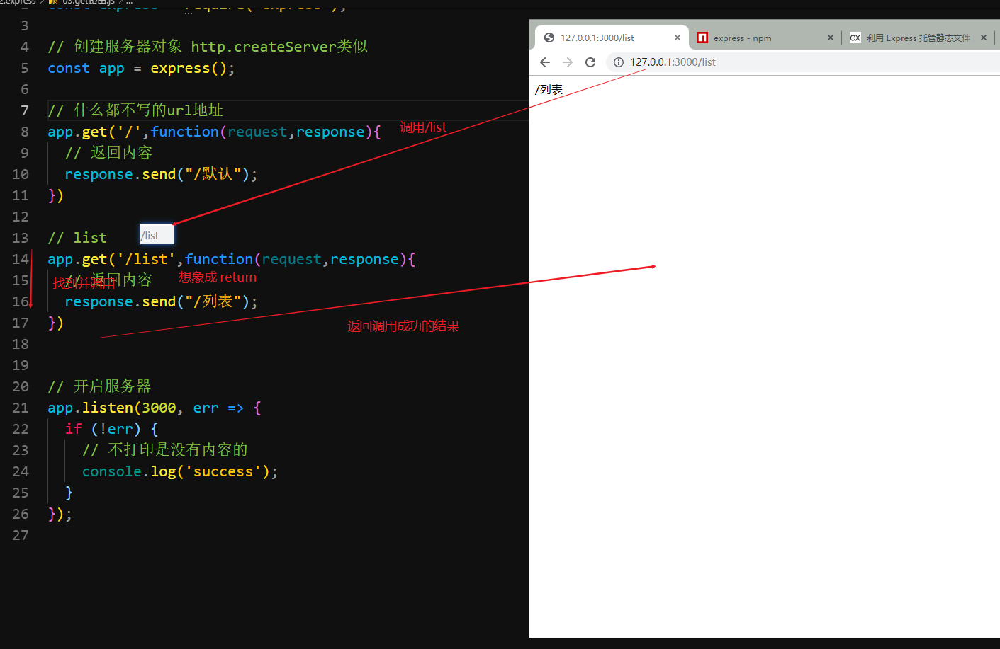
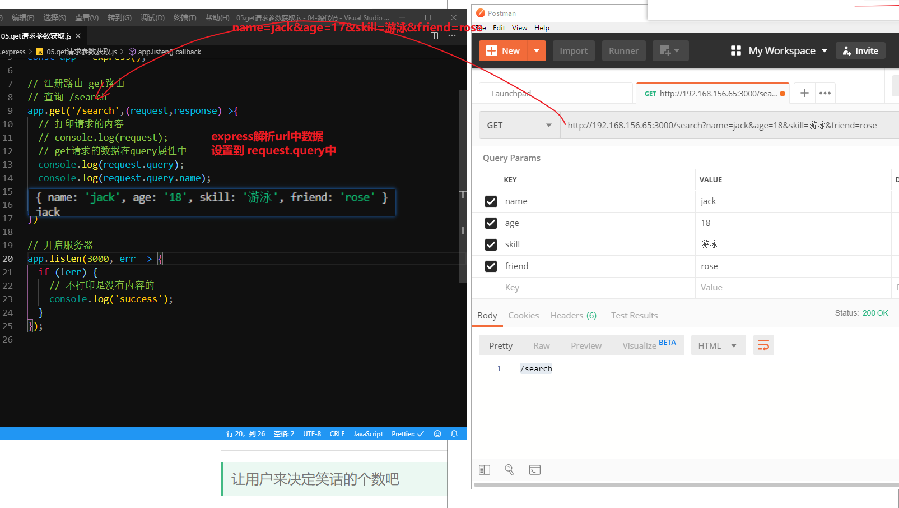
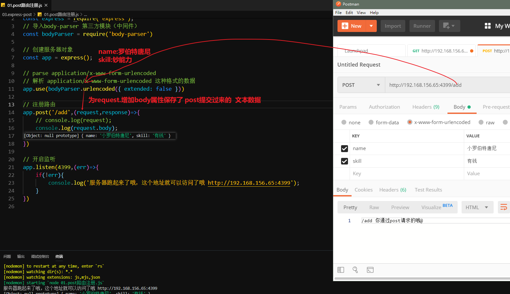
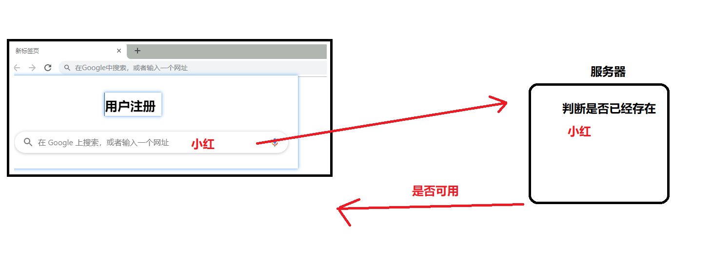
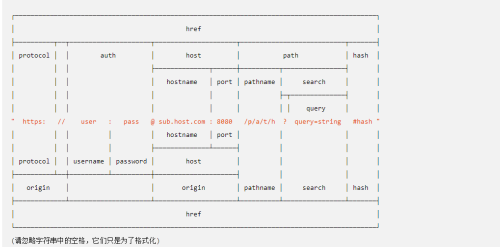

# Node.js - day03

## 回顾

1. 浏览器&服务器&数据库
2. 
3. 静态资源服务器
   1. 模块：
      1. http:开启服务器
      2. fs:读取文件
      3. path:获取路径
   2. 创建服务器
      1. 回调函数中
      2. 获取url地址
      3. 根据url地址生成路径
      4. 根据路径读取文件
      5. 读取成功：返回
      6. 失败：返回404
   3. 开启服务器：端口，错误判断
4. get和post请求判断
5. 第三方模块使用

## express基本使用

> 相比于原生http模块，开发速度更快的web开发框架

传送门1:http://www.expressjs.com.cn/

传送门2:http://expressjs.com/

1. 只要框架流行，基本都会有中文网
2. express是`node.js`中的一个`web开发框架`
3. 很多框架都是基于`express`哦 

使用步骤:

1. 创建文件夹:
   1. 不要叫`express`和模块同名
2. 初始化:`npm init -y`
3. 下载express:`npm i express`
4. 导入`express`
   1. c+v
5. 使用`express`
   1. c+v
   2. http模块的方法都可以用，但是更建议用`express`的

```javascript
// 导包 express
const express = require('express');
// 创建服务器对象 http.createServer类似
const app = express();

// 如果请求的是 / （url为空）
app.get('/', (request, response) => {
  // 原生的方法也支持
//   response.end('很高兴认识你');
  // 返回一个 hello world
  // 更高级的 end方法
  response.send('很高兴认识你');
});

// 开启服务器
app.listen(3000, err => {
  if (!err) {
    // 不打印是没有内容的
    console.log('success');
  }
});

```


特点:

	1. 静态资源托管
 	2. 路由
 	3. 中间件
      	1. 第三方中间件
      	2. 自定义中间件

## express - 托管静态资源

> 一行代码让外部可以访问指定的文件夹

传送门: http://www.expressjs.com.cn/starter/static-files.html 



```javascript
// public文件夹下的文件就可以被访问了
app.use(express.static('public'))
```

1. public 建议和js文件同级
2. 重复打开需要关闭之前的那个
3. 初期花姐强烈建议`c+v`
4. `ip地址`每天是会变的 用`localhost`或者`127.0.0.1`


## express - get路由

>  get请求时，url地址  和   后台函数(逻辑)的对应关系

1. 接口调用 

   1. 浏览器`调用` 定义在`服务器的函数`

2. 写接口

   1. 根据接口文档注册路由
   2. 实现逻辑
   3. 返回结果

   

```javascript
// 导包 express
const express = require('express');

// 创建服务器对象 http.createServer类似
const app = express();

// 什么都不写的url地址
app.get('/',function(request,response){
  // 返回内容
  response.send("/默认");
})

// list
/*
  食物数组接口
  请求地址:http://192.168.156.65:3000/list
  请求方法:get
  请求参数:无
  返回结果:食物数组
*/
app.get('/list',(request,response)=>{
  // 返回一个食物列表
  const foods = ["西兰花炒蛋","花菜炒蛋","菜花炒蛋","肉炒蛋"];
  // 返回内容
  // response.send("/列表");
  response.send(foods);
})

// 开启服务器
app.listen(3000, err => {
  if (!err) {
    // 不打印是没有内容的
    console.log('success');
  }
});

```


## api- 笑话接口

> 写个接口试试，请求之后返回固定的笑话

- 请求地址：/joke
- 请求方法：get（数据的获取用`get`）
- 请求参数：无
- 响应内容：一条笑话

步骤：

	1. 注册路由
 	2. 根据文档写方法，写地址
 	3. 根据响应内容写返回的结果即可

注意

1. app.get（/joke）根据文档注册路由，写地址
2. 报错还是从上往下看
3. 今天的服务器名叫做`app`


## api- 随机笑话接口

> 固定的笑话多没意思，返回随机的笑话吧

- 请求地址：/randomJoke
- 请求方法：get(数据获取)
- 请求参数：无
- 响应内容：随机的笑话

实现步骤：

	1. 准备多条笑话`[笑话1，笑话2，笑话3....]`
 	2. 从多条笑话中获取一条`parseInt(Math.random()*数组长度 ）`
 	3. 返回获取到的这一条`response.send(笑话数组[随机索引])`

注意

1. 逻辑写在函数内部
2. 只要地址不同，`app.get`可以写多个

## api - 随机笑话接口优化

> 笑话和代码分离可以吗？
>
> 可以

- 请求地址：/randomJokePro
- 请求方法：get
- 请求参数：无
- 响应内容：随机的笑话


步骤

 	1. 把笑话放到项目文件夹下`data/jokes.json`
 	2. 从文件中读取笑话
      	1. `fs`模块
      	2. `path`模块
      	3. `path.join(__dirname,路径)`
      	4. 读取完成之后
           	1. 编码格式`utf-8`
           	2. 类型是字符串
           	3. `JSON.parse`把字符串转为数组
 	3. 从读取的笑话中中获取一条`parseInt(Math.random()*数组长度 ）`
 	4. 返回获取到的这一条`response.send(笑话数组[随机索引])`


注意

1. fs，path需要额外的导入
2. 文件的路径是灵活的，可以自行更改

## express - get请求参数获取

> express中如何获取get请求的参数呢
>
> 参数有点类似于函数的形参

1. get请求的参数放在那里 `url?key=value&key2=value2`
2. `key`接口文档提供给我们的
3. `value`前端准备好的
4. get请求的数据全部都放在`request`中
5. 

重点

1. url中的数据通过`request.query`来获取

## api - 随机笑话接口带参数

> 让用户来决定笑话的个数吧

- 请求地址：/getSomeJoke
- 请求方法：get
- 请求参数：num(随机个数)
- 响应内容：

```json
{
    num:个数,
    msg:'获取成功',
    jokes:['笑话1','笑话2']
}
```

实现步骤

1. 注册路由`app.get('/getSomeJoke')`

2. 回调函数中

   1. 获取传递过来的参数`request.query.num`
   2. 读取笑话
   3. 定义空数组`[]`
   4. 循环`num`次
   5. 循环完毕之后，返回数据

   

   注意

   1. 当涉及到参数传递时
   2. 后台接口在实现的时候
      1. 接收数据
      2. 处理数据
      3. 返回数据


## express - post路由

> post请求时，url和后台函数的对应关系

```javascript
app.post('/地址',function(request,response){})
```

注意

1. post路由的注册方法 和get类似，名字变为`post`
2. 直接通过浏览器的url访问发送的是`get`
3. 可以通过`postman`发请求
4. 自己写ajax设置请求的`type`为post
5. 默认注册的post路由中无法获取到提交过来的参数(数据)

## express - post数据获取（普通文本）

> 通过express的`中间件` 获取post提交的文本数据

传送门: https://www.npmjs.com/package/body-parser 

1. 中间件是一个特殊的第三方模块
2. 必须结合`express`才可以使用
3. 类比为`jQuery`插件



使用步骤·

1. 下包
2. 导包
3. 用包

```javascript
// 导入express
const express = require('express');
// 导入body-parser 第三方模块（中间件）
const bodyParser = require('body-parser')

// 创建服务器对象
const app = express();

// parse application/x-www-form-urlencoded
// 解析 application/x-www-form-urlencoded 这种格式的数据
app.use(bodyParser.urlencoded({ extended: false }))

// 注册路由
app.post('/add',(request,response)=>{
    console.log(request);
    response.send("/add  你通过post请求的哦@");
})

// 开启监听
app.listen(4399,(err)=>{
    if(!err){
        console.log('服务器跑起来了哦，这个地址就可以访问了哦 http://192.168.156.65:4399');
    }
})

```

## api - 用户名验证接口

> 用户注册之前，咱们先验证一下这个用户名是否已经被注册了



- 请求地址：/checkUsername
- 请求方法：post
- 请求参数：username
- 响应内容：

```
{
	msg:可以注册 或 已被注册,
	code:200 或 400
}
```

实现步骤：

1. 下载`body-parser`中间件
2. 导入中间件
3. 使用中间件
4. 注册路由`app.post('/checkUsername')`
5. 回调函数中 
   1. 获取用户名`request.body.username`
   2. 定义一个用来模拟所有用户的数组`userArr=['a','b','c']`
   3. 判断是否存在
      1. indexOf: -1不存在
      2. some:false不存在
   4. 返回信息
      1. 可以注册
      2. 不可以注册

注意

1. 用户主动的数据提交，用`post`
2. 约定好了数据的名字之后，不要胡乱提交
3. 数据比约定的要多，服务器可以不处理，
4. 如果比约定的要少，可能逻辑就会有问题

## express - post文件提交

> express通过第三方中间件来获取上传的文件

传送门: https://www.npmjs.com/package/express-fileupload 

1. 下包
2. 导包
3. 用包
   1. `request.files` 保存了所有文件信息
   2. `request.files.xxx` 获取 key为`xxx`的文件信息
   3. `request.files.xxx.mv（路径，回调函数）`把文件移动到某个地方

```javascript
// 导入express
const express = require('express');
// 导入 express-fileupload
const fileUpload = require('express-fileupload');

// 导入
const path = require('path');

// 创建服务器对象
const app = express();

// 使用中间件 接收文件
app.use(fileUpload());

// 上传
app.post('/upload',(request,response)=>{
    // console.log(request);
    // 使用了 中间件之后 可以通过 request.files获取文件信息
    // console.log(request.files);
    // files中用对象属性的方式 保存了上传的文件信息
    console.log(request.files.icon);
    // 通过 文件属性的.mv方法 移动文件到某个地方
    // 获取文件名
    const fileName = request.files.icon.name;
    // 生成路径
    const fullPath = path.join(__dirname,'./files/',fileName);
    request.files.icon.mv(fullPath,(err)=>{
        if(!err){
            console.log('哎哟，文件上传过来了哦');
        }
    })
    response.send("/upload");
})


// 开启监听
app.listen(4399,(err)=>{
    if(!err){
        console.log('服务器跑起来了哦，这个地址就可以访问了哦 http://192.168.156.65:4399');
    }
})

```


## 中间件

1. 就是一个特殊的第三方模块
2. 依赖于express
3. 起了一个牛逼的名字

## 课外阅读 - 原生http模块 - get参数获取

> 解析在url中参数

* 在http协议中，一个完整的url路径如下图
  * 通过下图我们可以得知，get请求的参数是直接在url路径中显示。
  * get的请求参数在path资源路径的后面添加，以`?`表示参数的开始，以`key=value`表示参数的键值对，多个参数以`&`符号分割

  * hash部分表示的是资源定位符（滚动网页可视区域），由浏览器自动解析处理，它的作用是跳转到对应id的标签的位置




```javascript
//1.导入模块
const http = require('http');
//url模块：解析url路径得到url协议中的每一部分
const url = require('url');

//2.创建服务器
let server = http.createServer((req,res)=>{
    //req.url:获取整个请求url  包含路径和参数
    console.log(req.url);
    //decodeURI():了解即可，默认情况下url中的中文会进行URI编码，使用decodeURI解码可以得到中文
    console.log(decodeURI(req.url));

    /*1.使用url模块解析get请求 
    第一个参数：要解析的url
    第二个参数: 布尔类型  true：推荐使用，得到的参数是一个对象   false：得到参数是字符串
    返回值：对象类型：将url中的每一部分作为对象的属性
     */
    let urlObjc = url.parse(req.url,true);
    console.log(urlObjc);

    //2.获取请求的路径
    let urlPath = urlObjc.pathname;
    console.log(urlPath);
    //3.获取请求的参数
    let query = urlObjc.query;
    console.log(query);

    //响应客户端请求
    //服务端不能直接响应js对象，需要转成json对象（后台具有跨平台性，不是只为前端服务）
    res.end(JSON.stringify({
        code:10000,
        list:[10,20,30]
    }));
   /*
   {
  protocol: null,//协议名
  slashes: null,//表示 //到第一个/之间都是host
  auth: null,//认证
  host: null,//主机名+ 端口号  hosetname+port
  port: null,//端口号
  hostname: null,//主机名  ip地址
  hash: null,//资源定位符
  search: '?name=OldFe&age=18',
  query: { name: 'OldFe', age: '18' },//get请求的参数对象
  pathname: '/getRequest',//路径
  path: '/getRequest?name=OldFe&age=18',//路径+请求参数
  href: '/getRequest?name=OldFe&age=18' }
   */
   //console.log(urlObjc);

});

//3.开启服务器
server.listen(3000,()=>{
    console.log('success');
});
```


## 课外阅读 - 原生http模块 - post参数获取

> 解析通过请求主体发送过来的参数

<!DOCTYPE html>
<html lang="en">
<head>
    <meta charset="UTF-8">
    <meta name="viewport" content="width=device-width, initial-scale=1.0">
    <meta http-equiv="X-UA-Compatible" content="ie=edge">
    <title>Document</title>
</head>
<body>
    <form id="form" action="http://127.0.0.1:3000/register" method="POST" enctype="application/x-www-form-urlencoded">
        <div>
            <input type="text" placeholder="用户名" name = "username">
        </div>
        <div>
            <lable><input type="radio" value="男" name = "gender" checked>男</lable>
            <lable><input type="radio" value="女" name = "gender">女</lable>
        </div>
        <div>
            <input type="password" placeholder="密码" name="password">
        </div>
        <div><input type="submit"></div>
    </form>
</body>
</html>


## 课外阅读 - nodejs实现服务端重定向

* **服务端重定向常见于某些网站引导登陆注册的功能（当我们访问网站首页的时候，会跳转到登陆注册的界面）**
* **服务端的重定向功能主要由响应头的302状态码来实现**


```javascript
//1.导入模块
const http = require('http');

const fs = require('fs');

const path = require('path');

//2.创建服务器
let server = http.createServer((req,res)=>{
    console.log(req.url);
    //请求路径
    let urlPath = req.url;
    //请求方法
    let  method = req.method;

    if(req.url === '/'){
        //302表示重定向
        //(1)设置重定向地址
        res.writeHead(302, {
            'Location': 'login'  //键值对，键表示客户端浏览器将进行重定向  值：表示客户端浏览器重定向的请求
            //add other headers here...
        });
        //(2)响应本次请求
        res.end();
    }
    //登陆页
    if(req.url === '/login'){
        fs.readFile(path.join(__dirname,'login.html'),function(err,data){
            if(err){
                throw err;
            }
            res.end(data);
        });
    };
});


//3.开启服务器
server.listen(3000,  ()=> {
    console.log('服务器启动成功');
});
```