# 一、Vue 基础

  

## 介绍

### 疯狂发展的前端技术

- 前端开发的三个时代
  + 纯原生 JavaScript，直接操作 DOM
  + jQuery（仅仅是提高了 DOM 操作的效率）
  + 框架时代
* 前端交互越来越多，功能需求越来越复杂；旧浏览器逐渐淘汰，移动端需求增加
* 架构由传统的后台 MVC 向 REST API + MV\* 发展
  - 以前：胖服务器，瘦客户端
  - 现在：胖客户端，瘦服务器
- 前后端分离开发方式
  * 人员职责的划分
  * 技能的划分
* 各种前端框架诞生
  - Vue
  - React
  - Angular
  - ...

### 是什么

以下引自官网原话：

> Vue.js (读音 /vjuː/，类似于 view) 是一套构建用户界面的渐进式框架。
> 与其他重量级框架不同的是，Vue 采用自底向上增量开发的设计。
> Vue 的核心库只关注视图层，它不仅易于上手，还便于与第三方库或既有项目整合。
> 另一方面，当与单文件组件和 Vue 生态系统支持的库结合使用时，Vue 也完全能够为复杂的单页应用程序提供驱动。

- 操作视图的方式
  - 直接操作 DOM
  - jQuery（封装了DOM操作），提高了操作DOM 的效率
  - Vue.js
    - MVVM（数据驱动视图的方式）
    - 面向数据式编程

- 一款非常优秀的前端渐进式 JavaScript 框架
  - Vue 本身只是一个用于数据驱动视图更新的库
    - 让你原来操作 DOM 这件事儿更简单了
  - 随着生态的慢慢发展，如今已经有了 Vue Router、Vuex、Vue CLI、Vue Server Renderer 等功能库，所以当 Vue 和这些核心功能库结合到一起的时候，我们称之为一个框架
- 由尤雨溪开发并于 2014 年 2 月开源于 Github
  - 目前已收货了 15w+ :star:
- 可以轻松构建 **SPA 应用程序**
  - Single Page Application 单页面应用程序，说白了就是网页无刷新
  - 例如类似于网易云音乐PC端网站
- 核心特点：通过**数据操作视图更新**，解放了 DOM 操作
- 核心特点：通**过组件化开发**极大的提高了开发的效率和可维护性

---

### 发展历史

> [Github 发布记录](https://github.com/vuejs/vue/releases)

- Vue.js 由尤雨溪个人正式发布于 2014 年 2 月，并开源于 Github
- 2015 年 10 月 27 日，正式发布 `1.0`
- 2016 年 8 月 1 日，正式发布 `2.0`
- 截止到 2019-6 目前最新版本为 `2.6.10`
- 预计2020年发布 3.0 版本
- 目前已在 Github 收获 15w+ Star

---

### Vue 核心思想

Vue 是为了克服 HTML 在构建应用上的不足而设计的。Vue 有着诸多特性，最为核心的是：

- **数据驱动**
  - DOM 是数据的一种自然映射
  - 数据改变自动驱动视图更新
- **组件化**
  - 扩展 HTML 元素，封装可重用代码


### 相关链接

> 建议：为了达到更好的学习效果，把官方的学习教程看至少两遍。

- [Vue Github 仓库](https://github.com/vuejs/vue)
- [Vue 中文官网](https://cn.vuejs.org/)
- [Vue 官方教程](https://cn.vuejs.org/v2/guide/)
- [Vue 官方 API 参考文档](https://cn.vuejs.org/v2/api/)
- [Vue 官方示例](https://cn.vuejs.org/v2/examples/)
- [awesome-vue](https://github.com/vuejs/awesome-vue)


### 关于作者


- [尤雨溪 - 知乎](https://www.zhihu.com/people/evanyou/answers)
- [Vue 作者尤雨溪：以匠人的态度不断打磨完善 Vue （图灵访谈）](http://www.ituring.com.cn/article/273032)
- [尤雨溪 - 新浪微博](https://weibo.com/arttechdesign)
- [比较详细的采访 Vue 作者尤雨溪](https://www.zcfy.cc/article/an-interview-with-vue-js-creator-evan-you)
- [尤雨溪 GitHub](https://github.com/yyx990803)
- [尤雨溪谈 Vue.js ：缔造自由与真我](https://gitee.com/gitee-stars/14)

---

## 像使用模板引擎一样使用Vue

需求：下面的数据如何显示到页面中？

```js
const data = {
  message: 'Hello Vue.js!',
  user: {
    name: '张三',
    age: 18,
    gender: 0
  },
  todos: ['吃饭', '睡觉', '打豆豆']
}

```

```html
<h1></h1>
<p>姓名：</p>
<p>年龄：</p>
<p>性别：</p>
<ul>
  <li></li>
</ul>
```

方式一：操作 DOM（麻烦）

```js
document.querySelector('h1').innerHTML = data.message
...
```

方式二：使用 jQuery（稍微好点儿）

```js
$('h1').html('xxx')
```


方式三：模板引擎（更好一些了）

```html
<div id="app"></div>

<scrit type="text/html" id="tpl">
  <h1>{{ message }}</h1>
  <p>姓名：{{ user.name }}</p>
  <p>年龄：</p>
  <p>性别：{{ user.gender === 0 ? '女' : '男' }}</p>
  <ul>
    {{ each }}
    <li>{{ $value }}</li>
    {{ /each }}
  </ul>
</scrit>

<script src="模板引擎.js"></script>
<script>
  var htmlStr = template('tpl', data)
  document.getElementById('app').innerHTML = htmlStr
</script>
```


方式四：使用 Vue（更高级的一个模板引擎**而已**！）

```html
<!DOCTYPE html>
<html lang="en">
<head>
  <meta charset="UTF-8">
  <title>Document</title>
</head>
<body>
  <div id="app">
    <h1>{{ message }}</h1>
    <p>姓名：{{ user.name }}</p>
    <p>年龄：{{ user.age }}</p>
    <p>性别：{{ user.gender === 0 ? '男' : '女' }}</p>
    <ul>
      <li v-for="item in todos">{{ item }}</li>
    </ul>
  </div>
  <!-- 
    1. 安装 Vue
      Vue 不支持 IE8 及以下版本
    2. 创建 Vue 
    3. 根据视图抽象 data 数据
    4. 使用 Vue 的语法把数据绑定到视图中
   -->
  <script src="node_modules/vue/dist/vue.js"></script>
  <script>
    const app = new Vue({
      /**
       * 告诉 Vue 管理视图的入口
       */
      el: '#app',
      /**
       * 这个 data 就好比之前使用 art-template 模板引擎的数据一样的
       * 我们可以直接在被 Vue 管理的视图中使用 data 中的数据绑定
       */
      data: {
        message: 'Hello Vue.js!',
        user: {
          name: '张三',
          age: 18,
          gender: 0 // 0 男，1 女
        },
        todos: ['吃饭', '睡觉', '打豆豆']
      }
    })
  </script>
</body>
</html>

```

### 安装

- Vue.js 不支持 IE8 及其以下版本
  - 因为 Vue 使用了 IE8 无法模拟的 ECMAScript 5 特性。但它支持所有兼容 ECMAScript 5 的浏览器。
- 最新稳定版本：2.6.10
  - 每个版本的更新日志见 [Github Releases](https://github.com/vuejs/vue/releases)
- 直接下载
  - 开发版本：https://cn.vuejs.org/js/vue.js
  - 生产版本：https://cn.vuejs.org/js/vue.min.js
- CDN
  - `<script src="https://cdn.jsdelivr.net/npm/vue"></script>` 最新稳定版
  - `<script src="https://cdn.jsdelivr.net/npm/vue@2.6.10/dist/vue.js"></script>` 指定版本
- 使用 `npm` 下载
  - `npm install vue` 最新稳定版
  - `npm install vue@版本号` 指定版本

### 使用

```html
<!DOCTYPE html>
<html lang="en">
<head>
  <meta charset="UTF-8">
  <title>Document</title>
</head>
<body>
  <div id="app">
    <h1>{{ message }}</h1>
    <p>姓名：{{ user.name }}</p>
    <p>年龄：{{ user.age }}</p>
    <p>性别：{{ user.gender === 0 ? '男' : '女' }}</p>
    <ul>
      <li v-for="item in todos">{{ item }}</li>
    </ul>
  </div>
  <!-- 
    1. 安装 Vue
      Vue 不支持 IE8 及以下版本
    2. 创建 Vue 
    3. 根据视图抽象 data 数据
    4. 使用 Vue 的语法把数据绑定到视图中
   -->
  <script src="node_modules/vue/dist/vue.js"></script>
  <script>
    const a = 1
    const app = new Vue({
      /**
       * 告诉 Vue 管理视图的入口
       */
      el: '#app',
      /**
       * 这个 data 就好比之前使用 art-template 模板引擎的数据一样的
       * 我们可以直接在被 Vue 管理的视图中使用 data 中的数据绑定
       */
      data: {
        message: 'Hello Vue.js!',
        user: {
          name: '张三',
          age: 18,
          gender: 0 // 0 男，1 女
        },
        todos: ['吃饭', '睡觉', '打豆豆']
      }
    })
  </script>
</body>
</html>

```


### 怎么更新视图？

需求：如果我需要修改 `h1`、`用户名`、`年龄`、`todos列表` 视图

方式一：操作 DOM（麻烦）

方式二：jQuery（稍微好点儿，还是麻烦）

方式三：模板引擎（更好一些）

- 修改数据
- 重新调用编译渲染，然后把结果替换到容器中

方式四：Vue：数据驱动视图（更好的）

测试：在控制台中通过 Vue 实例修改数据观察视图变化

```js
app.message = 'hello'

app.todos.push({ '跑步' })
```

你就发现，使用了 Vue 只需要关心两件事儿：

1. 初始化 data 数据
2. 把数据根据 Vue 的特点语法绑定到视图中

然后通过修改 data 数据从而影响视图更新。

## Vue 实例

每个 Vue 应用都是通过用 `Vue` 函数创建一个新的 **Vue 实例**开始的：

```js
var vm = new Vue({
  // 选项
})
```

 当创建一个 Vue 实例时，你可以传入一个**选项对象**。这篇教程主要描述的就是如何使用这些选项来创建你想要的行为。 

例如：

- el
- data
- methods
- watch
- computed
- ....

不同的选项具有不同的作用。

### 实例选项 - el

- 不能是 html、body 节点
- el 只能作用到单一节点上

### 实例选项 - data

data 不是普通的数据，这种数据我们称之为**响应式**数据，**用来驱动视图更新的数据**。

注意：

- **模板中访问的数据必须初始化到 data 中**
- **模板无法访问 Vue 实例之外的数据**

```js
const a = 1
    const app = new Vue({
      /**
       * 告诉 Vue 管理视图的入口
       */
      el: '#app',
      /**
       * 这个 data 就好比之前使用 art-template 模板引擎的数据一样的
       * 我们可以直接在被 Vue 管理的视图中使用 data 中的数据绑定
       */
      data: {
        message: 'Hello Vue.js!',
        user: {
          name: '张三',
          age: 18,
          gender: 0 // 0 男，1 女
        },
        todos: ['吃饭', '睡觉', '打豆豆'],
        count: '',
        num: 0, // 数字
        str: '', // 字符串
        isSeen: false, // 布尔值
        arr: [], // 空数组
        /**
         * 对于对象的修改
         * 1. 没有初始化的对象成员如果修改不会更新视图
         * 2. 也有方式可以动态添加未初始化的数据成员并且能更新视图（后面说）
         * 3. 直接对对象进行重新赋值可以实现视图更新
         *   xxx = 新的数据对象，例如 app.obj = { a: 123 }
         * 建议：最好把所有需要的数据都初始化到 data 中来
         */
        obj: {
          // a: 0
        } // 对象，没有初始化的对象成员如果修改不会更新视图
      }
    })
```


## 插值绑定

### 文本

 数据绑定最常见的形式就是使用“Mustache”语法 (双大括号) 的文本插值： 

```html
<p>{{ message }}</p>
<span>{{ message }}</span>
<strong>{{ message }}</strong>
```

### JavaScript 表达式

`{{}}` 中可以有一些简单的 JavaScript 逻辑运算：

```html
<p>{{ number + 1 }}</p>
<p>{{ number + 1 > 10 ? 'number大于10' : 'number小于10' }}</p>
<p>{{ arr }}</p>
<p>{{ message.split('').reverse().join('') }}</p>
```

### 属性

```html
<p v-bind:title="message">花括号不能使用在属性中</p>
<a v-bind:href="url">去百度</a>
```

可以简写

```html
<p :title="message">花括号不能使用在属性中</p>
<a :href="url">去百度</a>
```

属性值中的写法和 `{{}}` 中的写法一致，也可以写简单的 JavaScript 运算表达式：

```html
<p :title="message.split('').reverse().join('')">Hello World</p>
<p :title="1 + 1">属性中的表达式</p>
<p :title="number + 1 > 10 ? 'number大于10' : 'number小于10'">属性中的表达式</p>
```

> `{{}}` 怎么写，那么 `v-bind` 属性绑定也怎么写

### 原始 HTML 字符串

```html
<div>{{ htmlStr }}</div>
<!-- 使用 v-html 指令渲染 html 标签内容字符串 -->
<div v-html="htmlStr"></div>
```

> v-html 中绑定的 html 内容数据不能使用数据绑定

## 列表渲染

### 遍历数组

html:

```html
<ul id="v-for-object" class="demo">
  <li v-for="value in object">
    {{ value }}
  </li>
</ul>
```

js:

```js
new Vue({
  el: '#v-for-object',
  data: {
    object: {
      title: 'How to do lists in Vue',
      author: 'Jane Doe',
      publishedAt: '2016-04-10'
    }
  }
})
```

结果：

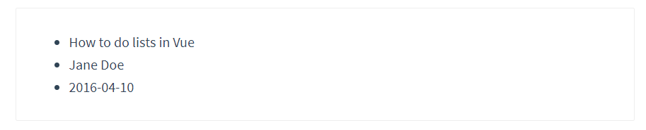

### 数组的更新

这些常见的数组操作方法都会正常的进行视图更新：

```js
push()
pop()
shift()
unshift()
splice()
sort()
reverse()
```

或者直接对数组进行重新赋值：

```js
实例.数组 = 新的数组
```

注意，以下两种情况都不会更新视图：

- 当你利用索引直接设置一个数组项时，例如：`vm.items[indexOfItem] = newValue`

- 当你修改数组的长度时，例如：`vm.items.length = newLength`
  - 了解即可

对于问题1，我们可以使用 Vue 中提供的 `Vue.set` 方法来解决。

```js
// Vue.set
// 参数1： 实例的数组
// 参数2：索引
// 参数3：你要修改的那个数据新值
Vue.set(vm.items, indexOfItem, newValue)
```


### 遍历对象

遍历值：

```html
<p v-for="value in user">{{ value }}</p>
```

带有值+属性名：

```html
<p v-for="(value, name) in user">{{ name }} -- {{ value }}</p>
```

遍历值+属性名+索引：

```html
<p v-for="(value, name, index) in user">{{ index }} -- {{ name }} -- {{ value }}</p>
```

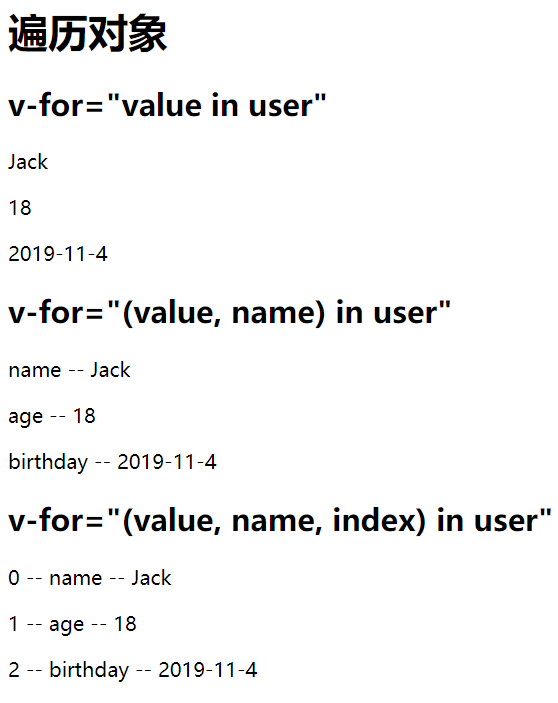

### 对象的更新

已知实例中 data 的数据：

```js
const app = new Vue({
  el: '#app',
  data: {
    message: 'Hello Vue.js!',
    user: {
      // 初始化了的都可以正常的更新
      name: 'Jack',
      age: 18,
      // 没有初始化的不能直接修改数据更新视图，例如 app.user.gender = '男'
    }
  }
})

```


常规方式修改对象数据更新视图：

```js
app.user.name = 'Rose' // 可以更新

app.user.gender = '女' // 不会更新，因为 gender 没有初始化

app.user = { name: 'Rose', age: 16, gender: '女' } // 可以更新
```

如果想要动态添加一个可以更新视图的对象成员数据：

```js
// 参数1：实例的数据对象
// 参数2：属性名（注意：属性名是一个字符串）
// 参数3：属性值
Vue.set(vm.userProfile, 'age', 27)
```

> 一个建议就是最好都把数据提前初始化好。

### v-for 和 key

例如我有这样一段代码：

```vue
<!DOCTYPE html>
<html lang="en">

<head>
  <meta charset="UTF-8">
  <title>vfor和key</title>
  <style></style>
  <!--  -->
</head>

<body>
  <div id="app">
    <h1>vfor和key</h1>
    <button @click="todos.reverse()">改变数组顺序</button>
    <ul>
      <!-- 不要使用 index，因为即便数据项的位置发生改变，但是索引不会变 -->
      <!-- 索引不变，也就意味着 key 的顺序没有改变，那么 Vue 就不会处理 -->
      <li
        v-for="(item, index) in todos">
        {{ item.title }}
        <input type="text">
      </li>
    </ul>
  </div>
  <script src="https://cdn.jsdelivr.net/npm/vue@2.6.10/dist/vue.js"></script>
  <script>
    const app = new Vue({
      el: '#app',
      data: {
        todos: [
          { id: 1, title: '吃饭' },
          { id: 2, title: '睡觉' },
          { id: 3, title: '打豆豆' }
        ]
      },
      methods: {
      }
    })
  </script>
</body>

</html>

```

效果如下：

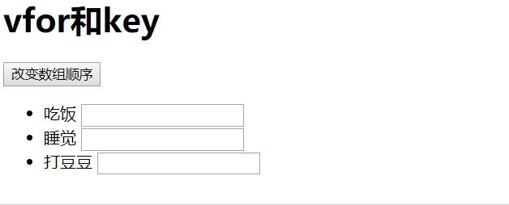

修改代码如下：

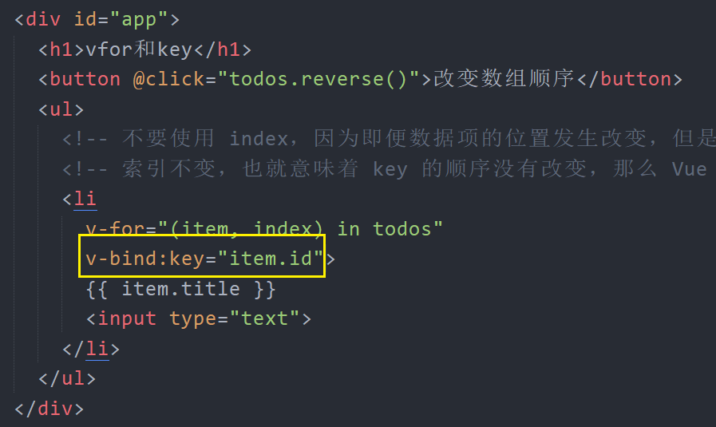

结果演示：


总结：

> 官方文档说明：[https://cn.vuejs.org/v2/guide/list.html#%E7%BB%B4%E6%8A%A4%E7%8A%B6%E6%80%81](https://cn.vuejs.org/v2/guide/list.html#维护状态)

当 Vue 正在更新使用 `v-for` 渲染的元素列表时，它默认使用“就地更新”的策略。如果数据项的顺序被改变，Vue 将不会移动 DOM 元素来匹配数据项的顺序，而是就地更新每个元素，并且确保它们在每个索引位置正确渲染。这个类似 Vue 1.x 的 `track-by="$index"`。

这个默认的模式是高效的，但是**只适用于不依赖子组件状态或临时 DOM 状态 (例如：表单输入值) 的列表渲染输出**。

为了给 Vue 一个提示，以便它能跟踪每个节点的身份，从而重用和重新排序现有元素，你需要为每项提供一个唯一 `key` 属性：

```
<div v-for="item in items" v-bind:key="item.id">
  <!-- 内容 -->
</div>
```

建议尽可能在使用 `v-for` 时提供 `key` attribute，除非遍历输出的 DOM 内容非常简单，或者是刻意依赖默认行为以获取性能上的提升。

因为它是 Vue 识别节点的一个通用机制，`key` 并不仅与 `v-for` 特别关联。后面我们将在指南中看到，它还具有其它用途。

> 注意：
>
> - 不要使用对象或数组之类的非基本类型值作为 `v-for` 的 `key`。请用字符串或数值类型的值。
> - 不要使用遍历索引 index 作为唯一的 key 值，会有问题
> - 一般使用数据中能表示唯一的那个字段，例如id

### 值范围遍历

`v-for` 也可以接受整数。在这种情况下，它会把模板重复对应次数。

```html
<div>
  <span v-for="n in 10">{{ n }} </span>
</div>
```

结果：

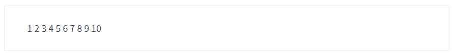

### 在 template 上使用 v-for

当需要遍历多个元素而又不想增加额外的元素节点的时候，可以结合 Vue 中提供的 `template` 遍历渲染：

```html
<ul>
  <template v-for="item in items">
    <li>{{ item.msg }}</li>
    <li class="divider" role="presentation"></li>
  </template>
</ul>
```


## 条件渲染

### v-if

根据绑定数据的真假来决定是否渲染这个元素：

```html
<h1 v-if="awesome">Vue is awesome!</h1>
```

### v-else、v-else-if

也可以结合 `v-else` 进行判定：


### v-show

### v-if 和 v-show 区别

- v-if 条件渲染，如果条件为  false，则不渲染元素
  - true 渲染 DOM
  - false 不渲染 DOM
- v-show 条件显示，无论条件的真假始终都渲染元素
  - true 渲染 DOM
  - false 渲染 DOM，不显示（display: none）
  - 不能和 v-else、v-else-if 结合使用

> 一般来说，`v-if` 有更高的切换开销，而 `v-show` 有更高的初始渲染开销。因此，如果需要非常频繁地切换，则使用 `v-show` 较好；如果在运行时条件很少改变，则使用 `v-if` 较好。

### v-if 和 template

当你想要控制多个同级元素的渲染的时候而又不想增加额外的节点，可以结合 template，最终渲染结果中不会包含 template 元素：

```html
<template v-if="seen">
  <p>hello1</p>
  <p>hello2</p>
</template>
```


**注意：在 template 上使用 v-show 无效。**

## 事件处理

### 基本语法

```html
<!DOCTYPE html>
<html lang="en">
<head>
  <meta charset="UTF-8">
  <title>Document</title>
</head>
<body>
  <div id="app">
    <h1>{{ message }}</h1>
    <!-- 
      v-on:事件名称="处理函数"
      onclick
      事件名称就使用原生的那个事件名称。
     -->
    <button v-on:click="onClick">测试</button>

    <!-- 技巧：原生的怎么写，只需要把 on 替换为 v-on: -->
    <!-- <input type="text" v-on:keydown=""> -->
    <!-- <input type="text" v-on:keyup=""> -->

    <!-- 
      v-on 可以简写
      提示：在 Vue 中，有且之后 v-bind 和 v-on 有简写，其它都没有
        v-bind :
        v-on   @
     -->
    <!-- <input type="text" @keydown=""> -->
    <!-- <input type="text" @keyup=""> -->
  </div>
  <script src="node_modules/vue/dist/vue.js"></script>
  <script>
    const app = new Vue({
      el: '#app',
      data: {
        message: 'Hello Vue.js!'
      },
      /**
       * 实例选项 methods，存储模板中使用的方法
       */
      methods: {
        // ECMAScript 6 简写方式
        // 等价于 onClick: function () {}
        // 注意：仅仅是简写而已，和箭头函数没关系
        onClick () {
          window.alert('hello')
        }
      }
    })
  </script>
</body>
</html>

```

### 处理函数中的 this

```html
<!DOCTYPE html>
<html lang="en">
<head>
  <meta charset="UTF-8">
  <title>Document</title>
</head>
<body>
  <div id="app">
    <h1>{{ message }}</h1>
    <button @click="onClick">测试</button>
    <button @click="onClick2">测试2</button>
  </div>
  <script src="node_modules/vue/dist/vue.js"></script>
  <script>
    const app = new Vue({
      el: '#app',
      data: {
        message: 'Hello Vue.js!'
      },
      methods: {
        onClick () {
          // 事件处理函数中的 this 指向的是 Vue 实例对象，也就是 app
          // 注意：事件处理函数不能使用箭头函数定义
          console.log(this === app)

          this.message = 'hello'
        },

        // 注意：箭头函数定义的 methods 其中的 this 指向的是 window
        // 除非你不需要在函数中访问 Vue 实例 this，你可以定义箭头函数
        // 何必呢？
        onClick2: () => {
          console.log(this)
        }
      }
    })
  </script>
</body>
</html>

```


### 模板中简写

```html
<!DOCTYPE html>
<html lang="en">
<head>
  <meta charset="UTF-8">
  <title>Document</title>
</head>
<body>
  <div id="app">
    <h1>{{ message }}</h1>
    <button @click="onClick">测试</button>

    <!-- 
      当处理函数只有一句代码的时候，我们可以直接写到模板中
      注意：这里不需要加 this
     -->
    <button @click="message = 'hello'">测试</button>
  </div>
  <script src="node_modules/vue/dist/vue.js"></script>
  <script>
    const app = new Vue({
      el: '#app',
      data: {
        message: 'Hello Vue.js!'
      },
      methods: {
        onClick () {
          this.message = 'hello'
        }
      }
    })
  </script>
</body>
</html>

```


### 自定义传参

```html
<!DOCTYPE html>
<html lang="en">
<head>
  <meta charset="UTF-8">
  <title>Document</title>
</head>
<body>
  <div id="app">
    <h1>{{ message }}</h1>
    <ul>
      <!-- 
        没有参数，就直接  @click="onShow"
        有参数，就调用传参 @click="onShow(item.title)"
       -->
      <li
        v-for="item in todos"
        :key="item.id"
        @click="onShow(item.title)"
      >
        {{ item.title }}
      </li>
    </ul>
  </div>
  <script src="node_modules/vue/dist/vue.js"></script>
  <script>
    const app = new Vue({
      el: '#app',
      data: {
        message: 'Hello Vue.js!',
        todos: [
          { id: 1, shenfenzheng: 'dnsjadl', title: '吃饭1' },
          { id: 2, shenfenzheng: '123', title: '吃饭2' },
          { id: 3, shenfenzheng: 'dnsandlksa', title: '吃饭3' },
          { id: 4, shenfenzheng: 'dsnaklndlksa', title: '吃饭4' }
        ]
      },

      methods: {
        onShow (title) {
          window.alert(title)
        }
      }
    })
  </script>
</body>
</html>

```

### 函数的默认参数 event

```html

```

### 事件修饰符

### 按键修饰符

### 系统修饰符

## Vue DevTools

在使用 Vue 时，我们推荐在你的浏览器上安装 [Vue Devtools](https://github.com/vuejs/vue-devtools#vue-devtools)。它允许你在一个更友好的界面中审查和调试 Vue 应用。 


### 下载

- Google Chrome 应用商店（需要梯子）

### 安装

1、解压安装包

2、浏览器右上角选择依次找到：更多工具 -> 扩展程序

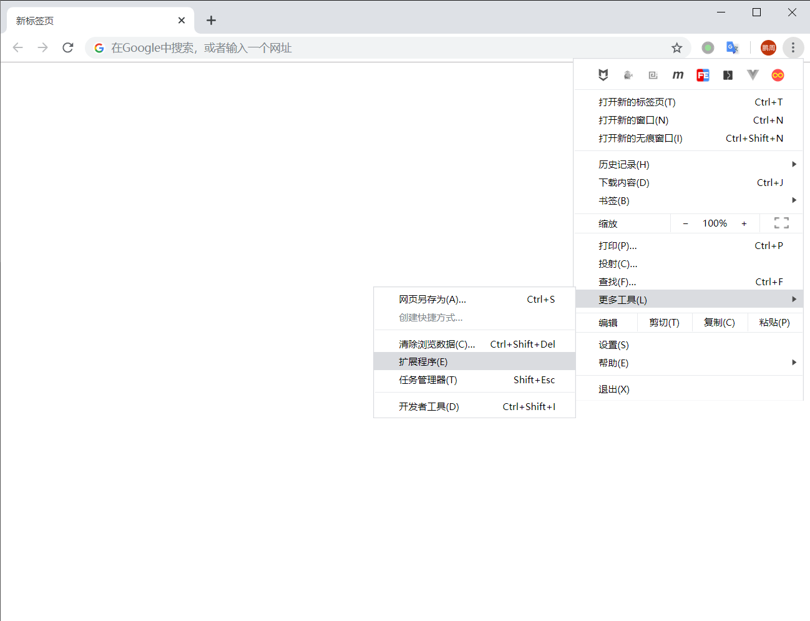

3、启用开发者模式

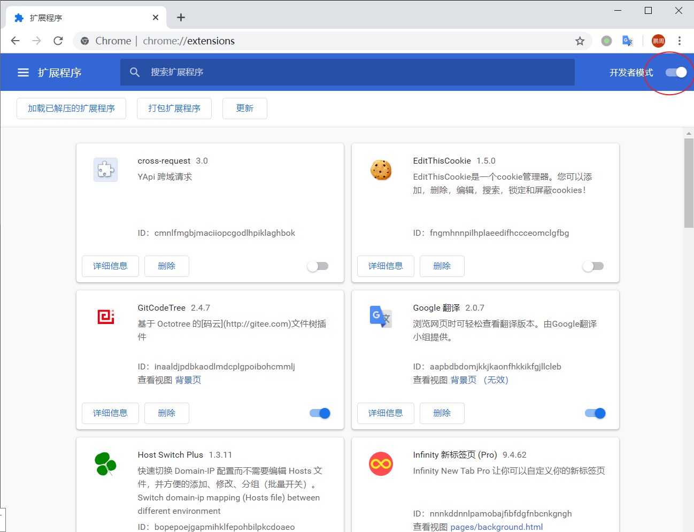

4、加载已解压的扩展程序

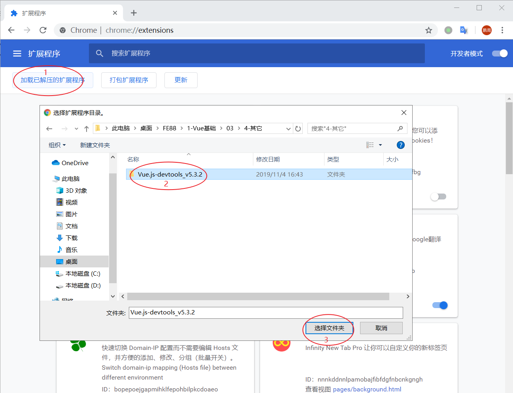

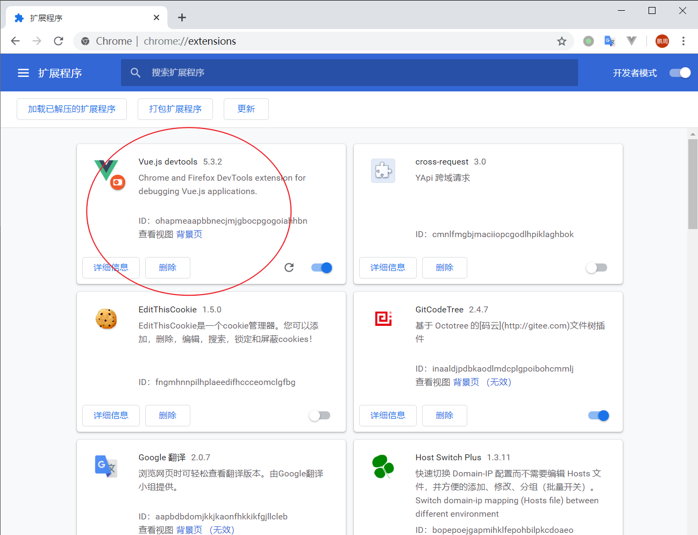

5、打开插件的详细信息，启用**允许访问文件网址**

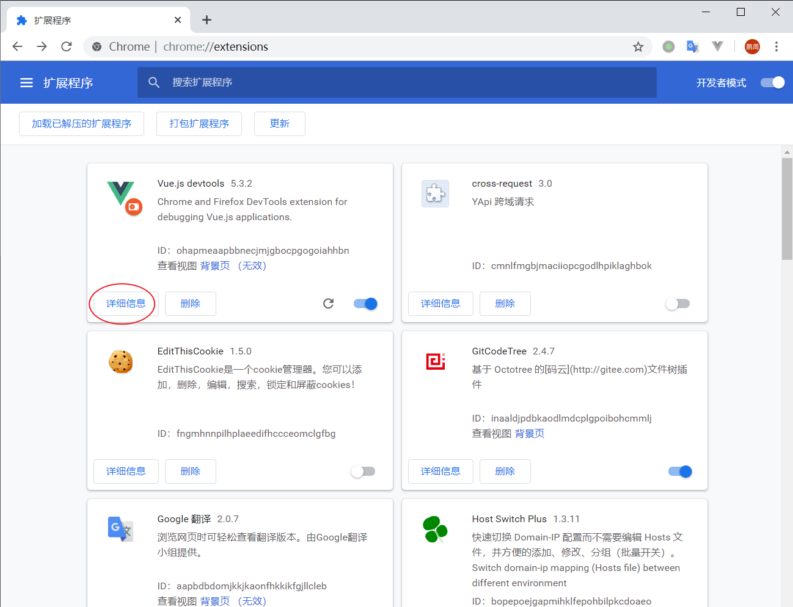

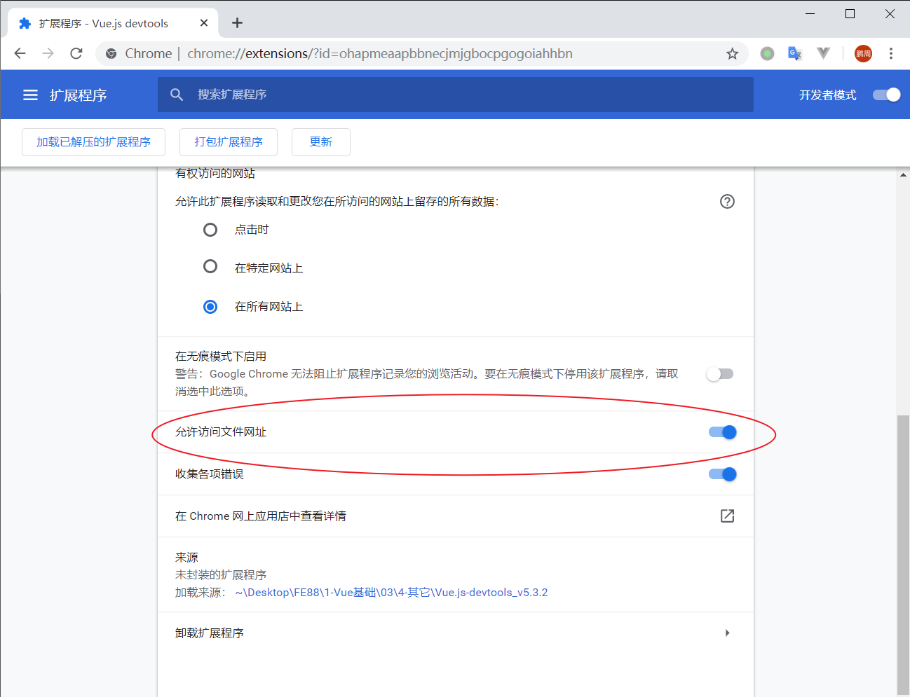

> Vue DevTools 插件默认只能工作在 http 协议网址下。
>
> 如果想要它工作在 file:// 本地文件地址协议下，就必须手动启用它。

### 使用

1、在浏览器中打开开发者工具

2、在开发者工具面板中找到 Vue

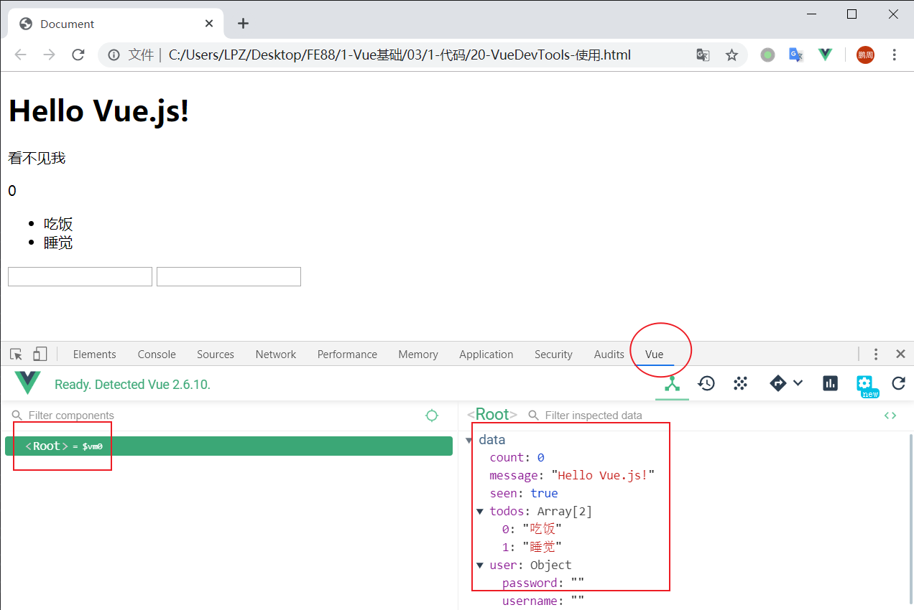

> 注意：
>
> - 必须在使用 `Vue` 的网页中才能看到这个调试工具（不能说打开百度去查看这个工具，那不行）
> - 另外页面中只有加载 `vue.js` 才能使调试工具正常工作，使用 `vue.min.js` 不行

## 表单输入绑定

### 文本框

```html
<input v-model="message" placeholder="edit me">
<p>Message is: {{ message }}</p>
```

### 多行文本框

```html
<span>Multiline message is:</span>
<p style="white-space: pre-line;">{{ message }}</p>
<br>
<textarea v-model="message" placeholder="add multiple lines"></textarea>
```


### 复选框

单个复选框，绑定到布尔值：

```html
<input type="checkbox" id="checkbox" v-model="checked">
<label for="checkbox">{{ checked }}</label>
```

多个复选框，绑定到同一个数组：

```html
<div id='example-3'>
  <input type="checkbox" id="jack" value="Jack" v-model="checkedNames">
  <label for="jack">Jack</label>
  <input type="checkbox" id="john" value="John" v-model="checkedNames">
  <label for="john">John</label>
  <input type="checkbox" id="mike" value="Mike" v-model="checkedNames">
  <label for="mike">Mike</label>
  <br>
  <span>Checked names: {{ checkedNames }}</span>
</div>
```

```js
new Vue({
  el: '#example-3',
  data: {
    checkedNames: []
  }
})
```


### 单选框

```html
<div id="example-4">
  <input type="radio" id="one" value="One" v-model="picked">
  <label for="one">One</label>
  <br>
  <input type="radio" id="two" value="Two" v-model="picked">
  <label for="two">Two</label>
  <br>
  <span>Picked: {{ picked }}</span>
</div>
```

```js
new Vue({
  el: '#example-4',
  data: {
    picked: ''
  }
})
```

### 下拉列表

单选：

```html
<div id="example-5">
  <select v-model="selected">
    <option disabled value="">请选择</option>
    <option>A</option>
    <option>B</option>
    <option>C</option>
  </select>
  <span>Selected: {{ selected }}</span>
</div>
```

```js
new Vue({
  el: '...',
  data: {
    selected: ''
  }
})
```

多选（绑定到一个数组）：

```html
<div id="example-6">
  <select v-model="selected" multiple style="width: 50px;">
    <option>A</option>
    <option>B</option>
    <option>C</option>
  </select>
  <br>
  <span>Selected: {{ selected }}</span>
</div>
```

```js
new Vue({
  el: '#example-6',
  data: {
    selected: []
  }
})
```


## 样式处理

### Class 类名

 我们可以传给 `v-bind:class` 一个对象，以动态地切换 class： 

```html
<div v-bind:class="{ active: isActive }"></div>
```

 上面的语法表示 `active` 这个 class 存在与否将取决于数据属性 `isActive` 的真假：

-  true，作用类名
- false，去除类名


### Style 行内样式


## 计算属性

模板内的表达式非常便利，但是设计它们的初衷是用于简单运算的。在模板中放入太多的逻辑会让模板过重且难以维护。例如： 

```html
<div id="example">
  {{ message.split('').reverse().join('') }}
</div>
```

 在这个地方，模板不再是简单的声明式逻辑。你必须看一段时间才能意识到，这里是想要显示变量 `message` 的翻转字符串。当你想要在模板中多次引用此处的翻转字符串时，就会更加难以处理。 

- 使用方法
- 使用计算属性

所以，对于任何复杂逻辑，你都应当使用**计算属性**。 

### 基本使用

### 计算属性 vs 方法

我们可以将同一函数定义为一个方法而不是一个计算属性。两种方式的最终结果确实是完全相同的。然而，不同的是：

- **计算属性是基于它们的响应式依赖进行缓存的**。只在相关响应式依赖发生改变时它们才会重新求值。 
- 相比之下，每当触发重新渲染时，调用方法将**总会**再次执行函数

## 侦听器（watch监视）

> 暂时了解语法即可，具体在后面的案例业务需求中使用体会。

Vue 提供了可以自定义监视数据变化的功能：watch 监视，当监视到数据变化之后执行一些需要的业务逻辑。

```js
const app = new Vue({
  data: {
    count: 0
  },
  
  watch: {
    // 属性名：要监视的数据成员（必须是已存在的数据）
    // 属性值：处理函数
    //   参数1：变化之后的最新数据
    //   参数2：变化之前的旧的数据
    // 作用：当被监视数据成员发生变化的时候，它会自动调用处理函数
    // 注意：监视的一个功能特性，不是 data、methods、computed 之类的数据，不能用于模板绑定
    count (newVal, oldVal) {
      console.log(newVal, oldVal)
    }
  }
})

app.count = 1 // 监视到数据变化，输出：1, 0
app.count++ // 监视到数据变化，输出：2, 1
```


## 使用总结

- Vue 最大程度上解放了传统 JavaScript 中繁琐的 DOM 操作
- 让开发人员更专注于业务操作
- 通过简洁的指令结合页面结构与逻辑数据
- 通过组件化方便模板重用以及增加可维护性
- 代码结构更合理
- 维护成本更低
