# 二、基础案例


> 学习目标：
>
> - 掌握 Vue.js 基础语法

案例基本会涵盖到以下内容知识点：

- 数据绑定
- 计算属性 computed
- 侦听器 watch
- Class 与 Style 样式处理
- 条件渲染
- 列表渲染
- 事件处理
- 表单输入绑定
- 。。。

## 案例介绍

- [TodoMVC 官网](http://todomvc.com/)

- 对比在线完整版查看需求： http://todomvc.com/examples/vue/ 

## 准备

### 下载模板

```bash
# 使用 Git 把模板下载到本地
$ git clone https://github.com/tastejs/todomvc-app-template.git

# 切换到 todomvc-vue 目录中，安装依赖项
cd 下载的项目中

# 模板项目把样式等文件放到了第三方包里面了，所以我们要执行 npm install 安装它的那些依赖项才能正常的预览到这个项目页面
npm install
```

安装完成，打开 index.html 预览模板。

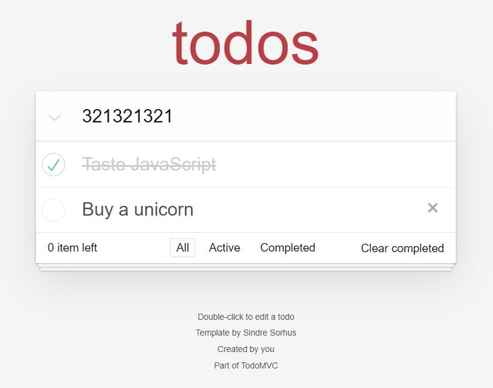

### 导入 Vue

1、安装 Vue 到项目中

```bash
$ npm i vue
```

2、在页面中引入 vue.js 脚本文件

3、在 `js/app.js` 中

```js
new Vue({
  el: '#app',
  data: {
    foo: 'bar'
  },
  methods: {}
})
```

## 需求说明

- [x] 任务列表
  - [x] 有数据的时候
  - [x] 没有数据的时候
- [x] 添加任务
  - [x] 添加任务到列表中
  - [x] 清空文本框
- [x] 删除单个任务项
- [x] 切换单个任务的完成状态
- [x] 删除所有已完成任务
  - [x] 处理它的显示状态
  - [x] 删除功能
- [x] 切换所有任务的完成状态（全选功能）
  - [x] 切换
  - [x] 受子元素影响
- [x] 显示所有未完成任务的数量
- [ ] 数据筛选
  - [ ] 展示所有任务
  - [ ] 展示已完成任务
  - [ ] 展示未完成所有
  - [ ] 刷新页面保持筛选状态
- [ ] 数据持久化
  - [ ] 这里没有后端接口，我们可以使用本地存储简单处理一下
- [x] 编辑任务
  - [x] 双击获取编辑状态
  - [x] 回车保存
  - [x] ESC 取消

## 任务列表

```html
<li class="completed" v-for="item in todos">
  <div class="view">
    <input class="toggle" type="checkbox" checked />
    <label>{{ item.title }}</label>
    <button class="destroy"></button>
  </div>
  <input class="edit" value="Create a TodoMVC template" />
</li>
```

状态处理

```html
<li :class="{ completed: item.completed }" v-for="item in todos">
  <div class="view">
    <input class="toggle" type="checkbox" v-model="item.completed" />
    <label>{{ item.title }}</label>
    <button class="destroy"></button>
  </div>
  <input class="edit" value="Create a TodoMVC template" />
</li>
```

没有数据的时候隐藏内容区域

```html
<template v-if="todos.length > 0">
  <!-- This section should be hidden by default and shown when there are todos -->
  <section class="main">
    <input id="toggle-all" class="toggle-all" type="checkbox" />
    <label for="toggle-all">Mark all as complete</label>
    <ul class="todo-list">
      <!-- These are here just to show the structure of the list items -->
      <!-- List items should get the class `editing` when editing and `completed` when marked as completed -->
      <!--
              任务项
                completed 已完成
                editing 编辑中
                空     未完成
             -->

      <li :class="{ completed: item.completed }" v-for="item in todos">
        <div class="view">
          <input class="toggle" type="checkbox" v-model="item.completed" />
          <label>{{ item.title }}</label>
          <button class="destroy"></button>
        </div>
        <input class="edit" value="Create a TodoMVC template" />
      </li>
      <!-- <li>
              <div class="view">
                <input class="toggle" type="checkbox">
                <label>Buy a unicorn</label>
                <button class="destroy"></button>
              </div>
              <input class="edit" value="Rule the web">
            </li> -->
    </ul>
  </section>
  <!-- This footer should hidden by default and shown when there are todos -->
  <footer class="footer">
    <!-- This should be `0 items left` by default -->
    <span class="todo-count"><strong>0</strong> item left</span>
    <!-- Remove this if you don't implement routing -->
    <ul class="filters">
      <li>
        <a class="selected" href="#/">All</a>
      </li>
      <li>
        <a href="#/active">Active</a>
      </li>
      <li>
        <a href="#/completed">Completed</a>
      </li>
    </ul>
    <!-- Hidden if no completed items are left ↓ -->
    <button class="clear-completed">Clear completed</button>
  </footer>
</template>
```

```html {2,15}
...
<template v-if="todos.length > 0">
  <section class="main">
    <input
      id="toggle-all"
      class="toggle-all"
      type="checkbox"
      v-bind:checked="getToggleAllStatus()"
      @change="handleToggleAll"
    />
    <label for="toggle-all">Mark all as complete</label>
    <ul class="todo-list">
      <!-- These are here just to show the structure of the list items -->
      <!-- List items should get the class `editing` when editing and `completed` when marked as completed -->
      <li v-for="(item, index) in todos" v-bind:class="{completed: item.done}">
        <div class="view">
          <input class="toggle" type="checkbox" v-model="item.done" />
          <label>{{ item.title }}</label>
          <button @click="handleRemoveTodo(index)" class="destroy"></button>
        </div>
        <input class="edit" value="Rule the web" />
      </li>
    </ul>
  </section>
  <!-- This footer should hidden by default and shown when there are todos -->
  <footer class="footer">
    <!-- This should be `0 items left` by default -->
    <span class="todo-count"><strong>0</strong> item left</span>
    <!-- Remove this if you don't implement routing -->
    <ul class="filters">
      <li>
        <a class="selected" href="#/">All</a>
      </li>
      <li>
        <a href="#/active">Active</a>
      </li>
      <li>
        <a href="#/completed">Completed</a>
      </li>
    </ul>
    <!-- Hidden if no completed items are left ↓ -->
    <button class="clear-completed">Clear completed</button>
  </footer>
</template>
...
```

## 添加任务

1、首先在模板中给输入框绑定按键回车事件

```html
...
<input
	class="new-todo"
	placeholder="What needs to be done?"
	autofocus
+	v-model="inputTitle"
+	@keydown.enter="onAdd"
>
...
```

2、然后在 JavaScript 中

```js
new Vue({
	el: '#app',
	data: {
+		inputTitle: '', // 用户输入的任务名称
		todos: [
			{ id: 1, title: '吃饭', done: false },
			{ id: 2, title: '睡觉', done: true },
			// { id: 3, title: '打豆豆', done: false },
			{ id: 4, title: '跑步', done: true }
		]
	},

	methods: {
+++		onAdd () {
			// 1. 得到文本框的数据
			const inputTitle = this.inputTitle.trim()

			// 2. 非空校验
			// if (inputTitle.length === 0) {
			if (!inputTitle.length) {
				return
			}

			// 3. 如果没问题，把数据添加到任务列表中
			this.todos.push({
				id: Math.random(),
				title: inputTitle,
				done: false
			})

			// 4. 清空文本框
			this.inputTitle = ''
		}
	}
})

```

## 删除单个任务

1、在视图模板中注册事件

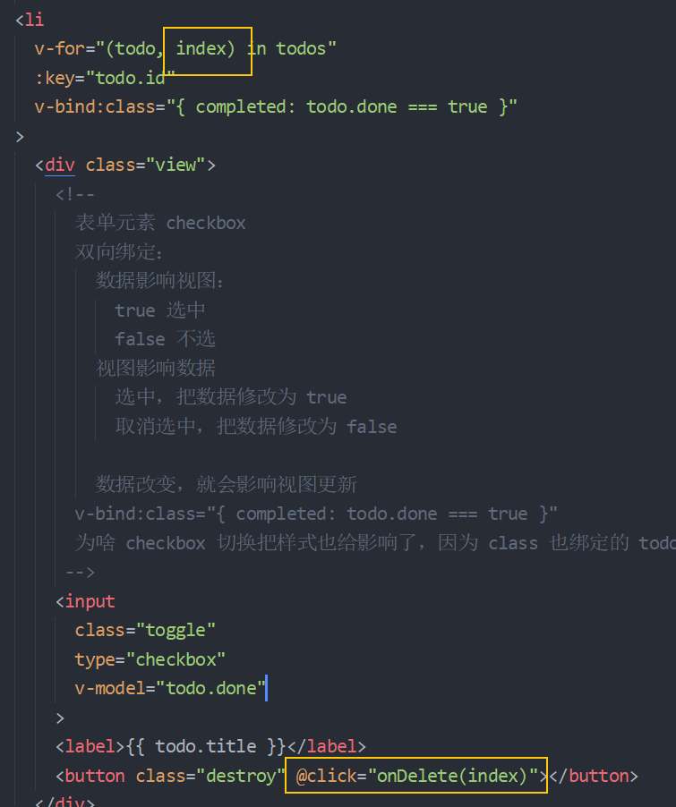

2、在 JavaScript 中添加一个 methods 成员

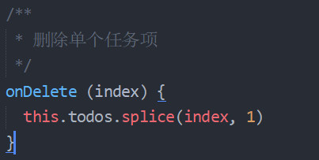

### 数组的 splice 方法

```js
const arr = [1, 2, 3, 4, 5]

// arr.splice(1) // 从指定索引开始（包括索引本身）一直删到最后

// arr.splice(1, 2) // 从指定索引开始（包括索引本身），删除指定的个数

// arr.splice(1, 2, 3) // 从索引1开始，删除2个，替换为 3

// arr.splice(1, 2, 3, 4, 5, 6) // 从索引1开始，删除2个，替换为 3, 4, 5, 6

说白了从第3个参数开始都是要替换的参数
```


## 删除所有已完成任务

### 处理显示状态

1、在模板中

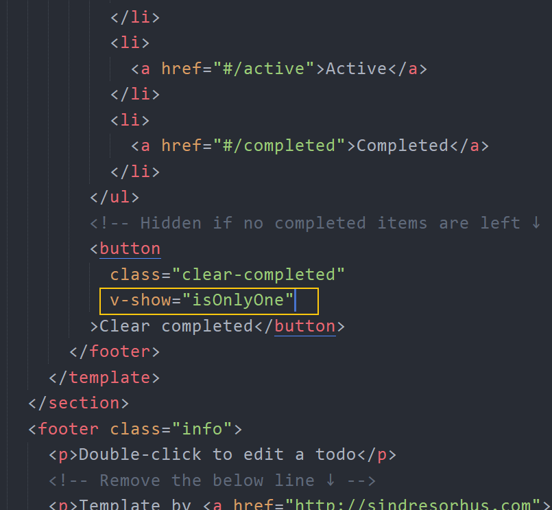

2、添加一个计算属性


### 删除

1、在模板中

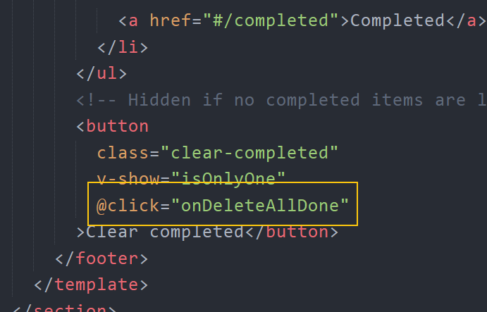

2、然后添加一个 methods 方法

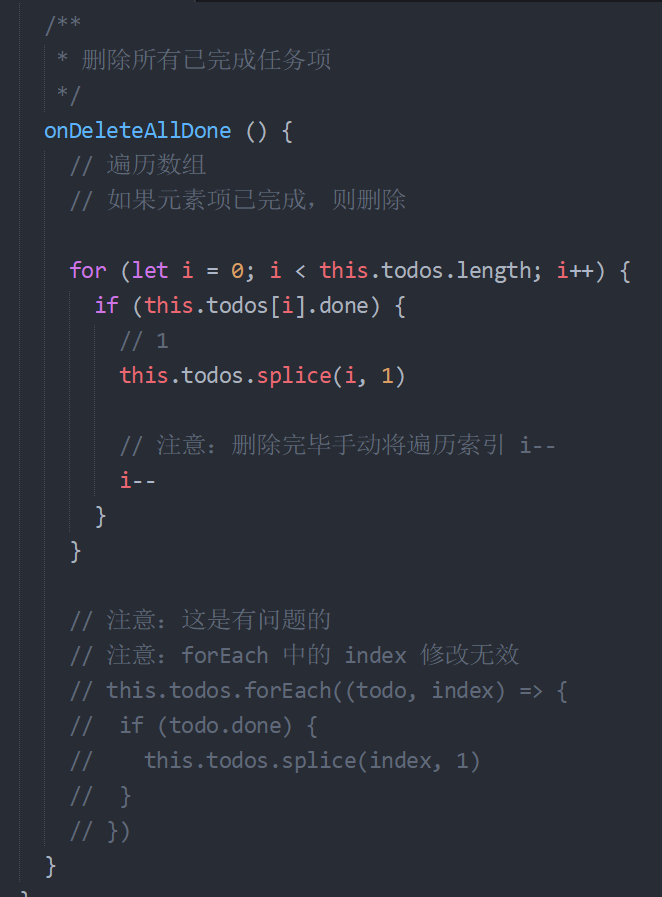

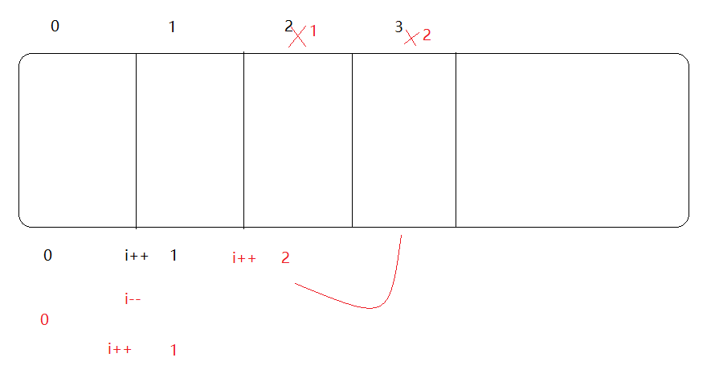

## 显示所有剩余未完成任务数

1、在模板中

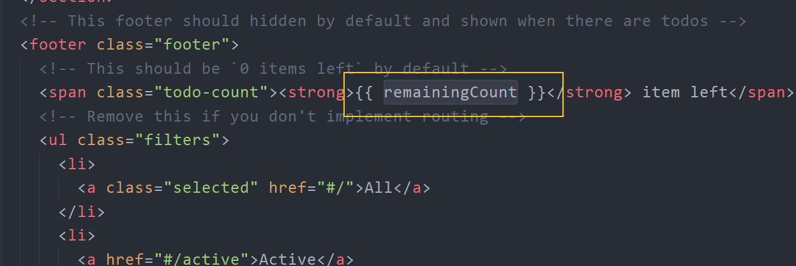

2、然后添加一个 computed 计算属性

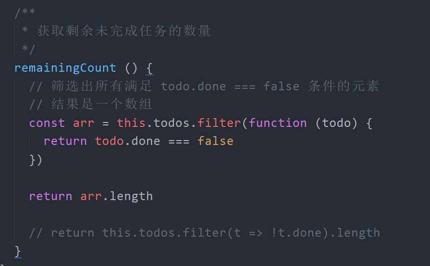

## 切换所有任务的完成状态（全选）

### 切换所有

1、在模板中

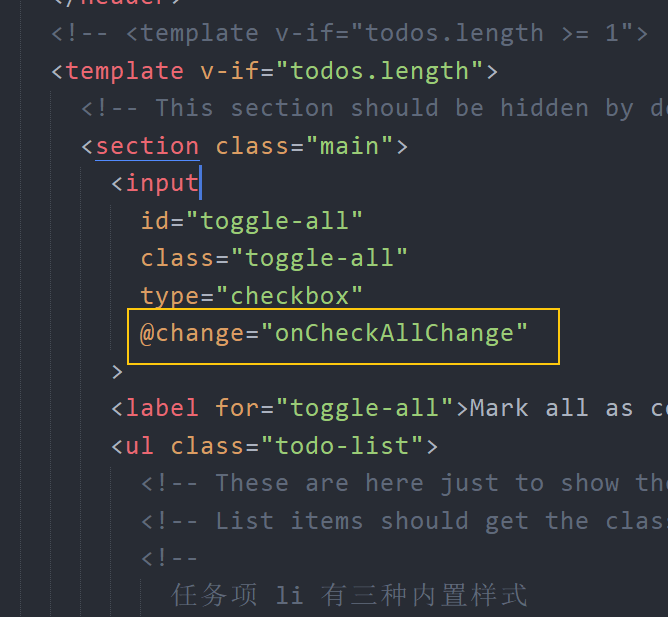

2、添加一个 methods 处理函数

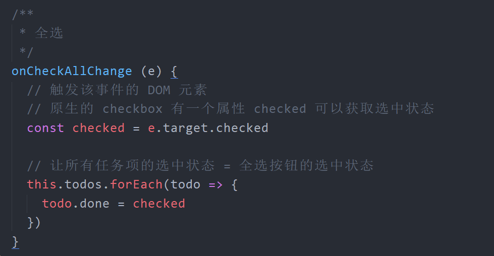

### 让其受子元素的完成状态影响

1、在模板中绑定一个计算属性

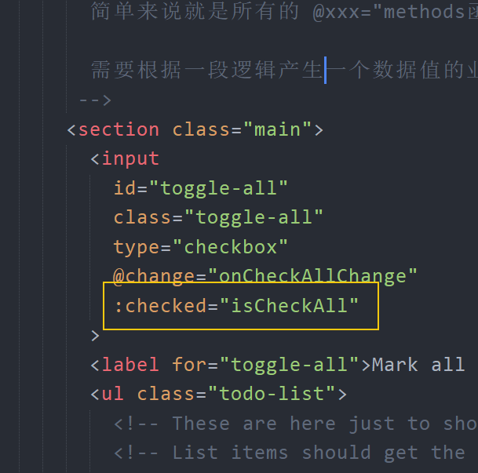

2、然后添加一个计算属性

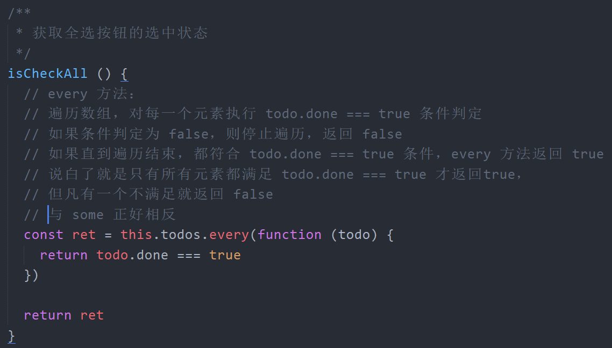

## 编辑任务

### 双击获得编辑状态

思路：

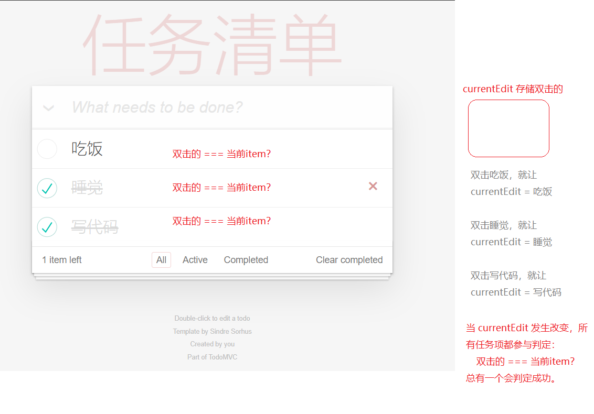


1、在模板中

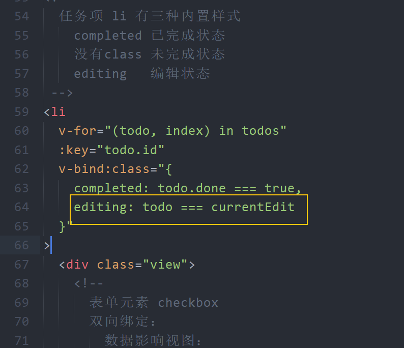

2、添加一个 data 数据

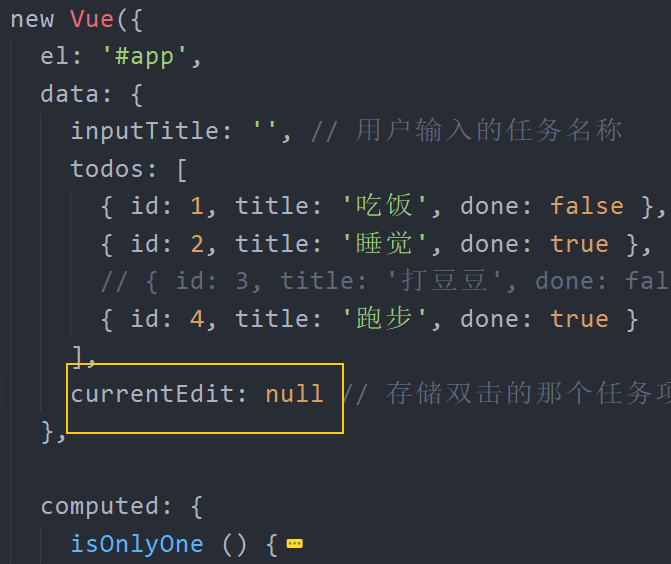

3、当双击任务项的时候，把双击的任务项存储给 `currentEdit`

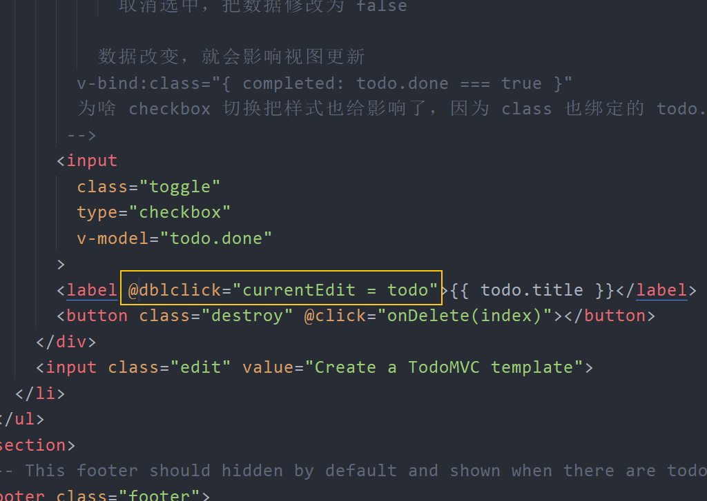


### 回车保存

1、在模板中

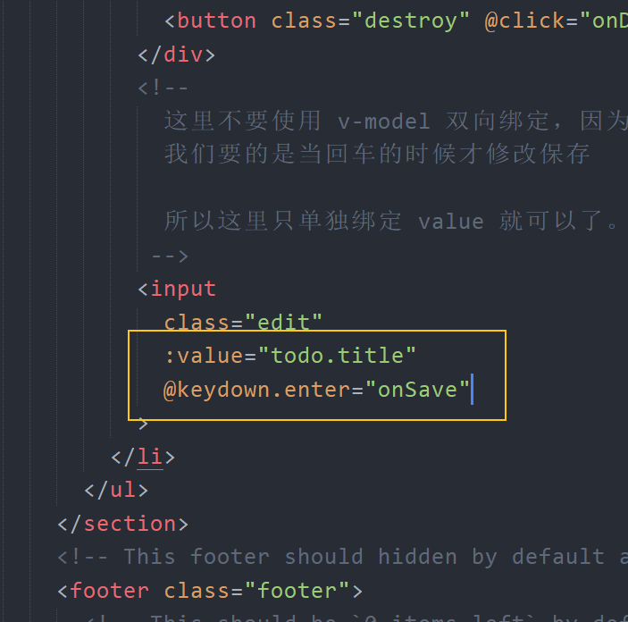

2、添加一个 methods 处理函数

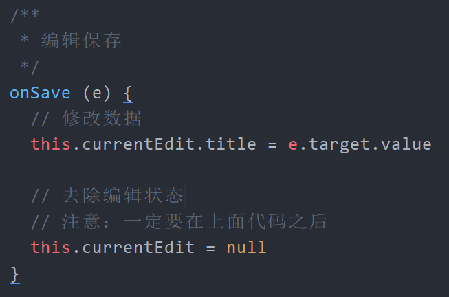

### ESC取消编辑

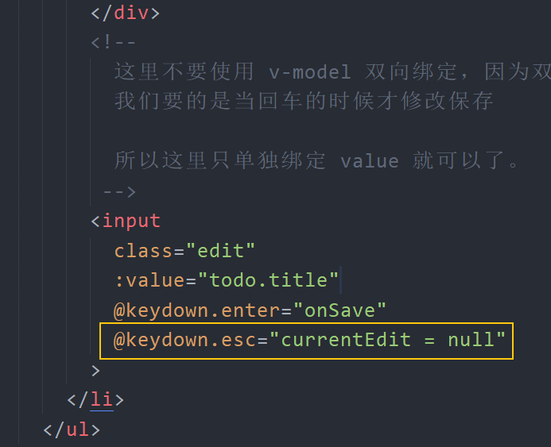

## 数据过滤（自行参考源码学习）

> 原版代码： https://github.com/tastejs/todomvc/tree/gh-pages/examples/vue 

## 持久化存储

