# 三、和服务端通信

## 概述

Vue 不像 jQuery 内置了 ajax 请求函数，在 Vue 中没有提供这样的功能。所以当我们需要在 Vue 中和服务端进行通信的时候可选择的方式会更灵活一些。

> 注意：Vue 不提供的原因是为了让 Vue 本身更专注于视图部分，保持其渐进灵活的特性。

所以 Vue 给了我们更多的选择空间，例如我们可以使用下面的可选方案：

- 原生的 [XMLHttpRequest](https://developer.mozilla.org/zh-CN/docs/Web/API/XMLHttpRequest)
- 原生的 [Fetch](https://developer.mozilla.org/zh-CN/docs/Web/API/Fetch_API/Using_Fetch)
- 也可以结合使用 jQuery 自带的 [Ajax](http://api.jquery.com/category/ajax/) 请求函数
- 早期大家开发 Vue 应用喜欢使用一个第三方插件：[Vue Resource](https://github.com/pagekit/vue-resource)
- 目前主流的方案是使用社区中知名的第三方库 [axios](https://github.com/axios/axios)
- ...

## JSON Server

- JSON Server 是一个提供测试环境接口的工具，它可以帮我们快速生成一套接口服务，专门用于学习测试。

- 它是免费开源的命令行工具

### 安装并启动服务

1、首先，安装：

```bash
npm install -g json-server

# 该命令用于测试是否安装成功，如果看到一个版本输出，就证明OK了
json-server --version
```


2、创建一个目录 `json-server-demo`，然后在该目录中创建一个文件 `db.json` 并写入以下内容：

```json
{
  "posts": [
    { "id": 1, "title": "json-server", "author": "typicode" }
  ],
  "comments": [
    { "id": 1, "body": "some comment", "postId": 1 }
  ],
  "profile": { "name": "typicode" },
  "users": [
    {
      "id": 1,
      "name": "张三",
      "age": 18,
      "gender": "男"
    }
  ]
}

```

3、最后，在命令行中进入 `db.json` 文件所属目录，执行

```bash
json-server --watch db.json
```

如果成功，你将看到以下输入

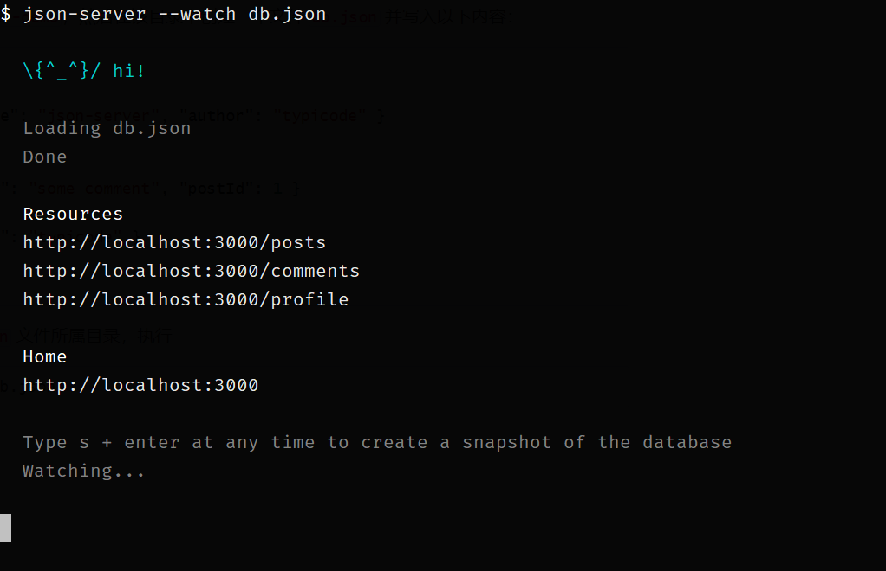

> 接口服务默认占用 3000 端口


### 获取用户列表

- 请求方法：`GET`
- 请求路径 `/users`
- 请求参数
- 响应数据 一个数组，用户列表

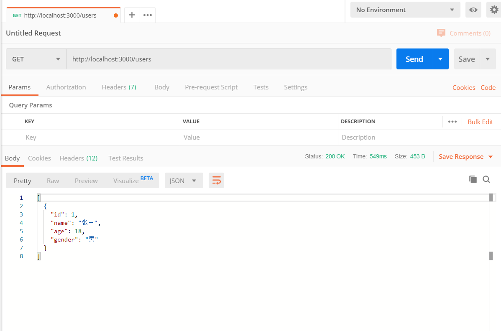

### 获取指定条件的数据

- 请求方法：`GET`
- 请求路径 `/users`
- 请求参数

Query （查询字符串）参数：

- name 姓名
- age 年龄
- gender 性别

示例：

```
http://localhost:3000/users?name=张三丰

http://localhost:3000/users?age=18

http://localhost:3000/users?age=18&name=李四二
```


- 响应数据 一个数组，查询结果


### 添加用户

- 请求方法：`POST`
- 请求路径 `/users`
- 请求参数

```json
{
  "name": 姓名,
  "age": 年龄,
  "gender": 性别
}
```


- 响应数据

```
新增的用户信息
```

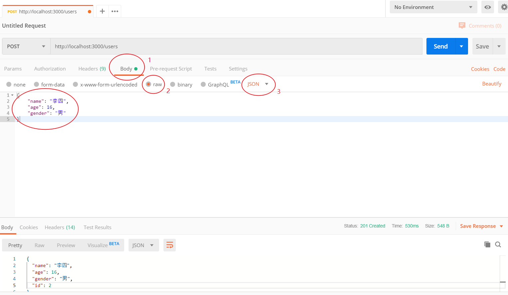

> 注意：请求体数据必须是 JSON 格式字符串

### 删除用户

- 请求方法：`DELETE`
- 请求路径 `/users/用户id`
  - 例如删除id为3的用户：`http://localhost:3000/users/3`
- 请求参数
- 响应数据

```
{}
```

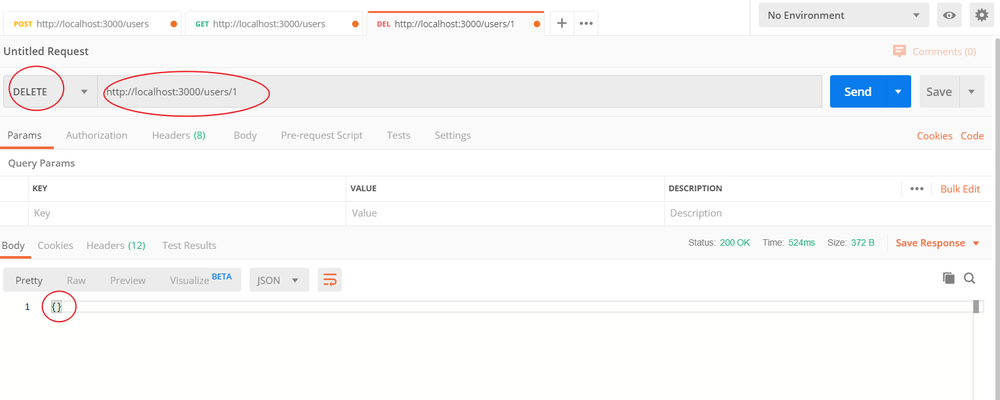

### 修改用户

- 请求方法：`PATCH`
- 请求路径 `/users/用户id`
  - 例如修改id为3的用户：`http://localhost:3000/users/3`
- 请求参数

Body 请求体数据：

```json
{
  "name": 名称,
  "age": 年龄,
  "gender": 性别
}
```

> 注意：name、age、gender 都是可选的，修改谁就传谁

- 响应数据（修改之后的用户的完整信息）

```
{
  "name": "李四二",
  "age": 18,
  "gender": "男",
  "id": 2
}
```

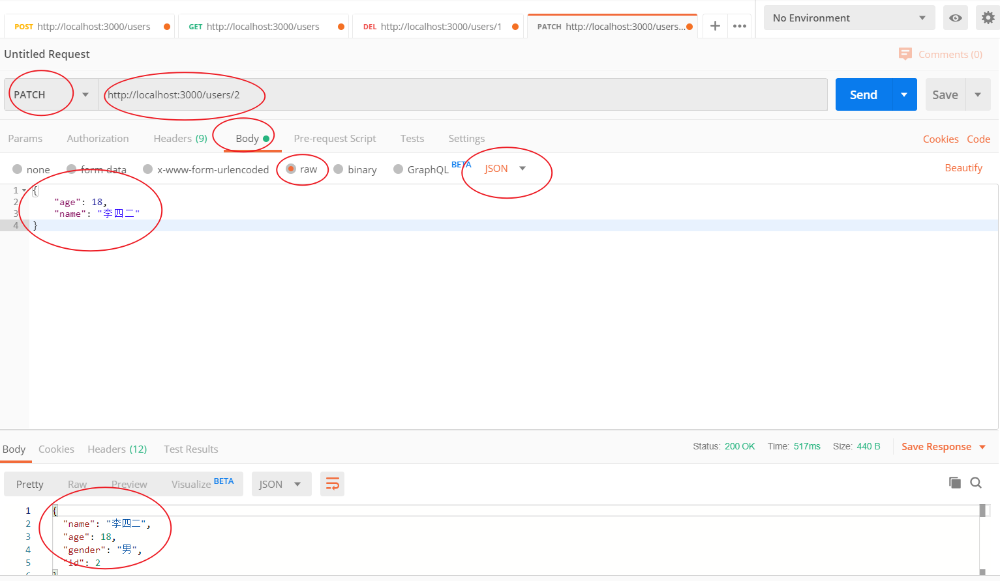

## axios 介绍

[axios](https://github.com/axios/axios) 是一个基于 Promise 的第三方 HTTP 客户端请求库，可以用于浏览器或者 Node.js。
axios 本身和 Vue 没有一毛钱关系，只是简单纯粹的封装了 HTTP 请求功能。可以运行在任何支持 JavaScript 环境的平台。

- 在浏览器端使用的是 [XMLHttpRequest](https://developer.mozilla.org/zh-CN/docs/Web/API/XMLHttpRequest)
- 在 Node 中使用的是 [http](http://nodejs.org/api/http.html)
- 支持 Promise
- 支持请求拦截和响应拦截
- 支持转换请求和响应数据
- 支持取消请求
- 自动转换 JSON 数据
- 客户端支持防止 XSRF

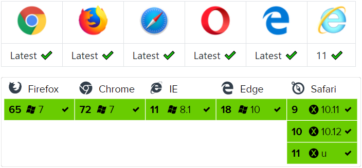

> axios 依赖原生的 ECMAScript 6 Promise 支持。
>
> 如果浏览器不支持 ECMAScript 6 Promise，可以使用 [es6-promise](https://github.com/stefanpenner/es6-promise) 进行兼容处理。

## 基本使用

### 安装

```shell
npm install axios
```

### 执行一个 `GET` 请求

```javascript
axios({ // 配置请求相关数据信息
      method: 'GET', // 请求方法
      url: 'http://localhost:3000/users', // 请求路径
      // params: {}, // Query 参数
      // data: {} // Body 参数
    }).then(function (res) {
      // res 是响应对象
      // 接口返回的数据再 res.data 中
      //    config: {url: "http://localhost:3000/users", method: "get", headers: {…}, transformRequest: Array(1), transformResponse: Array(1), …}
      //      本次请求配置信息对象，很少使用
      //    data: [{…}]
      //      真正的响应结果数据
      //    headers: {cache-control: "no-cache", content-length: "84", content-type: "application/json; charset=utf-8", expires: "-1", pragma: "no-cache"}
      //      响应头数据，很少使用
      //    request: XMLHttpRequest {readyState: 4, timeout: 0, withCredentials: false, upload: XMLHttpRequestUpload, onreadystatechange: ƒ, …}
      //      请求对象，几乎不适用
      //    status: 200
      //      响应状态码
      //    statusText: "OK"
      //      响应状态短语
      console.log(res.data)
    })
```

### 带有 Query 参数的 GET 请求

```js
const user = {
  name: '张三',
  age: 18
}

axios({
  method: 'GET',
  // url: 'http://localhost:3000/users?name=' + name + '&age=' + age,
  // url: `http://localhost:3000/users?name=${name}&age=${age}`,
  url: 'http://localhost:3000/users',
  // 配置 Query 查询参数
  // axios 在内部把 params 对象转换为 key=value&key=value 的数据格式
  // 然后放到 url 后面，把请求发出去
  params: {
    // name: user.name,
    age: user.age
  }
}).then(res => {
  console.log(res)
})
```


### 执行一个 `POST` 请求

```javascript
axios({
  method: 'POST',
  url: 'http://localhost:3000/users',
  data: { // POST 请求体放到 data 中
    name: '张三风',
    age: 50,
    gender: '男'
  }
}).then(res => {
  if (res.status === 201) {
    console.log('添加成功')
  }
})
```

### 执行一个 `DELETE` 请求

```js
axios({
  method: 'DELETE',
  url: 'http://localhost:3000/users/3'
}).then(res => {
  console.log(res)
})
```


### 执行一个 `PATCH` 请求

```js
axios({
  method: 'PATCH',
  url: 'http://localhost:3000/users/4',
  data: { // Body 请求体
    name: '张三丰'
  }
}).then(res => {
  console.log(res)
})
```


## axios API

### axios(config)

我们可以像使用 `$.ajax()` 一样来使用 `axios`。

```javascript
// Send a POST request
axios({
  method: 'post',
  url: '/user/12345',
  data: {
    firstName: 'Fred',
    lastName: 'Flintstone'
  }
})
```

```javascript
// GET request for remote image
axios({
  method: 'get',
  url: 'http://bit.ly/2mTM3nY',
  responseType: 'stream'
}).then(function(response) {
  response.data.pipe(fs.createWriteStream('ada_lovelace.jpg'))
})
```

### 请求方法别名(了解即可)

为了方便，axios 为所有的请求方法都提供了别名支持。

- axios.request(config)
- axios.get(url[, config])
- axios.delete(url[, config])
- axios.head(url[, config])
- axios.options(url[, config])
- axios.post(url[, data[, config]])
- axios.put(url[, data[, config]])
- axios.patch(url[, data[, config]])

> 注意：当使用了这些别名方法时，`url`, `method` 和 `data` 属性不需要声明在配置对象中。


## 响应体结构

请求的响应包含以下信息。

```json
{
  // `data` is the response that was provided by the server
  "data": {},

  // `status` is the HTTP status code from the server response
  "status": 200,

  // `statusText` is the HTTP status message from the server response
  "statusText": "OK",

  // `headers` the headers that the server responded with
  // All header names are lower cased
  "headers": {},

  // `config` is the config that was provided to `axios` for the request
  "config": {},

  // `request` is the request that generated this response
  // It is the last ClientRequest instance in node.js (in redirects)
  // and an XMLHttpRequest instance the browser
  "request": {}
}
```

当使用 `then` 方法时，将收到如下结果

```js
axios.get('/user/12345').then(function(response) {
  console.log(response.data)
  console.log(response.status)
  console.log(response.statusText)
  console.log(response.headers)
  console.log(response.config)
})
```

## 配置

### 配置 baseUrl

```js
// 配置请求的基础路径
axios.defaults.baseURL = 'https://api.example.com'
```


## 处理错误

```js
axios({
  method: 'PATCH',
  url: '/users/2',
  data: {
    name: 'abc'
  }
}).then((res) => { // 成功执行 then
  // 在 axios 中，默认只有 >=200 和 <400 的状态码都认为是成功的
  // axios 在请求失败以后就不执行 then 里面的代码了
  console.log('请求结果 => ', res)
}).catch(err => { // 失败执行 catch
  console.log('请求失败了', err)
  window.alert('更新失败，请稍后重试！')
})
```

## 在 Vue 中配合使用 axios

### 准备页面模板

```html
<!DOCTYPE html>
<html lang="en">
<head>
  <meta charset="UTF-8">
  <title>Document</title>
</head>
<body>
  <div id="app">
    <form>
      <div>
        <label for="">姓名</label>
        <input type="text">
      </div>
      <div>
        <label for="">年龄</label>
        <input type="text">
      </div>
      <div>
        <label for="">性别</label>
        <input type="radio" value="男" name="gender"> 男
        <input type="radio" value="女" name="gender"> 女
      </div>
      <div>
        <button>添加</button>
      </div>
    </form>

    <table>
      <thead>
        <tr>
          <th>id</th>
          <th>姓名</th>
          <th>年龄</th>
          <th>性别</th>
          <th>操作</th>
        </tr>
      </thead>
      <tbody>
        <tr>
          <td>1</td>
          <td>张三</td>
          <td>18</td>
          <td>男</td>
          <td>
            <button>删除</button>
          </td>
        </tr>
        <tr>
          <td>1</td>
          <td>张三</td>
          <td>18</td>
          <td>男</td>
          <td>
            <button>删除</button>
          </td>
        </tr>
      </tbody>
    </table>
  </div>
</body>
</html>

```

### 安装依赖

```bash
# 安装 Vue
npm i vue

# 安装 axios
npm i axios
```

### 导入 Vue 和 Axios

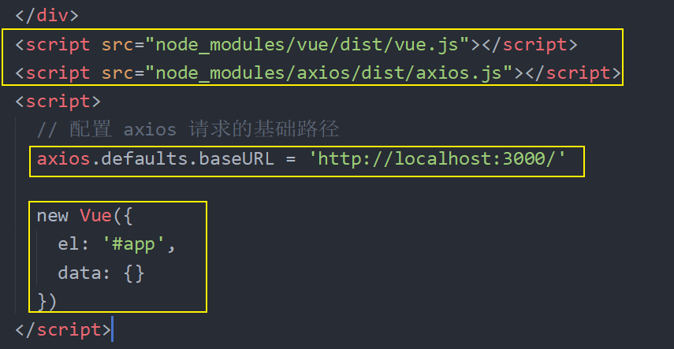


### 添加

一、获取表单数据

1、根据接口和视图抽象出数据初始化到 data 中

```js
data: {
  user: {
    name: '',
    age: '',
    gender: ''
  }
},
```

2、将数据绑定到对应的表单元素

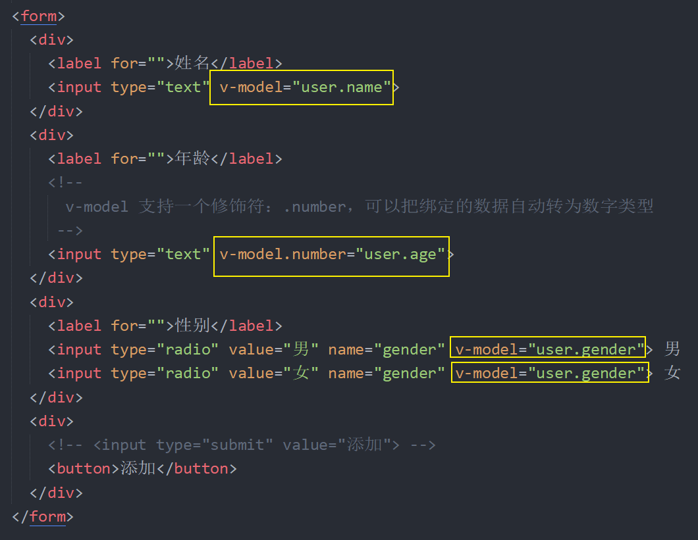

3、使用 VueDevTools 调试工具测试数据绑定是否正确。

二、注册表单提交事件

1、监听表单的 `submit` 事件，并绑定 `onAdd` 处理函数

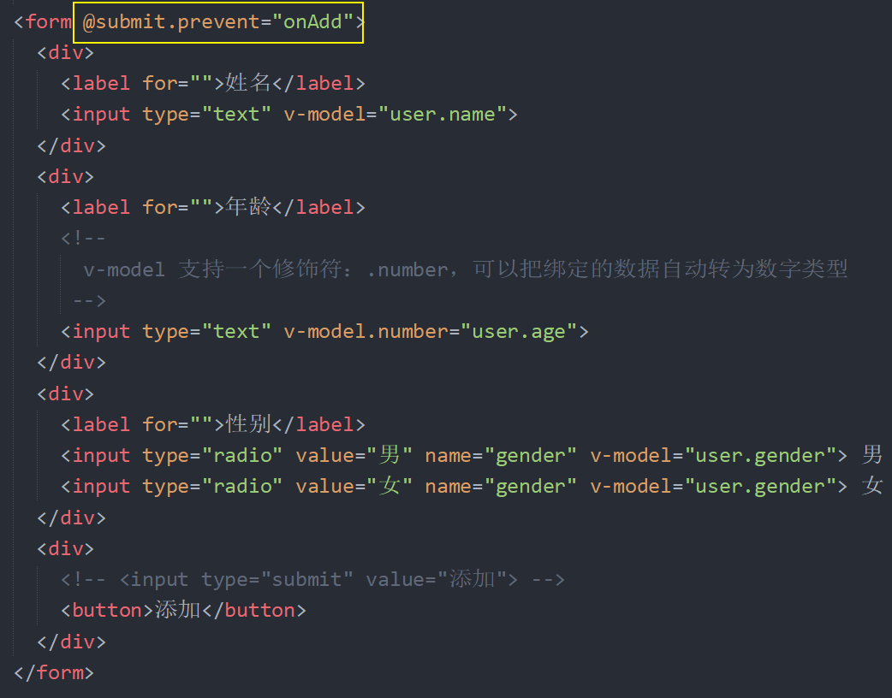

2、在 `methods` 中添加 `onAdd` 处理函数，请求提交表单

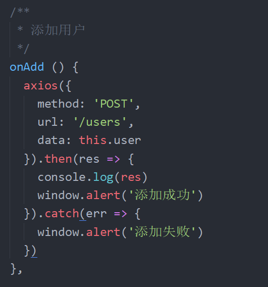


### 列表加载

1、在 `mthods` 中封装一个方法 `loadUsers` 用于请求获取数据并更新数据

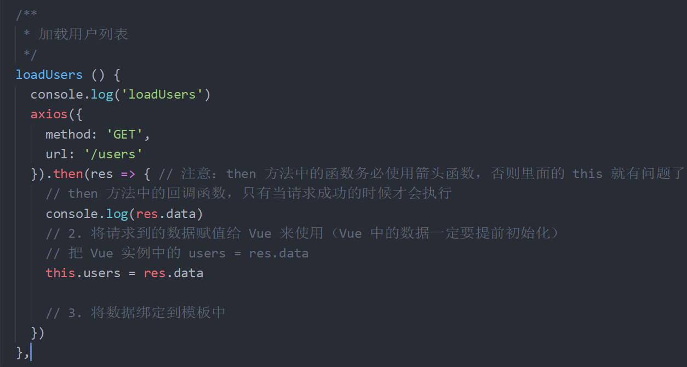

2、然后在实例选项 `created` 方法中调用 `loadUsers` 方法

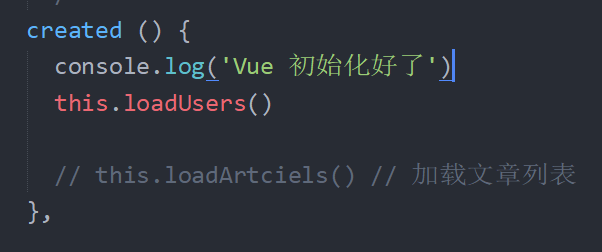

3、在模板中使用 `v-for` 遍历展示用户列表

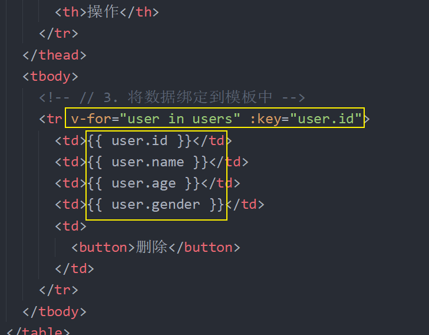

3、在 `onAdd` 中添加用户完成的 then 回调中调用 `loadUsers` 更新用户列表

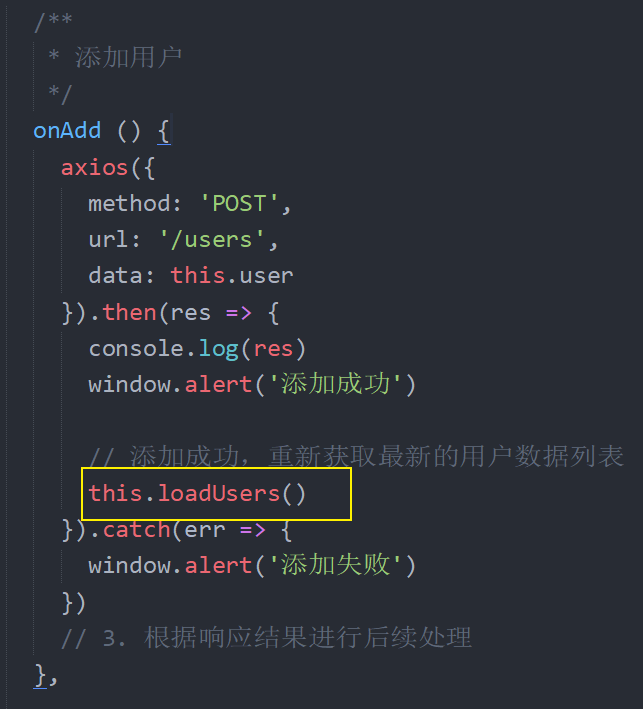

### 删除

1、给用户列表中的删除按钮绑定点击处理函数

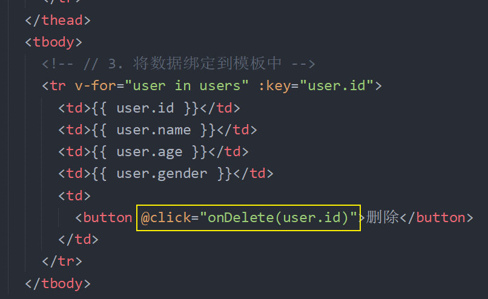

2、在 `methods` 中定义 `onDelete` 处理函数

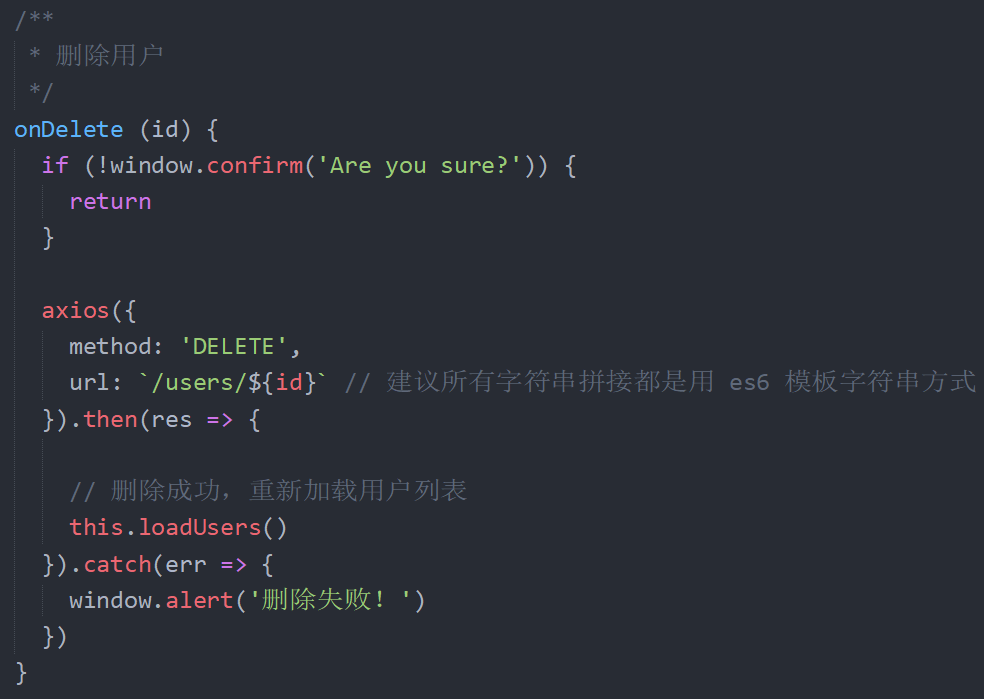

最后回到浏览器中测试删除。

### 完整代码如下

```html
<!DOCTYPE html>
<html lang="en">
<head>
  <meta charset="UTF-8">
  <title>Document</title>
</head>
<body>
  <div id="app">
    <!-- 
      表单的 submit 事件：当表单中的 submit 或者 button 点击的时候，或者表单文本框中敲回车的时候都会触发 submit 事件
     -->
    <form @submit.prevent="onAdd">
      <div>
        <label for="">姓名</label>
        <input type="text" v-model="user.name">
      </div>
      <div>
        <label for="">年龄</label>
        <!-- 
          v-model 支持一个修饰符：.number，可以把绑定的数据自动转为数字类型
         -->
        <input type="text" v-model.number="user.age">
      </div>
      <div>
        <label for="">性别</label>
        <input type="radio" value="男" name="gender" v-model="user.gender"> 男
        <input type="radio" value="女" name="gender" v-model="user.gender"> 女
      </div>
      <div>
        <!-- <input type="submit" value="添加"> -->
        <button>添加</button>
      </div>
    </form>

    <table>
      <thead>
        <tr>
          <th>id</th>
          <th>姓名</th>
          <th>年龄</th>
          <th>性别</th>
          <th>操作</th>
        </tr>
      </thead>
      <tbody>
        <!-- // 3. 将数据绑定到模板中 -->
        <tr v-for="user in users" :key="user.id">
          <td>{{ user.id }}</td>
          <td>{{ user.name }}</td>
          <td>{{ user.age }}</td>
          <td>{{ user.gender }}</td>
          <td>
            <button @click="onDelete(user.id)">删除</button>
          </td>
        </tr>
      </tbody>
    </table>
  </div>
  <script src="node_modules/vue/dist/vue.js"></script>
  <script src="node_modules/axios/dist/axios.js"></script>
  <script>
    axios.defaults.baseURL = 'http://localhost:3000/'

    // 1. 发送请求获取数据
    // axios({
    //   method: 'GET',
    //   url: '/users'
    // }).then(res => {
    //   // then 方法中的回调函数，只有当请求成功的时候才会执行
    //   console.log(res.data)
    //   // 2. 将请求到的数据赋值给 Vue 来使用（Vue 中的数据一定要提前初始化）
    //   // 把 Vue 实例中的 users = res.data
    //   app.users = res.data

    //   // 3. 将数据绑定到模板中
    // })

    const app = new Vue({
      el: '#app',
      data: {
        message: 'Hello Vue.js!',
        // 根据接口要求包括视图，抽象出需要绑定的数据字段
        // 这里的名字也不要瞎起了，因为这个数据要提交给后端接口
        user: {
          name: '',
          age: '',
          gender: ''
        },
        users: [] // 存储用户数据列表
      },

      /**
       * 实例选项：created
       * 它是一个函数，它会在 Vue 初始化完成以后自动调用
       * 我们可以在它里面访问 this 获取 Vue 实例
       * 常见的场景就是：在页面加载好以后请求获取数据列表
       */
      created () {
        console.log('Vue 初始化好了')
        // 1. 发送请求获取数据
        // axios({
        //   method: 'GET',
        //   url: '/users'
        // }).then(res => { // 注意：then 方法中的函数务必使用箭头函数，否则里面的 this 就有问题了
        //   // then 方法中的回调函数，只有当请求成功的时候才会执行
        //   console.log(res.data)
        //   // 2. 将请求到的数据赋值给 Vue 来使用（Vue 中的数据一定要提前初始化）
        //   // 把 Vue 实例中的 users = res.data
        //   this.users = res.data

        //   // 3. 将数据绑定到模板中
        // })

        // 我们不太建议在 created 中写大量的业务逻辑代码
        // 我们更推荐把这些功能都封装成一个一个的函数放到 methods 中
        
        // 方法也可以直接通过 Vue 实例调用
        this.loadUsers()

        // this.loadArtciels() // 加载文章列表
      },

      methods: {
        /**
         * 添加用户
         */
        onAdd () {
          console.log(this.user)
          // 1. 获取表单数据
          // 1.1 根据接口和视图抽象出数据初始化到 data 中
          //     建议表单相关的数据放到一个单独的数据对象中
          // 1.2 然后使用 v-model 把数据分别绑定到对应的表单元素上
          // 1.3 最后利用 VueDevTools 调试工具测试数据是否绑定OK
          // 2. 请求提交
          // json-server 默认提供了 CORS 后端跨域，前端不需要做任何处理
          // 在后端的 CORS请求中，浏览器会先发出一个请求方法叫 OPTIONS 的预检请求
          // 注意：整个过程都是自动的，不需要代码参与，浏览器的默认行为
          axios({
            method: 'POST',
            url: '/users',
            data: this.user
          }).then(res => {
            console.log(res)
            window.alert('添加成功')

            // 添加成功，重新获取最新的用户数据列表
            this.loadUsers()
          }).catch(err => {
            window.alert('添加失败')
          })
          // 3. 根据响应结果进行后续处理
        },

        /**
         * 加载用户列表
         */
        loadUsers () {
          console.log('loadUsers')
          axios({
            method: 'GET',
            url: '/users'
          }).then(res => { // 注意：then 方法中的函数务必使用箭头函数，否则里面的 this 就有问题了
            // then 方法中的回调函数，只有当请求成功的时候才会执行
            console.log(res.data)
            // 2. 将请求到的数据赋值给 Vue 来使用（Vue 中的数据一定要提前初始化）
            // 把 Vue 实例中的 users = res.data
            this.users = res.data

            // 3. 将数据绑定到模板中
          })
        },

        /**
         * 删除用户
         */
        onDelete (id) {
          if (!window.confirm('Are you sure?')) {
            return
          }

          axios({
            method: 'DELETE',
            url: `/users/${id}` // 建议所有字符串拼接都是用 es6 模板字符串方式
          }).then(res => {

            // 删除成功，重新加载用户列表
            this.loadUsers()
          }).catch(err => {
            window.alert('删除失败！')
          })
        }
      }
    })
  </script>
</body>
</html>

```

