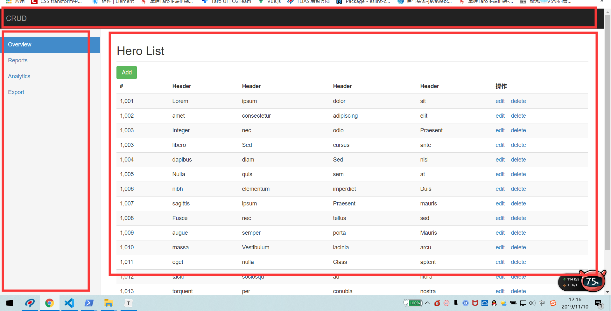

## 复习

* 在组件中使用了**`其他组件`**的标签就是组件嵌套
* 全局组件在任何实例都可以使用
* 局部组件只能在当前实例上使用
* 组件嵌套 => 传值 =>  父传子
* 组件
* 路由 => 动态路由 => 1定义参数  path =>  user/:参数名  2  传递参数  user/123 3 $route.params.参数名
* 编程式导航 => push /replace/go =>  router =>  this.$router

## 基础-vue-cli工具介绍

>**`目标`**了解vue-cli是什么东西 =>脚手架	
>
>* 介绍: **`vue-cli`**是一个**`辅助开发工具`**=> **`代码编译`** + **`样式`** + 语法校验 + 输出设置 + 其他 ...
>
>* 作用: 可以为开发者提供一个**`标准的项目开发结构`** 和配置  **开发者**不需要再关注
>
>* vue-cli 一个**`命令行`**工具,最新版本也支持**`图形化`**操作,可快速搭建大型网页应用

## 基础-vue-cli安装和2-3版本解释

>**`目标`**掌握vue-cli的版本安装
>
>说明:vue-cli本质上是一个npm包,也需要通过npm去安装下载
>
>```bash 
>npm i -g @vue/cli  // 全局安装脚手架  默认安装的最新版本 4.0+
>```
>
>安装完成后  可通过 **`vue命令`**来进行检查 脚手架是否安装成功
>
>**注意** vue-cli的命令行 关键字 是**vue**
>
>查看版本
>
>```bash
>vue -V  // 查看脚手架版本号
>or 
>vue --version // 和上面等价 
>```
>
>`注意`: 默认安装的4.0+ 版本,但是企业很多还在用2.0+版本 怎么破?
>
>执行以下命令就可以 2.0 和 3.0 /4.0兼得
>
>* **`2.0和3.0/4.0创建项目的命令是不一样的`**
>
>```bash
>
>npm install -g @vue/cli-init  // 安装桥接工具 将2.0的功能补齐到目前的脚手架上
>
>```
>
>**注意**  vue生成的模板的有难有易 
>
>* 简单业务 => 简易模板 
>
>* 复杂业务 => 内容丰富模板
>
>**`任务`**
>
>1. 安装vue-cli脚手架 并 将2.0版本的补丁打到当前版本

## 基础-vue-cli创建项目

>**`目标`** 学会使用vue-cli 2.0特性创建项目
>
>创建项目: 采用 cli 2.0的特性 (生成简易模板)
>
>```bash
>#  heroes 创建的项目名称
>$ vue  init webpack-simple heroes //  webpack-simple 为模板名称 固定写法
># 切换到当前目录
>$ cd  heroes 
># 安装依赖
>$ npm install  
># 在开发模式下 启动运行项目
>$ npm run dev
>
>```
>
>创建项目: 采用 cli 3.0/4.0特性 (两种 默认 /选填)
>
>```bash 
># 3.0下创建项目
>$ vue create heroes // create(创建) 为关键字
># 切换到当前目录
>$ cd  heroes 
># 在开发模式下 启动运行项目
>$ npm run serve
>```
>
>**注意** 3.0 +创建项目时  有两种模式, 一种**`默认模式`**, 一种选择模式,
>
>默认模式:一种标准的模板
>
>选择模式 可以根据自己的需求选择需要的工具和模式
>
>**`任务`**
>
>1. 分别使用vue-cli 2.0 和 4.0特性创建一个叫做heroes的项目 
>2. 分别启动运行

## 基础-vue-cli项目目录解释

>**`目标`**对2.0项目目录生成的模板文件进行识别认识
>
>.bablelrc=>存放 babel编译的配置信息 () => es6 => es5 
>
>.editorconfig => 存放编辑器的配置信息
>
>.gitignore => git忽略文件
>
>index.html => 单页应用的html
>
>package.json => 用于存放依赖信息 及 其他项目信息
>
>README.md => 项目介绍信息 github上的页面信息
>
>webpack.config.js => wepack工具的配置文件 => webpack是一个前端工程化的工具  编译代码 -压缩代码- 处理代码,其他....
>
>webpack => 代码编译,打包 压缩
>
>build.js =>  不是人写的 => webpack 打包而来 => webpack中可以配置文件的**`入口`** ,可以配置文件的**`出口`**
>
>webpack 文件的出口 =>buildjs =>  配置信息  =>  webpack.config.js
>
>entry => 整个项目的入口文件=> main.js
>
>output => 整个项目的出口文件 => filename => build.js  =>  build.js 启动项目时  并不是物理文件,而是内存中一个文件流

## 基础-回顾-ES6模块的导入和导出

**`目标`**回顾ES6的导入导出

>**ES6**提供**import**   `变量`   **from**  `路径`   语法 来**`引入组件/模块`** 
>
>import  别名 from  路径  => 引入 
>
>* 如果 引用的包是第三方的包 可以用包名代替路径
>
>* 如果 不需要别名 可以 用 **`import`**  "路径"
>
>导出 =>  export default  对象   
>
>如果想引入一个文件,并且使用,这个该文件中必须导出=  > 如果想引用一个组件,就必须先导出该组件 
>
>import  from   =>export  default  对象
>
>提供了 export default 变量  **`导出组件`**
>
>提供 **export**  **default**  **`对象`** 语法来导出组件
>
>导入和导出 带来的好处是  **`可以 将很多模块拆成一个个的文件`**
>
>上面的代码 换成import 
>
>```js
>export default vue //导出对象   vue.js
>```
>
>```js
>import vue from 'vue' 
>```
>
>扩展--- 
>
>```js
>export const function  fn1() {} // 方法1
>export const function  fn2() {} // 方法2
>export const function  fn3() {} // 方法3
>// 一个文件
>```
>
>```js 
>import { fn1,fn2, fn3 } from '文件'
>```

## 基础-Vue-单文件组件及入口解析

>**`目标`**  掌握认识 Vue的单文件组件
>
>App.vue => 一个组件 => 根组件
>
>单文件组件 => 一个**`.vue`**文件就是一个组件 
>
>> vue==> **`template`** => 组件结构(有且只有一个根元素),**`script`** => 导出一个对象 => 组件内容 => 
>>
>> data/methods/computed  => **`style标签`** => 组件样式
>
>介绍: 在cli开发模式下, 一个*.vue文件就是一个组件
>
>* template 组件的页面结构 代表它的 html 结构 
>
>* 必须在里面放置一个 html 标签来包裹所有的代码 
>* script  组件的逻辑结构及数据对象
>
>
>
>* style 组件的样式
>* html+js+css =>  templte /script/style
>*  就是针对我们的 template 里内容出现的 html 元素写一些样式 
>
>**`注意`**: vue-cli的作用就是让我们把精力放在业务编码上,一切准备的工作交给vue-cli去做
>
>**`任务`** 
>
>1. 新建一个名为 Menu的组件 
>2. 内容为 一个横向菜单   商城   团购   拼团   省钱帮 
>3. 菜单高60px  水平居中  字体大小为20px  颜色为 red  背景色 为 #CCCCCC
>4. 实现组件在页面上展示
>
>

## 基础-示例项目效果演示

>**`目标`**演示示例项目的最终效果 分拆功能
>
>英雄项目演示 =>  功能拆分 => 路由 => 嵌套路由 =>  列表 =>  新增 修改 删除  更新  

## 基础-示例项目-导入素材处理样式

>**`目标-任务`**:将项目所需样式导入到项目中 
>
>* 运行时依赖 / 开发时依赖 
>* 运行时依赖  => 项目在线上运行的时候所需要依赖的文件
>* 开发依赖 =>  开发调试过程中 辅助开发的依赖 脚手架
>* npm i  包名 -S或者 --save  => 将包装包运行时依赖包
>* npm i 包名  -D 或者 --save--dev => 将包装到开发时依赖
>
>* 安装 bootstrap固定版本
>* cnpm  必须写 -S或者-D
>
>```bash 
>npm i  bootstrap@3.3.7 
>```
>
>安装完成之后 ,在main.js入口处引入css文件
>
>```js
>import "./../node_modules/bootstrap/dist/css/bootstrap.css"; // 引入 bootstarp的样式文件
>import "./assets/index.css"; // 引入index.css
>
>```
>
>重启运行,发现bootstrap.css文件 运行报错 
>
>根据错误 需要在webpack.config.js增加对不识别文件的处理
>
>```js	
>{
>test: /.(ttf|woff2|woff|eot)$/,
>loader: "file-loader",
>options: {
>name: "[name].[ext]?[hash]"
>}
>}
>```
>
>

## 基础-示例项目-提取公共组件-头部-侧边栏-列表,并预览效果

>**`目标-任务`**:将静态内容的 头部 侧边栏 , 列表分别封装成Vue组件 ,并在视图中显示
>
>
>
>**`路径`** 提取组件
>
>1. 新建vue文件
>
>2.  拷贝html静态内容到 template中
>3.  在app.vue中引入注册组件
>4. 注册在app.vue的组件中 
>5. 在app.vue的模板中使用注册组件 

## 基础-示例项目-提取路由模块

**`目标-任务`** 在示例项目中 提取路由模块,并应用视图

>**`路径`**  提取路由模块
>
>1  安装路由 
>
>```bash 
>npm i vue-router // 安装路由模块
>```
>
>2   在main.js中引入 路由模块
>
>```js
>import VueRouter from 'vue-router ' // 引用router
>```
>
>3  使用router 
>
>```js 
>Vue.use(VueRouter) // 使用router
>```
>
>4   实例化 router 
>
>```js 
>const router = new VueRouter({
>routes:[] //实例化routes
>})
>```
>
>5  配置理由表
>
>```js
>const router = new VueRouter({
>routes: [
>{ path: "/heroes", component: AppList },
>{ path: "/foo", component: Foo },
>{ path: "/bar", component: Bar }
>] // 路由表
>}); // 实例化router
>```
>
>router-link 组件**`默认生成`**的a标签 =>  可以通过一个属性 来改变其最终生成的标签 => tag (标签)
>
>router-link **`默认`**激活样式 是  router-link-active   => 可以通过属性将默认的激活样式换掉  linkActiveClass
>
>**注意** 一般来说 路由表 需要单独一个文件   可以将router提取成一个js文件 
>
>6   提取 三个组件 appList(主要 )  Foo(组件) Bar(组件) 完善路由表
>
>```html
><template>
><div>Bar组件</div>
></template>
>
><script>
>export default {};
></script>
>
><style>
></style>
>
>```
>
>
>
>7   在App.vue中假如路由承载视图
>
>```html
><div>
><AppHeader></AppHeader>
><div class="row">
><AppSilder></AppSilder>
><div class="col-sm-9 col-sm-offset-3 col-md-10 col-md-offset-2 main">
><router-view></router-view> // 加入承载视图
></div>
></div>
></div>
>```

## 基础-示例项目-json-server-启动接口服务器

>**`目标-任务`**准备json-server服务器.启动实现 数据接口 增删改查的联通
>
>**`路径`**: 启动json-server服务器
>
>1  安装json-server  
>
>**注意** json-server 是一个命令行工具,和vue以及vue-cli没有任何关系 所以安装在任何位置都可以
>
>```bash 
>npm i -g json-server // 安装json-server 
>```
>
>2  新建json文件 
>
>```json
>{
>"heroes": [
>{ "name": "张三", "id": 1, "gender": "男" },
>{ "name": "李白", "id": 2, "gender": "女" },
>{ "name": "吕布", "id": 3, "gender": "男" }
>]
>}
>
>```
>
>3  启动json-server
>
>```bash
>json-server --watch db.json 
>```
>
>

## 基础-示例项目-列表渲染

>**`目标-任务`**完成英雄列表的数据加载及渲染
>
>**`路径`**:
>
>1 安装axios 插件 
>
>```bash
>npm i axios // 安装axios插件
>```
>
>2  英雄列表组件中引入 axios , 
>
>```js 
>import axiod from 'axios' // 引入axios
>```
>
>3  定义数据list
>
>```js
>data() {
>return {
>list: []
>};
>}
>```
>
>4  请求英雄列表的方法封装 
>
>```js
>loadData() {
>//restful规则
>axois.get("http:localhost:3000/heros").then(result => {
>this.list = result.data;
>});
>}
>```
>
>5  在事件中加入 请求方法
>
>```js
>// 实例完成事件
>created() {
>//可以加
>this.loadData();
>},
>```
>
>6  渲染列表list

## 基础-示例项目-删除功能

>**`目标`**实现英雄列表的删除功能
>
>路径: 删除功能
>
>1  注册删除事件 
>
>```html
><a href="javascript:void(0)" @click="delItem(item.id)">删除</a>
>
>```
>
>2 定义删除方法  实现删除逻辑
>
>```js
>// 定义删除方法
>// id为要删除id的方法
>delItem(id) {
>// restful规则
>if (confirm("确认删除此条数据")) {
>axios.delete("http://localhost:3000/heroes" + id).then(result => {
>if (result.status === 200) {
>  // 判断删除状态 是否成功
>  this.loadData(); // 刷新数据
>}
>});
>}
>}
>```
>
>3  根据状态 进行刷新页面
>
>```js
>this.loadData(); // 刷新数据
>```
>
>

## 基础-示例项目-添加-渲染添加组件

>**`目标-任务`**添加组件功能的静态实现
>
>路径: 添加视图的实现
>
>1 新建add.vue组件 并写入静态内容(拷贝)
>
>```html
><!-- 添加静态内容到template模板下 -->
><div>
><h2 class="sub-header">添加英雄</h2>
><form>
><div class="form-group">
><label for="exampleInputEmail1">用户名</label>
><!-- 使用v-model的方式来绑定表单 -->
><input
>v-model="formData.name"
>type="text"
>class="form-control"
>id="exampleInputEmail1"
>placeholder="请输入姓名"
>/>
></div>
><div class="form-group">
><label for="exampleInputPassword1">性别</label>
><input
>v-model="formData.gender"
>type="text"
>class="form-control"
>id="exampleInputPassword1"
>placeholder="请输入性别"
>/>
></div>
><!-- 给添加英雄按钮注册一个事件 -->
><button type="submit" class="btn btn-success" @click="addHero">添加英雄</button>
></form>
></div>
>
>```
>
>2  在路由表中配置添加功能的路由
>
>```js
>{ path: "/add", component: Add }  // 引入组件 配置路由
>
>```
>
>3  给列表组件中的添加按钮 添加l导航 到添加功能路由的导航
>
>```html
><!-- 给添加功能添加路由导航 -->
><a class="btn btn-success" href="#/add">添加</a>
>```
>
>4  根据业务场景调整页面模板
>
>```html
><div>
><h2 class="sub-header">添加英雄</h2>
><form>
><div class="form-group">
><label for="exampleInputEmail1">用户名</label>
><input type="email" class="form-control" id="exampleInputEmail1" placeholder="请输入姓名" />
></div>
><div class="form-group">
><label for="exampleInputPassword1">性别</label>
><input type="password" class="form-control" id="exampleInputPassword1" placeholder="请输入性别" />
></div>
><button type="submit" class="btn btn-success">添加英雄</button>
></form>
></div>
>```
>
>```
>
>```

## 基础-示例项目-添加-功能实现

>**`目标-任务`** 实现添加英雄的功能
>
>**`路径`**:  添加功能的实现
>
>1  定义表单数据  和  表单进行绑定 
>
>```js
>data() {
>return {
>// 定义一个数据对象 存储 姓名和性别
>formData: {
>name: "", // 姓名
>gender: "" // 性别
>}
>};
>}  //定义一个数据对象
>```
>
>2 	注册添加按钮的点击事件 
>
>```html
><!-- 给添加英雄按钮注册一个事件 -->
><button type="submit" class="btn btn-success" @click="addHero">添加英雄</button>
>```
>
>3   实现 添加的前后逻辑
>
>```js
>// 添加英雄方法
>addHero() {
>// 判断填报信息是否为空
>if (this.formData.name && this.formData.gender) {
>// 该判断条件是判断 当前的姓名和 性别都不为空
>// restful规则
>axios
>.post("http://localhost:3000/heroes", this.formData)
>.then(result => {
>  // 注意这里添加成功的状态码 是 201
>  if (result.status === 201) {
>    // 添加成功之后 要跳转回列表页
>    // 编程式导航
>    this.$router.push({ path: "/heroes" });
>  } else {
>    alert("添加失败");
>  }
>});
>} else {
>alert("提交信息不能为空");
>}
>}
>```
>
>

## 基础-示例项目-编辑-添加编辑组件	

>**`目标-任务`**实现英雄列表的编辑功能组件渲染
>
>路径: 编辑功能渲染
>
>新建编辑组件
>
>**注意** 由于 编辑组件和添加组件页面结构基本一致  可以 直接拷贝添加组件的内容
>
>```html
><!-- 添加静态内容到template模板下 -->
><div>
><h2 class="sub-header">添加英雄</h2>
><form>
><div class="form-group">
><label for="exampleInputEmail1">用户名</label>
><!-- 使用v-model的方式来绑定表单 -->
><input
>v-model="formData.name"
>type="text"
>class="form-control"
>id="exampleInputEmail1"
>placeholder="请输入姓名"
>/>
></div>
><div class="form-group">
><label for="exampleInputPassword1">性别</label>
><input
>v-model="formData.gender"
>type="text"
>class="form-control"
>id="exampleInputPassword1"
>placeholder="请输入性别"
>/>
></div>
><!-- 给添加英雄按钮注册一个事件 -->
><button type="submit" class="btn btn-success" @click="editHero">编辑英雄</button>
></form>
></div>
>```
>
>

## 基础-示例项目-编辑-显示编辑数据

>**`目标-任务`**实现英雄列表的编辑功能
>
>**`路径`**:  实现编辑的显示数据 
>
>1. 添加编辑路由  **注意** 由于需要拿到编辑数据的标识 所以需要动态路由
>
>```js
>{ path: "/edit/:id", component: Edit } // 编辑组件 动态路由
>```
>
>2. 编辑按钮添加跳转路由的属性
>
>```html
><a class="btn btn-success" href="#/edit">添加</a>
>```
>
>3. 定义加载英雄方法 **注意** 通过 $router.params来获取参数
>
>```js
>// 加载英雄
>loadHero() {
>const { id } = this.$route.params; // 通过参数获取id
>if (id) {
>//判断id
>axios.get("http://localhost:3000/heroes/" + id).then(result => {
>this.formData = result.data; // 获取数据并赋值给表单对象
>});
>}
>}
>```
>
>3.  在初始化事件中 调用loadHero 方法
>
>```js
>// 实例完成事件
>created() {
>this.loadHero(); // 加载英雄
>}
>```

## 基础-示例项目-编辑-表单处理

>**`目标-任务`**实现英雄列表编辑数据的提交
>
>**`路径`**:实现编辑方法
>
>定义实现编辑提交方法
>
>```js
>// 编辑英雄
>editHero() {
>if (this.formData.name && this.formData.gender) {
>const { id } = this.$route.params;
>//restful规则
>axios
>.put("http://localhost:3000/heroes/" + id, this.formData)
>.then(result => {
>  if (result.status === 200) {
>    this.$router.push({ path: "/heroes" });
>  } else {
>    alert("编辑失败");
>  }
>});
>} else {
>alert("提交内容不能为空");
>}
>}
>
>```
>
>

## 基础-示例项目-优化-axios统一导入

>**`目标-任务`**实现axios的统一导入
>
>**`路径`**: axios的统一导入 和使用
>
>1 在入口main.js文件中引入axios,并给全局Vue对象的原型链赋值 

 

>```js
>Vue.prototype.$http = Axios; //所有的实例都直接共享拥有了 这个方法
>
>```
>
>2  调用接口时  采用 实例.属性的方式即可调用 
>
>```js
>addHero() {
>// 判断填报信息是否为空
>if (this.formData.name && this.formData.gender) {
>// 该判断条件是判断 当前的姓名和 性别都不为空
>// restful规则
>this.$http
>.post("http://localhost:3000/heroes", this.formData)
>.then(result => {
>// 注意这里添加成功的状态码 是 201
>if (result.status === 201) {
>  // 添加成功之后 要跳转回列表页
>  // 编程式导航
>    this.$router.push({ path: "/heroes" });
>  } else {
>    alert("添加失败");
>  }
>});
>} else {
>alert("提交信息不能为空");
>}
>}
>```
>
>

## 基础-示例项目-优化-设置baseUrl

>**`目标-任务`**通过配置**`baseUrl`**将所有的请求地址进行优化 
>
>**`路径`**: axios中配置统一的**`请求路径头`**
>
>1. 给axios中的baseUrl设置常态值
>
>```js
>Axios.defaults.baseURL = "http://localhost:3000"; // 设置共享的方法
>
>```
>
>2. 改造所有的的请求
>
>```js
>this.$http.put("heroes/" + id, this.formData).then(result => {
>if (result.status === 200) {
>  this.$router.push({ path: "/heroes" });
>} else {
>  alert("编辑失败");
>}
>});
>```
>
>

## 基础--示例项目-优化-目录划分-统一设置激活样式

>**`目标-任务`**将组件的目录进行整理划分,并统一当前路由的激活样式
>
>* 路由级组件 =>直接挂载到路由上的文件 => 不用注册 => views
>* 普通级组件 => 在组件中用标签来使用的组件 叫做普通组件 =>需要注册 => components
>* span-btn
>
>路径:   左侧导航激活样式  目录划分
>
>* 路由级组件 =>直接挂在路由级组件 => views 目录名
>* 普通组件 => 在路由级组件中使用的组件 => components目录名
>
>1  统一激活样式
>
>```js
>linkActiveClass: "active", // active为bootstrap中的 一个class样式
>
>```
>
>2  整理目录   分门别类
>
>**注意**同一类 组件放入同一个文件夹下  修改引用地址


## 钩子函数

>**`目标`**掌握Vue的生命周期及其**`钩子函数`**
>
>* 生命周期是指Vue实例或者组件从诞生到消亡经历的每一个阶段，在这些阶段的前后可以设置一些函数当做事件来调用。
>
>

* beforeCreate (实例被创建前)
* created(实例被创建后)
* beforeMount(文档被挂载前)
* mounted(文档被挂载后)
* beforeUpdate(数据变化 页面更新前)
* updated(数据变化 页面更新后)
* beforeDestory(视图销毁前)
* destoryed(视图销毁后)

**`任务`**

1. 分别在以上不同的生命周期中 输出不同内容 查看不同变化

## Vue中的动画过渡

>**`目标`**掌握如何在过渡动画中自动应用class
>
>Vue 提供了 `transition` 的封装组件，在下列情形中，可以给任何元素和组件添加进入/离开过渡
>
>- 条件渲染 (使用 `v-if`)
>- 条件展示 (使用 `v-show`)
>- 动态组件
>- 组件根节点
>
>* 基本用法就是给我们需要动画的标签外面嵌套**`transition`**标签 ,并且设置name属性
>* Vue 提供了 `transition` 的封装组件，在下列元素更新,移除，新增 情形中，可以给任何元素和组件添加进入/离开过渡
>* 
>
>```html
><transition name="fade"> 
><div v-show="isShow" class="box"></div>
></transition>
>```
>
>6中class状态 
>
>1. v-enter：定义进入过渡的开始状态。
>2. v-enter-active：定义进入过渡生效时的状态。
>3. v-enter-to: 2.1.8版及以上 定义进入过渡的结束状态。
>4. v-leave: 定义离开过渡的开始状态。
>5. v-leave-active：定义离开过渡生效时的状态。
>6. v-leave-to: 2.1.8版及以上 定义离开过渡的结束状态。
>
>

**`注意`**  **`v`**要替换成transition组件的name属性值

**`注意`**先要编写元素的最终展示样式

**`任务`**

1. 实现一个div 显示时 从小到大过渡
2. 实现该div隐藏时 从大到小