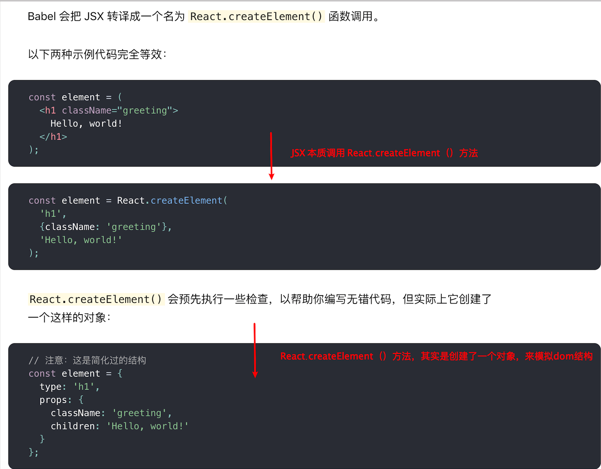
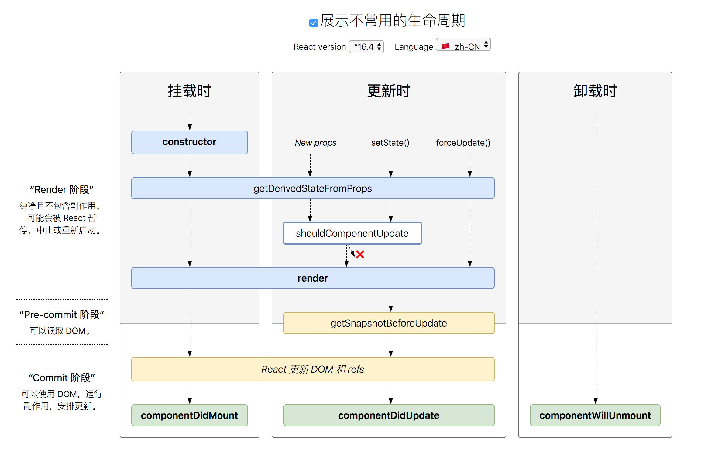
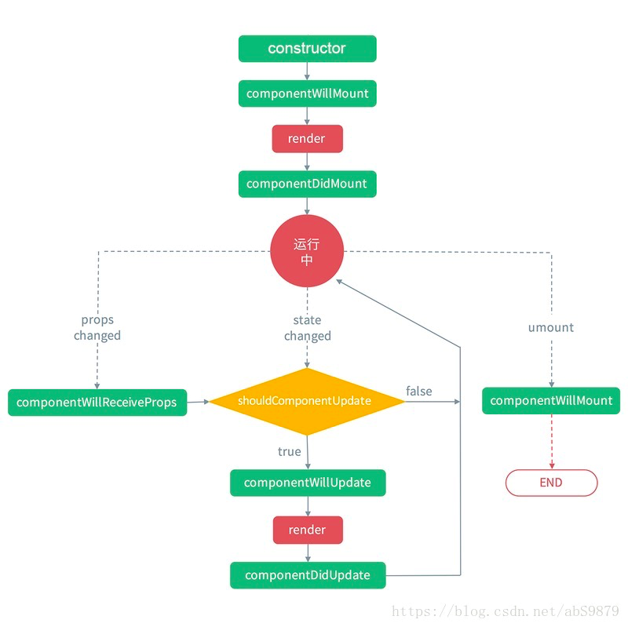
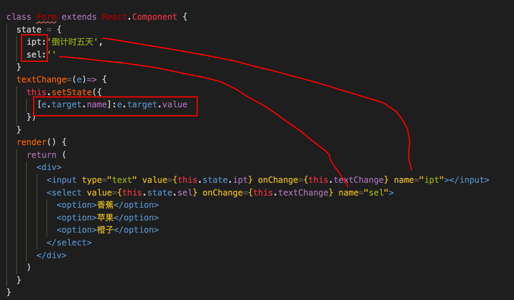
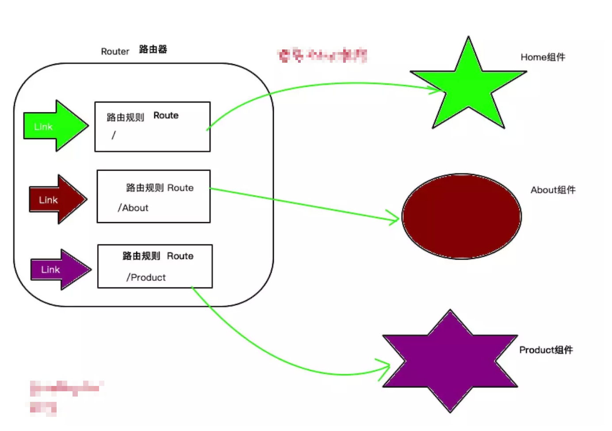

# React

## 0.与vue对比

|            /            |                             Vue                              |                            React                             |
| :---------------------: | :----------------------------------------------------------: | :----------------------------------------------------------: |
|     单文件直接引入      |                            vue.js                            |              react.js + react-dom.js + babel.js              |
|         虚拟DOM         |                              √                               |                              √                               |
| 虚拟DOM区域（挂载区域） |                          el 参数值                           |                ReactDOM.render() 第二个参数值                |
|        数据驱动         |                              √                               |                              √                               |
|       Model数据源       |       初始化，定义在data:{} 或 data () { return {} }里       |         在state里 constructor () { this.state = {} }         |
|        数据渲染         |                  {{ }} 插值渲染 支持表达式                   |                        JSX { } 表达式                        |
|        列表渲染         |                            v-for                             | JSX里生成元素集合 `{this.state.arr.map((item,index)=>{item})}` |
|        条件渲染         |                             v-if                             |             `{this.state.show? 条件渲染 : null}`             |
|        动态绑定         |                            v-bind                            |                   title={this.state.title}                   |
|        数据更新         |             重新赋值 this.id = xxx;/ this.$set()             |               this.setState({id:xx}) 更新数据                |
|          指令           |                              √                               |                              ×                               |
|        添加class        |                        class / :class                        |                       className="red"                        |
|      动态切换class      |             :class="[show? 'class1': 'class2']"              |      className={this.state.show ? "class1" : "class2"}       |
|        style行间        |                        style / :style                        |                JSX写法 style={{color:"pink"}}                |
|           ref           |                              √                               |                              √                               |
|        事件写法         |                       @click="clickFn"                       |              onClick={this.clickFn.bind(this)}               |
|      事件处理函数       |                        methods: {}里                         |                    与render(){} 方法同级                     |
|    生命周期钩子函数     |                    created() mounted() 等                    |         componentDidMount() componentDidUpdate() 等          |
|        创建组件         |            Vue.component全局 / components:{} 局部            |                   function组件 / class组件                   |
|      组件定义规则       |   1.kebab-case (短横线分隔命名) 2.PascalCase （大驼峰式）    |                为了区分原生标签，组件必须大写                |
|        组件特点         |                 .vue文件 分html、js、css三块                 |                          all in js                           |
|        数据流向         |                          单向数据流                          |                          单向数据流                          |
|      数据双向绑定       |                           v-model                            | 无 （但可以自己实现 绑定value值 + onchange事件更新value值）  |
|      监听数据变化       |                            watch                             |                  getDerivedStateFromProps()                  |
|   父组件向子组件传值    | props传值 - 需要在子组件接收props:['xx']，然后就可以使用xx值 |           props传值 - 直接使用this.props.xx 取到值           |
|   子组件向父组件传值    |                子组件this.$emit触发父组件事件                |              子组件this.props.xx 触发父组件事件              |
|          路由           |                          vue-router                          |                         react-router                         |
|        状态管理         |                             vuex                             |                         react-redux                          |
|        修改状态         |                        使用 mutations                        |                      使用reducer纯函数                       |

## 1.安装

1. CDN

   `crossorigin`：通过 CDN 的方式引入 React，建议你设置 ``crossorigin`` 属性，同时建议验证使用的 CDN 是否设置了 `Access-Control-Allow-Origin: *` HTTP 请求头，这样能在 React 16 及以上的版本中有更好的[错误处理体验](https://react.docschina.org/blog/2017/07/26/error-handling-in-react-16.html)。

   ```js
   <script src="https://unpkg.com/react@16/umd/react.development.js" crossorigin></script>
   <script src="https://unpkg.com/react-dom@16/umd/react-dom.development.js" crossorigin></script>
   ```

2. 脚手架

   ```js
   npx create-react-app my-app
   cd my-app
   npm start
   ```

## 2.JSX

1. 建议在 React 中配合使用 JSX，JSX 可以很好地描述 UI 

2. 声明变量 = html 标签

3. JSX 中嵌入表达式，标签中使用 {} ，{} 中放表达式，可以是变量/对象/函数调用，if语句以及for循环不是JavaScript表达式，不能直接作为表达式写在{}中

4. ReactDOM.render（）方法将JSX渲染到页面，参数一为JSX变量名，参数二为 dom 对象

5. ```js
   ReactDOM.render(
     element,
     document.getElementById('root')
   );
   ```

6. 将 JSX 拆分为多行,将内容包裹在括号中,避免遇到自动插入分号陷阱

7. 可以在 if 语句和 for 循环的代码块中使用 JSX

8. 数组元素会被展开渲染

9. 属性值要设置变量，也用 {}，字符串用””，变量用 {}

10. JSX 里的 class 变成了 className

11. 一个标签里面没有内容,可以使用单标签闭合，只能有一个根元素

12. Babel 会把 JSX 转译成一个名为 React.createElement() 函数调用



## 3.元素渲染

1. React 元素是[不可变对象](https://en.wikipedia.org/wiki/Immutable_object)。一旦被创建，你就无法更改它的子元素或者属性，除非重新调用 `ReactDOM.render()` 重新渲染
2. React DOM 会将元素和它的子元素与它们之前的状态进行比较，并只会进行必要的更新来使 DOM 达到预期的状态。

## 4.组件------>.vue

### 函数组件

1. 命名函数，返回一个 `JSX`
2. 默认形参 props

```js
function Welcome(props) {
  return <h1>Hello, {props.name}</h1>;
}
```

### 类组件

1. Es6  class 继承 react.component

2. 调用 render() 方法渲染

3. render 方法中返回内容

   ```js
   class Welcome extends React.Component {
     render() {
       return <h1>Hello, {this.props.name}</h1>;
     }
   }
   ```

### 注意

1. 无论函数名还是类名首字母都要大写，驼峰命名法
2. 使用组件时，把函数名或类名作为标签名，可以单闭合
3. 定义类名是在组件的 html 标签上定义，并非组件标签上，className="类名"
4. 定义在组件标签上的属性值，函数组件用默认形参 props 拿，类组件用 this.props 拿

## 5.state------>data

有状态组件（容器组件）：类组件，主要用来定义交互逻辑和业务数据

无状态组件（展示组件）：函数组件，主要用来定义模板，接收来自父组件props传递过来的数据

### 定义状态数据

```js
class Clock extends React.Component {
  constructor(props) {
    super(props);
    this.state = {
      date: new Date()
    };
  }

  render() {
    return (
      <div>
        <h1>Hello, world!</h1>
        <h2>It is {this.state.date.toLocaleTimeString()}.</h2>
      </div>
    );
  }
}
```

### 获取状态数据

```js
this.state.数据名
```

### 修改状态数据

	1. 传入对象
 	2. 传入函数

```js
this.setState({
  state数据名：新值
})
```

```js
this.setState(()=>{
    return {
        state数据名：新值
    }
})
```

#### 注意

1. 不要直接赋值修改 state ，使用 setState；直接赋值不会重新渲染组件
2. setState 是**异步**的，直接 setState 传入对象不会立即更新，传入函数则可以拿到最新值
3. **不能在`render`中直接使用外部的函数来进行`state`的改变**，会报错超过最大递归深度
4. 从该 state 派生的任何数据或 UI 只能影响树中“低于”它们的组件。**单向数据流**

**逐个检查相应数据是否属于 state：**

1. 该数据是否是由父组件通过 props 传递而来的？如果是，那它应该不是 state。
2. 该数据是否随时间的推移而保持不变？如果是，那它应该也不是 state。
3. 你能否根据其他 state 或 props 计算出该数据的值？如果是，那它也不是 state。

## 6.生命周期

1. 创建时

   1. 执行顺序：constructor--->render--->ComponentDidMount()
   2. `ComponentDidMount()` 组件挂载执行的方法，**发请求**

2. 更新时

   1. 执行顺序： shouldComponentUpdate--->render--->componentDidUpdate()
   2. state/props 有更新时，会重新执行 render 渲染
   3. `shouldComponentUpdate()` 返回一个 `布尔值`，true 时更新，false不更新
   4. `componentDidUpdate()` 组件更新的方法

3. 卸载时

   `componentWillUnmount()` dom 卸载执行的方法





## 7.事件处理

### 语法:

事件名称 = { 处理函数名 }

```js
<button onClick={this.activateLasers}>
  Activate Lasers
</button>
```

### this 指向

类组件中要注意 this 指向：要让 this 一直指向组件实例

三种解决 this 指向问题的方案

**bind绑定**

​	在构造函数中用 bind 改变 this 指向，但不调用函数

```js
class Toggle extends React.Component {
  constructor(props) {
    super(props);
    this.state = {isToggleOn: true};

    // 为了在回调中使用 `this`，这个绑定是必不可少的
    this.handleClick = this.handleClick.bind(this);
  }

  handleClick() {
    this.setState(state => ({
      isToggleOn: !state.isToggleOn
    }));
  }

  render() {
    return (
      <button onClick={this.handleClick}>
        {this.state.isToggleOn ? 'ON' : 'OFF'}
      </button>
    );
  }
}

ReactDOM.render(
  <Toggle />,
  document.getElementById('root')
);
```

**箭头函数**

​	在定义函数时，就把 this 指向确定

```js
class LoggingButton extends React.Component {
  // 此语法确保 `handleClick` 内的 `this` 已被绑定。
  // 注意: 这是 *实验性* 语法。
  handleClick = () => {
    console.log('this is:', this);
  }

  render() {
    return (
      <button onClick={this.handleClick}>
        Click me
      </button>
    );
  }
}
```

**在回调中使用箭头函数**

​	此语法问题在于每次渲染 `LoggingButton` 时都会创建不同的回调函数。在大多数情况下，这没什么问题，但如果该回调函数作为 prop 传入子组件时，这些组件可能会进行额外的重新渲染

```js
class LoggingButton extends React.Component {
  handleClick() {
    console.log('this is:', this);
  }

  render() {
    // 此语法确保 `handleClick` 内的 `this` 已被绑定。
    return (
      <button onClick={(e) => this.handleClick(e)}>
        Click me
      </button>
    );
  }
}
```

### 参数

1. 默认参数，事件对象
   1. 阻止默认行为：e.preventDefault()；return false 不管用
   2. 阻止冒泡：e.stopPropagation()

2. 传实参？？？？？？？

## 8.条件渲染

1. If 判断：根据表达式的值来决定渲染哪个组件

2. &&运算：(适用于一个组件有无的渲染)

   在 JavaScript 中，`true && expression` 总是会返回 `expression`, 而 `false && expression` 总是会返回 `false`。因此，如果条件是 `true`，`&&` 右侧的元素就会被渲染，如果是 `false`，React 会忽略并跳过它。

```js
   function Mailbox(props) {
     const unreadMessages = props.unreadMessages;
     return (
       <div>
         <h1>Hello!</h1>
         {unreadMessages.length > 0 &&
           <h2>
             You have {unreadMessages.length} unread messages.
           </h2>
         }
       </div>
     );
   }
   
   const messages = ['React', 'Re: React', 'Re:Re: React'];
   ReactDOM.render(
     <Mailbox unreadMessages={messages} />,
     document.getElementById('root')
   );
```

3. 三元运算符：**（**适用于两个组件二选一的渲染）

```js
render() {
  const isLoggedIn = this.state.isLoggedIn;
  return (
    <div>
      {isLoggedIn ? (
        <LogoutButton onClick={this.handleLogoutClick} />
      ) : (
        <LoginButton onClick={this.handleLoginClick} />
      )}
    </div>
  );
}
```

4. 阻止组件渲染：return null；在组件的 `render` 方法中返回 `null` 并不会影响组件的生命周期

## 9.列表渲染&key

1. 用数组的 map 方法，遍历返回一个由 JSX组成的新数组

```js
const numbers = [1, 2, 3, 4, 5];
const listItems = numbers.map((number) =>
  <li key={number.toString()}>
    {number}
  </li>
);
```

2. 遍历的每一项要有 key 值，在 `map()` 方法中的元素需要设置 key 属性。

3. key 会传递信息给 React ，但不会传递给你的组件。如果组件中需要使用 `key` 的值，用其他属性名传递此值

   如下例子中，`Post` 组件可以读出 `props.id`，但是不能读出 `props.key`

   ```js
   const content = posts.map((post) =>
     <Post
       key={post.id}
       id={post.id}
       title={post.title} />
   );
   ```

## 10.表单

#### 受控组件

1. 在表单元素上设置了 `value` 属性，因此显示的值将始终为 `this.state.value`，由于 `handlechange` 在每次按键时都会执行并更新 React 的 state，因此显示的值将随着用户输入而更新。
2. 即：1. 设置value值，value由state控制，2. value值一般在onChange事件中通过setState进行修改

|   元素   |                        Value                        |  事件  |
| :------: | :-------------------------------------------------: | :----: |
|  Input   |                        Value                        | change |
| Textarea |                        value                        | Change |
|  Select  | option的value/内容与select的value相等时，该项被选中 | Change |

3. 当需要处理多个 `input` 元素时，可以给每个元素添加 `name` 属性，并且让`state`数据也定义相同的数据名

   

#### 非受控组件

**定义**：借助于 ref，使⽤原⽣ DOM ⽅式来获取表单元素值；ref 的作⽤：获取 DOM 或组件实例

文件类型的`input` 就是非受控组件

**步骤**：

1. 调⽤ React.createRef() ⽅法创建⼀个 ref 对象

   ```js
   constructor() {
     super()
     this.txtRef = React.createRef()
   }
   ```

2. 将创建好的 ref 对象添加到⽂本框中

   ```js
   <input type="text" ref={this.txtRef} />
   ```

3. 通过 ref 对象获取到⽂本框的值

   ```js
   console.log(this.txtRef.current.value)
   ```

**表单初始值**：defaultValue

```js
render() {
  return (
    <form onSubmit={this.handleSubmit}>
      <label>
        Name:
        <input
          defaultValue="Bob"
          type="text"
          ref={this.input} />
      </label>
      <input type="submit" value="Submit" />
    </form>
  );
}
```

**文件 file**

```js
class FileInput extends React.Component {
  constructor(props) {
    super(props);
    this.handleSubmit = this.handleSubmit.bind(this);
    this.fileInput = React.createRef();
  }
  handleSubmit(event) {
    event.preventDefault();
    alert(
      `Selected file - ${
        this.fileInput.current.files[0].name
      }`
    );
  }
  render() {
    return (
      <form onSubmit={this.handleSubmit}>
        <label>
          Upload file:
          <input type="file" ref={this.fileInput} />
        </label>
        <br />
        <button type="submit">Submit</button>
      </form>
    );
  }
}
```


## 11.状态提升

**自我理解**：组件的状态数据是单独互不影响的，如果需要影响其他组件，则需要将状态数据提升至最近的父组件，再进行向下传值

**步骤**

1. 子组件标签上定义数据

   ```js
   //父组件
   render() {
       return (
         <div className="App">
             <Up1 msg={this.state.msg} />
             <Up2 msg={this.state.msg} />
         </div>
   		)
   }
   ```

2. 子组件中 props 接收并绑定数据

   ```js
   //子组件
   render() {
       console.log(this.props);
       
       return (
         <div>
           <input value={this.props.msg}/>
         </div>
       )
   }
   ```

3. 如需修改数据，在子组件标签上定义事件

   ```js
   //父组件
   updateMsg = (e)=>{
       this.setState({
         msg:e
       })
   }
   render() {
       return (
         <div className="App">
             <Up1 msg={this.state.msg} handler={this.updateMsg}/>
             <Up2 msg={this.state.msg} handler={this.updateMsg}/>
         </div>
   		)
   }
   ```

4. 子组件中调用传递参数

   ```js
   //子组件
   changetxt=(e)=> {
       this.props.handler(e.target.value)
     }
   
     render() {
       console.log(this.props);
       
       return (
         <div>
           <input value={this.props.msg} onChange={this.changetxt}/>
         </div>
       )
     }
   ```

## 12.组件传值

### 父传子：props

1. 父组件通过属性进行传递
2. 子组件通过props获取

```js
//父组件
class CommentList extends Component{
    render(){
        return(
            <div>
               <Comment comment={information}/>
            </div>
        )
    }
}
//子组件
class Comment extends Component{
    render(){
        return(
            <div>
                <span>{this.props.comment}:</span>
            </div>
        )
    }
}
```

### 子传父：回调

通过 props 回调进行传递数据：

1. 父组件定义函数，并接收参数
2. 子组件标签上传递函数
3. 子组件中调用函数，传递实参

```js
//父组件
class App extends React.Component {
  state = {
    msg : "测试"
  }
  updateMsg = (e)=>{
    this.setState({
      msg:e
    })
  }
  render() {
    return (<div><Up1 msg={this.state.msg} handler={this.updateMsg} /></div>)
	}
}
//子组件
class Up1 extends React.Component {
  changetxt=(e)=> {
    this.props.handler(e.target.value)
  }
  render() {
    return (
      <div>
        <input value={this.props.msg} onChange={this.changetxt}/>
      </div>
    )
  }
}
```

### 非父子：

**状态提升**

**context**

## 13.高级

- <React.Fragments></React.Fragments>
  - 类似于 vue 的 template 空标签
  - 真正渲染时不会存在此标签
  - 可以用 <></> 代替，但是这样写不能用 key 值

- 自动焦点

  - ```js
    focus() {
      // 使用原始的 DOM API 显式地聚焦在 text input 上
      // 注意：我们通过访问 “current” 来获得 DOM 节点
      this.textInput.current.focus();
    }
    ```

- 组件懒加载
  - `React.lazy` 接受一个函数，这个函数内部调用 `import()` 动态导入
  
  - 引入模块：`import React ,{lazy,Suspense} from 'react';`
  
- 加载组件：`const Form = lazy(()=>import('./表单元素'))`
  
  - 使用组件标签：`<Suspense fallback={<div>Loading</div>}><Form></Form></Suspense>`
  
    
  
- context 跨多级传值

  - 1.单独文件创建 context 对象并导出

    ```js
    //context.js
    import React from 'react'
    const context = React.createContext()
    
    export default context
    ```

  - 2.数据提供者用 <context.Provider> 包裹要接收数据的组件，用 value 属性传递

    ```js
    function Son () {
      return (
        <div>
          <context.Provider value="感冒快点好吧">
            <Consumer />
          </context.Provider>
        </div>
      )
    }
    ```
    
  - 3.数据接收者用<context.Consumer>包裹，用函数接收 context 对象传过来的数据
  
    这需要函数作为子元素这种做法。这个函数接收当前的 context 值，返回一个 React 节点
  
    ```js
    import React from "react";
    import context from "./context";
    class Consumer extends React.Component {
      render() {
        return (
          <context.Consumer>
            { context => ( <h1> {context} </h1> )}
          </context.Consumer>
        );
      }
    }
    export default Consumer;
    ```

- 高阶组件

  - HOC

    - 组件作为参数传入另外一个组件，返回该组件并带有一些 prop 数据
      1. 创建函数
      2. 返回类组件
      3. 类组件的 render 方法中返回参数组件，并带有相应数据
      4. 参数组件 props 接收数据，并使用
      5. 调用这个函数，并传入要增强的组件

    ```js
    const withMouse = (Component) => {
      return class extends React.Component {
        state = { x: 0, y: 0 }
    
        handleMouseMove = (event) => {
          this.setState({
            x: event.clientX,
            y: event.clientY
          })
        }
    
        render() {
          
          return (
            <div style={{ height: '100%' }} onMouseMove={this.handleMouseMove}>
              <Component mouse={this.state}/>
            </div>
          )
        }
      }
    }
    
    class App extends React.Component{
        render() {
          console.log(this.props);
          
          // 代替直接处理state,我们从props里获得x,y坐标
          const { x, y } = this.props.mouse
    
          return (
            <div style={{ height: '100%' }}>
                <h1>The mouse position is ({x}, {y})</h1>
            </div>
          )
        }
    }
    
    //把App组件当做参数传到withMouse方法里面，在withMouse内部通过props获得x、y坐标值
    const AppWithMouse = withMouse(App)
    ```

  - render prop

    - 组件标签上定义 render 函数，子组件中调用并传入实参
      1. 父组件中在子组件的标签上定义 render 函数
      2. 子组件中 props 接收，并调用传入实参

    ```js
    class Mouse extends React.Component {
      
      state = { x: 0, y: 0 }
    
      handleMouseMove = (event) => {
        this.setState({
          x: event.clientX,
          y: event.clientY
        })
      }
    
      render() {
        return (
          <div style={{ height: '100%' }} onMouseMove={this.handleMouseMove}>
            {this.props.render(this.state)}
          </div>
        )
      }
    }
    
    class Mouse2 extends React.Component {
      render() {
        return (
          <div style={{ height: '100%' }}>
            <Mouse render={({ x, y }) => (
              <h1>The mouse position is ({x}, {y})</h1>
            )}/>
          </div>
        )
      }
    }
    ```

    

- props

  - Children 属性

    - 组件的字节点
    - 通过 props.children 属性获取

  - PropTypes 类型检查

    1. 安装包 prop-types （yarn add prop-types / npm i props-types）
    2. 导⼊ prop-types 包
    3. 使⽤ 组件名.propTypes = {} 来给组件的props添加校验类型
    4. 校验类型通过 PropTypes 对象来指定
  
    ```js
    import PropTypes from 'prop-types';
    function App(props) {
      return (<h1>Hi, {props.colors}</h1>) }
              // 类型定义
              App.propTypes = { 
              // 约定colors属性为array类型
              // 如果类型不对，则报出明确错误，便于分析错误原因
              colors: PropTypes.array,
              // 常⻅类型
              optionalFunc: PropTypes.func,
              // 必选
              requiredFunc: PropTypes.func.isRequired,
    }
    ```
    
    5. 默认值
    
    ```js
    // 指定 props 的默认值：
    App.defaultProps = {
      name: 'Stranger'
    };
    ```

- shouldComponentUpdate 

  - 对比前后的 props 或 state 数据是否一致，一致则不更新 return false ，不一致则需要更新 return true

    ```js
    class CounterButton extends React.Component {
      constructor(props) {
        super(props);
        this.state = {count: 1};
      }
    
      shouldComponentUpdate(nextProps, nextState) {
        if (this.props.color !== nextProps.color) {
          return true;
        }
        if (this.state.count !== nextState.count) {
          return true;
        }
        return false;
      }
    
      render() {
        return (
          <button
            color={this.props.color}
            onClick={() => this.setState(state => ({count: state.count + 1}))}>
            Count: {this.state.count}
          </button>
        );
      }
    }
    ```

  -  使用纯组件代替，与上面的手动对比作用一致，但只能浅比较

    ```js
    class CounterButton extends React.PureComponent {
      constructor(props) {
        super(props);
        this.state = {count: 1};
      }
    
      render() {
        return (
          <button
            color={this.props.color}
            onClick={() => this.setState(state => ({count: state.count + 1}))}>
            Count: {this.state.count}
          </button>
        );
      }
    }
    ```


# react-router

React项目的可用的路由库是`React-Router`,当然这也是官方支持的。它也分为：

- react-router 核心组件
- react-router-dom 应用于浏览器端的路由库（单独使用包含了react-router的核心部分）
- react-router-native 应用于native端的路由

### 安装

```js
yarn add react-router-dom	
npm install react-router-dom
```

### 路由的基本概念

ReactRouter中提供了以下三大组件：

- Router 是所有路由组件共用的底层接口组件，它是路由规则制定的最外层的容器。
- Route 路由规则匹配，并显示当前的规则对应的组件。
- Link 路由跳转的组件

三大组件之间的关系



### 使用

**1.导包**

```js
import { 
	BrowserRouter as Router,  
  //使用as相当于重命名，如果需要从浏览器路由改成HasRouter只需要在这里把BrowserRouter改成HasRouter就可以		了，其他地方还是使用Router包着不需要改变
	Switch,		//和js里面的switch语法差不多，这个是用来判断路由地址
  Route,		//用来路由的
  Redirect,	//重定向，用来判断用户输入的地址是否满足条件，不满足就重定向到xxx页面
} from "react-router-dom"; 
```

**2. 配置路由组件**

	1. 最外层用 Router 组件包裹路由配置
 	2. Route 组件配置路由规则，path 属性对应 url 地址，component 属性对应组件标签
 	3. Link 组件配置导航，to 属性对应 url 地址

```js
import React from 'react'
import {
  BrowserRouter as Router,
  Route,
  Link
} from "react-router-dom";

class App extends React.Component {
  render() {
    return(
      <Router>
        <Link to="/home">home</Link>
        <Link to="/about">about</Link>
        <Route path="/home" component={Home}></Route>
        <Route path="/about" component={About}></Route>
      </Router>
    )
  }
}
function Home() {
  return (
    <div>Home</div>
  )
}
function About() {
  return (
    <div>About</div>
  )
}
export default App
```

**3.精确匹配**

1. 默认模糊匹配，以路径开头进行匹配
2. 需要在 Route 组件上加 exact 属性，来设置精确匹配

```js
// 当location形如 http://location/时，Home就会被渲染。
// 因为 "/" 会匹配所有的URL，所以这里设置一个exact来强制绝对匹配。
<Route exact path="/" component={Home}/>
<Route path="/about" component={About}/>
```

**4.路由跳转**

路由组件有默认参数，参数中包含 `history`,`location`,`match`对象

- history
  - `push(path, [state])` - 追加
  - `replace(path, [state])` - 替换
  - `go(n)` - 移动 `n` 。
  - `goBack()` - 等同于 `go(-1)` 
  - `goForward()` - 等同于 `go(1)` 

**5.路由参数**

1. params参数

- 路由组件有默认参数，参数中包含 `history`,`location`,`match`对象
- match 
  - params 可以拿到路径参数对象
  - 拿 route 的 path 属性加 /:变量 的

2. query 参数

- 路由组件有默认参数，参数中包含 `history`,`location`,`match`对象
- location
  - search 拿 query 参数

**6.重定向**

```js
<Redirect to="/new" />
```

**7.导航高亮**

NavLink 组件

```js
// 选中后被添加class selected
<NavLink to={'/'} exact activeClassName='selected'>Home</NavLink>
// 选中后被附加样式 color:red
<NavLink to={'/gallery'} activeStyle={{color:red}}>Gallery</NavLink>
```

属性

- to 可以是字符串或者对象，同Link组件
- exact 布尔类型，完全匹配时才会被附件class和style
- activeStyle 对象类型
- activeClassName 字符串类型

**8.route 渲染的三种方法**

- `<Route component={}>`
- `<Route render={props=><component {...props}>`
- `<Route children>`

```js
<Router>
  <NavLink to="/"></NavLink>
	<NavLink to="/home" activeStyle={{color:'pink'}}>home</NavLink>
	<NavLink to="/about">about</NavLink>

	<Route path="/" exact component={Hello}></Route>
	<Route path="/home" render={props=><Home {...props}></Home>}></Route>
  <Route path="/about" component={About}></Route>
</Router>
```


# Redux

### 安装

```js
# NPM
npm install --save redux
# Yarn
yarn add redux
```

### 使用

​	应用中所有的 state 都以一个对象树的形式储存在一个单一的 *store* 中。 惟一改变 state 的办法是触发 *action*，一个描述发生什么的对象。 为了描述 action 如何改变 state 树，你需要编写 *reducers*。

1. 导入 createStore 方法

   ```js
   import { createStore } from 'redux';
   ```

2. 创建 Redux store 来存放应用的状态，createStore 方法传入一个 reducer 函数

   ```js
   let store = createStore(counter);
   ```

   ```js
   /**
    * 这是一个 reducer，形式为 (state, action) => state 的纯函数。
    * 描述了 action 如何把 state 转变成下一个 state。
    *
    * state 的形式取决于你，可以是基本类型、数组、对象、
    * 甚至是 Immutable.js 生成的数据结构。惟一的要点是
    * 当 state 变化时需要返回全新的对象，而不是修改传入的参数。
    *
    * 下面例子使用 `switch` 语句和字符串来做判断，但你可以写帮助类(helper)
    * 根据不同的约定（如方法映射）来判断，只要适用你的项目即可。
    *
    * action 有两个参数
    * 	type 类型
    * 	payload 负载参数
    */
   function counter(state = 0, action) {
     switch (action.type) {
     case 'INCREMENT':
       return state + 1;
     case 'DECREMENT':
       return state - 1;
     default:
       return state;
     }
   }
   ```

3. dispatch 一个 action 改变 state

   ```js
   // 改变内部 state 惟一方法是 dispatch 一个 action。
   // action 可以被序列化，用日记记录和储存下来，后期还可以以回放的方式执行
   store.dispatch({ type: 'INCREMENT' });
   // 1
   store.dispatch({ type: 'INCREMENT' });
   // 2
   store.dispatch({ type: 'DECREMENT' });
   // 1
   ```

4. 订阅更新

   ```js
   // 可以手动订阅更新，也可以事件绑定到视图层。
   store.subscribe(() =>
     console.log(store.getState())
   );
   ```

# antd

### 安装

```js
#npm
npm install antd --save
#yarn
yarn add antd
```

### 按需加载

使用 babel-plugin-import（官方推荐）

```js
// .babelrc or babel-loader option
{
  "plugins": [
    ["import", {
      "libraryName": "antd",
      "libraryDirectory": "es",
      "style": "css" // `style: true` 会加载 less 文件
    }]
  ]
}
```

### 国际化

`antd` 目前的默认文案是英文，如果需要使用其他语言，可以参考下面的方案。

**ConfigProvider**

antd 提供了一个 React 组件 ConfigProvider 用于全局配置国际化文案。

```jsx
import zhCN from 'antd/es/locale/zh_CN';

return (
  <ConfigProvider locale={zhCN}>
    <App />
  </ConfigProvider>
);
```

### 使用

1. 按需引入

   ```js
   import { Button, DatePicker } from "antd";
   ```

2. 使用

   ```js
   ReactDOM.render(
     <div className="App">
       <DatePicker />
       <Button type="primary" style={{ marginLeft: 8 }}>
         Primary Button
       </Button>
     </div>,
     document.getElementById("root")
   );
   ```

   