# react基础


---

## 基本使用

### React

#### 1.1 什么是React

- **React 是一个用于构建用户界面的 JavaScript 库。** 
- 用户界面：HTML页面（前端） 
- React 主要用来写HTML页面，或构建Web应用 
- React 仅仅是**视图层（V）**，也就是只负责视图的渲染，而并非提供了 完整的 M 和 C 的功能。 
- React 起源于 Facebook 的内部项目，后又用来架设 Instagram 的网站，并于 2013 年5月开源


#### 1.2 React特点

1. 声明式

   你只需要描述 UI（HTML）看起来是什么样，就跟写HTML一样 。

   React 负责渲染 UI，并在数据变化时更新 UI 。

   > 注意: react是用很像js的语言写标签

   ```jsx
   const jsx = <div className="app"><h1>Hello React! 动态变化数据：{count}</h1> </div>
   ```

2. 基于组件

   - 组件是 React 最重要的内容 
   -  组件表示页面中的部分内容 
   - 组合、复用多个组件，可以实现完整的页面功能 

3. 学习一次 随处使用

   - 使用 React 可以开发 Web 应用 
   -  使用 React 可以开发移动端原生应用（react-native） 
   -  使用 React 可以开发 VR（虚拟现实）应用（react 360） 


扩展阅读：https://react.docschina.org

### React的基本使用

#### 2.1 React的安装

- 安装命令：` $ npm i react react-dom` 

- react 包是核心，提供创建元素、组件等功能 
-  react-dom 包提供 DOM 相关功能等 

#### 2.2 HelloWorld

1. 引入 react 和 react-dom 两个 js 文件 

  ```html
  <script src="./node_modules/react/umd/react.development.js"></script> 
  <script src="./node_modules/react-dom/umd/react-dom.development.js"></script> 
  ```

2.  创建 React 元素 

3. 渲染React元素到页面中

   ```html
   <div id="root"></div>
   
   <script> 
       const title = React.createElement('h1', null, 'Hello React') 
       ReactDOM.render(title,document.getElementById('root'))
   </script> 
   
   ```

`方法说明`

 1. React.createElement() 说明（知道） 

    - 返回值：React元素 
    - 第一个参数：要创建的React元素名称 
    - 第二个参数：该React元素的属性 
    - 第三个及其以后的参数：该React元素的子节点 

 2. ReactDOM.render() 说明 

    - 返回值:React元素

    - 第一个参数：要渲染的React元素 
    - 第二个参数：DOM对象，用于指定渲染到页面中的位置 

### React脚手架的使用

#### 3.1 React脚手架的意义

1. 脚手架是开发现代Web 应用的必备。
2. 充分利用 Webpack、Babel、ESLint 等工具辅助项目开发。 
3. 零配置，无需手动配置繁琐的工具即可使用。 
4. 关注业务，而不是工具配置

#### 3.2 使用脚手架初始化项目

1. 初始化项目，命令`npx create-react-app my-app`
2.  启动项目，在项目根目录执行命令：npm start 

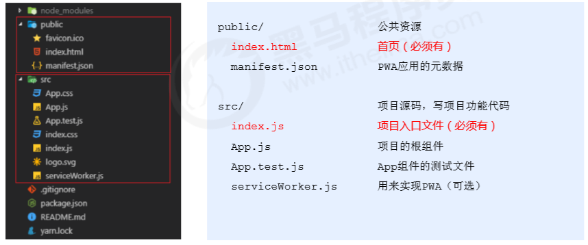

`补充说明` -> npx命令介绍

- npm v5.2.0 引入的一条命令 
- 目的：提升包内提供的命令行工具的使用体验 
-  原来：先安装脚手架包，再使用这个包中提供的命令 
- 现在：无需安装脚手架包，就可以直接使用这个包提供的命令 

#### 3.3 在脚手架中使用React

1. 导入 react 和 react-dom 两个包。 

   ```js
   import React from 'react' 
   import ReactDOM from 'react-dom' 
   ```

2. 调用 React.createElement() 方法创建 react 元素。

3. 调用 ReactDOM.render() 方法渲染 react 元素到页面中。 

### 小结

1. React是构建用户界面的JavaScript库 
2. 使用 react 时，推荐使用脚手架方式。 
3. 初始化项目命令：npx create-react-app my-app 。 
4. 启动项目命令：npm start。 
5. React.createElement() 方法用于创建 react 元素（知道）。 
6. ReactDOM.render() 方法负责渲染 react 元素到页面中。 


---


## JSX基本用法 

### JSX基本使用

#### 1.1 createElement()的问题

1. 繁琐不简洁。 
2. 不直观，无法一眼看出所描述的结构。 
3. 不优雅，用户体验不爽。 

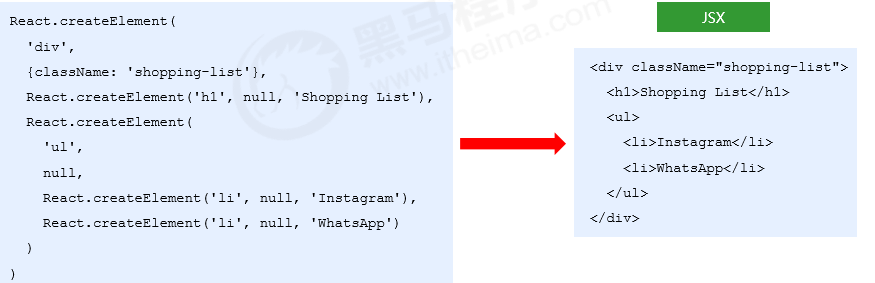

#### 1.2 JSX简介

- JSX 是 JavaScript XML 的简写，表示在 JavaScript 代码中写 XML（HTML） 格式的代码。 
- 优势：声明式语法更加直观、与HTML结构相同，降低了学习成本、提升开发效率 
- JSX 是 React 的核心内容。 

#### 1.3 JSX使用步骤

1. 使用 JSX 语法创建 react 元素 

   ```jsx
   // 使用 JSX 语法，创建 react 元素： 
   const title = <h1>Hello JSX</h1> 
   ```

2. 使用 ReactDOM.render() 方法渲染 react 元素到页面中 

  ```jsx
  // 渲染创建好的React元素 
  ReactDOM.render(title, root) 
  ```

#### 1.4 在脚手架中使用JSX

1. JSX 不是标准的 ECMAScript 语法，它是 ECMAScript 的语法扩展。 
2. 需要使用 babel 编译处理后，才能在浏览器环境中使用。 
3. create-react-app 脚手架中已经默认有该配置，无需手动配置。 

`补充`: **JSX是React.createElement方法的语法糖**

#### 1.5 使用注意

1. React元素的属性名使用小驼峰命名法

2. 特殊属性名：class -> className、for -> htmlFor、tabindex -> tabIndex 。 

3. 没有子节点的React元素可以用 /> 结束 。 

4. 推荐：使用小括号包裹 JSX ，从而避免 JS 中的自动插入分号陷阱。 

   ```jsx
   // 使用小括号包裹 JSX 
   const dv = ( 
     <div>Helo JSX</div> 
   ) 
   ```

   

### JSX中使用JS表达式

#### 2.1 嵌入 JS 表达式 

-  数据存储在JS中 

- 语法：{ JavaScript表达式 }  

- 注意：语法中是单大括号，不是双大括号！ 

  ```jsx
  const name = 'Jack' 
  const div = ( 
    <div>你好，我叫：{name}</div> 
  ) 
  ```

#### 2.2 使用注意

- 单大括号中可以使用任意的 JavaScript 表达式 （值，变量，函数调用，三元运算符，数组）
-  JSX 自身也是 JS 表达式 
-  注意：不能在{}中出现语句和对象（比如：if/for，{a:100} 等） 

 

### JSX条件渲染

#### 3.1 语法

- 场景：loading效果 
- 条件渲染：根据条件渲染特定的 JSX 结构 
-  可以使用if/else或三元运算符来实现 

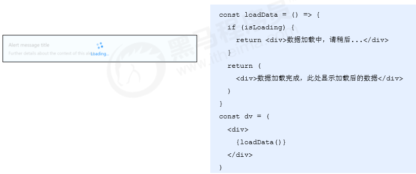


### JSX列表渲染

#### 4.1 语法

-  如果要渲染一组数据，应该使用数组的 map() 方法 

  ```jsx
  const songs = [ 
    {id: 1, name: '野狼disco'}, 
    {id: 2, name: '像我这样的人'}, 
    {id: 3, name: '桥边姑娘'}, 
  ] 
  const list = ( 
    <ul> 
      {songs.map(item => <li>{item.name}</li>)} 
    </ul> 
  ) 
  ```

#### 4.2 注意

- 如果要渲染一组数据，应该使用数组的 map() 方法 

- 注意：渲染列表时应该添加 key 属性，key 属性的值要保证唯一 

- 原则：map() 遍历谁，就给谁添加 key 属性 

- 注意：尽量避免使用索引号作为 key !

  ```jsx
  const songs = [ 
    {id: 1, name: '野狼disco'}, 
    {id: 2, name: '像我这样的人'}, 
    {id: 3, name: '桥边姑娘'}, 
  ] 
  const list = ( 
    <ul> 
      {songs.map(item => <li key={item.id}>{item.name}</li>)} 
    </ul> 
  ) 
  ```

  

### JSX样式处理

#### 5.1 行内样式-style

```jsx
<h1 style={{ color: 'red', backgroundColor: '#eee' }}> 
  JSX的样式处理 
</h1> 
```


#### 5.2 类名-className

```jsx
<h1 className="title"> 
 JSX的样式处理 
</h1> 
```

### 小结

1. JSX 是React 的核心内容。 
2. JSX 表示在JS代码中写HTML结构，是React声明式的体现。 
3. 使用 JSX 配合嵌入的 JS 表达式、条件渲染、列表渲染，可以描述任意 UI 
  结构。 
4. 推荐使用 className 的方式给JSX添加样式。 
5. React 完全利用 JS 语言自身的能力来编写UI，而不是造轮子增强 HTML 功
  能。 


---


## 组件用法

### React 组件介绍 

> vue组件特点？

#### 1.1 react组件的特点

- 组件是 React 的一等公民，**使用 React 就是在用组件** 

- 组件表示页面中的部分功能 

- 组合多个组件实现完整的页面功能 

- 特点：可复用、独立、可组合 

  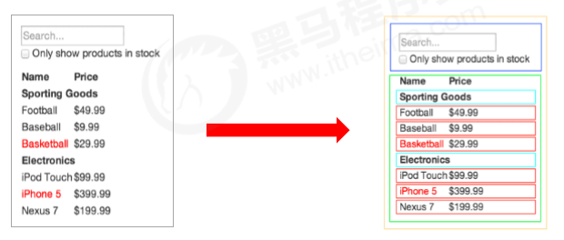

### React 组件的创建

#### 2.1 使用函数创建组件

##### 语法

- 函数组件：使用 JS 的函数（或箭头函数）创建的组件 
  - 函数体内要返回元素
- 渲染函数组件：用函数名作为组件标签名 

示例：

```jsx
function Hello() { 
  return ( 
    <div>这是我的第一个函数组件！</div> 
  ) 
} 
ReactDOM.render(<Hello />, root) 
```

##### 注意事项

1. 函数名称必须以大写字母开头，使用大驼峰命名法
2. 函数组件必须有返回值，表示该组件的结构 
3. 组件标签可以单闭合


#### 2.2 使用class创建组件

##### 语法

- 类组件：使用 ES6 的 class关键字 创建的组件 
- 类组件应该继承 React.Component 父类，从而可以使用父类中提供的方法和属性  

##### 注意事项

- 类名称也必须以大写字母开头，使用大驼峰命名法  
- 类组件必须提供 render() 方法 
- render() 方法必须有返回值，表示该组件的结构 

```jsx
class Hello extends React.Component { 
  render() { 
    return <div>Hello Class Component!</div> 
  } 
} 
ReactDOM.render(<Hello />, root) 
```


#### 2.3 将组件抽离为js文件

- 思考：项目中的组件多了之后，该如何组织这些组件呢？  
- 选择一：将所有组件放在同一个JS文件中 
- 选择二：将每个组件放到单独的JS文件中 
- 组件作为一个独立的个体，一般都会放到一个单独的 JS 文件中 

##### 步骤

1. 创建Hello.js 
2. 在 Hello.js 中导入React 
3. 创建组件（函数 或 类） 
4. 在 Hello.js 中导出该组件 
5. 在 index.js 中导入 Hello 组件 
6. 渲染组件 

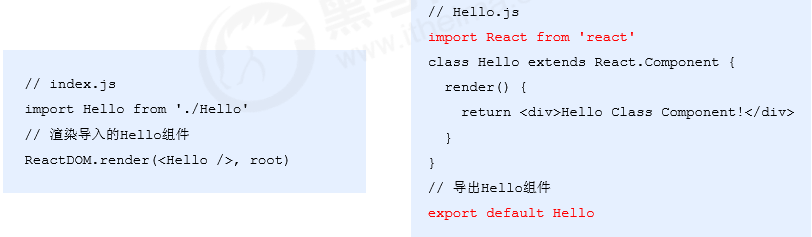


注意：

1. 首先引入React核心包
2. 创建组件
3. 导出组件 

### React 事件处理 

#### 3.1 事件绑定

- React 事件绑定语法与 DOM 事件语法相似 
- 语法：on+事件名称={事件处理程序}，比如：onClick={() => {}} 
-  注意：React 事件采用小驼峰命名法，比如：onMouseEnter、onFocus 
- 在组件中绑定事件： 

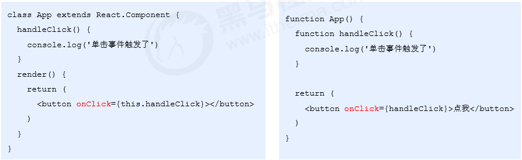

#### 3.2 事件对象

- 可以通过事件处理程序的默认参数获取到事件对象 
- React 中的事件对象叫做：合成事件（对象） 
- 合成事件：兼容所有浏览器，无需担心跨浏览器兼容性问题 

> 怎么传递实参给事件处理函数？

 ```jsx
function handleClick(e) { 
  e.preventDefault() 
  console.log('事件对象', e) 
} 
<a href="http://www.baidu.com" onClick={handleClick}>点我，不会跳转页面</a> 
 ```


#### 3.3 事件绑定 this 指向 

##### 利用bind修改this指向组件实例

```jsx
// Function.prototype.bind() 
class Hello extends React.Component {
  num = 0;
  addNum() {
    this.num += 1;
    alert(this.num)
  }
  render() {
    return (
      <div>
        <h1 onClick={this.addNum.bind(this)}>数字加一</h1>
      </div>
    )
  }
}
```

##### 利用箭头函数方法(推荐)

- 利用箭头函数定义方法 
- 注意：该语法是实验性语法，但是，由于babel的存在可以直接使用 

```jsx
class Hello extends React.Component {
  num = 0;
  addNum = () => {
    this.num += 1;
    alert(this.num)
  }
  render() {
    return (
      <div>
        <h1 onClick={this.addNum}>数字加一</h1>
      </div>
    )
  }
}
```

### 有状态组件和无状态组件 

Vue =》 script {data(){reutn {key:val}}}

* 函数组件->无状态组件

* 类组件class->有状态组件

#### 4.1 有状态组件和无状态组件的区别

- 函数组件又叫做无状态组件，类组件又叫做有状态组件 
- 状态（state）即数据，某个时刻的值  
- 类组件有自己的状态，负责更新 UI，让页面“动” 起来 
- 函数组件没有自己的状态，只负责数据展示（静）
- 比如计数器案例中，点击按钮让数值加 1 。0 和 1 就是不同时刻的状态，而由 0 变为 1 就表示状态发生了变 化。状态变化后，UI 也要相应的更新。React 中想要实现该功能，就要使用有状态组件来完成。 

### 类组件中的 state 和 setState() 

#### 5.1 state的基本使用 

> Vue 组件中data

- 状态（state）即数据，是组件内部的私有数据，只能在组件内部使用 
- state 的值是对象，表示一个组件中可以有多个数据 

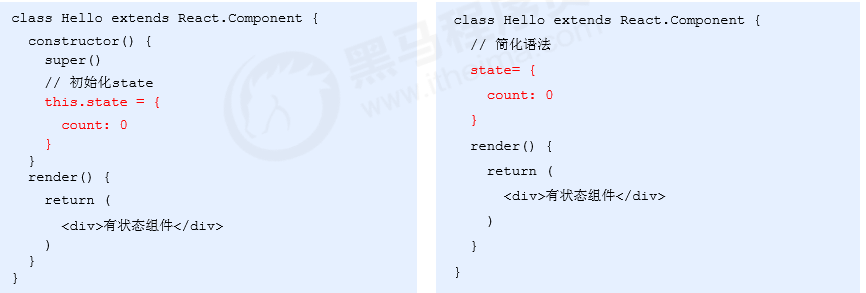

- 获取状态：this.state 

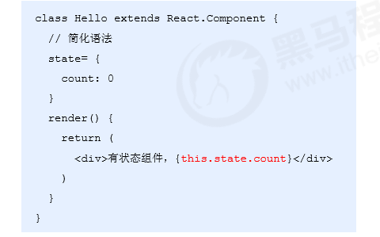


#### 5.2 setState()修改状态 

- 状态是可变的 
  - 语法：this.setState({ key:val, key2:val2 }) 
- 注意：不要直接修改 state 中的值，这是错误的！！！ ->this.state.num=2这样写不可以!
-  setState() 作用：
  - 修改 state 
  - 更新UI 
- 思想：数据驱动视图 

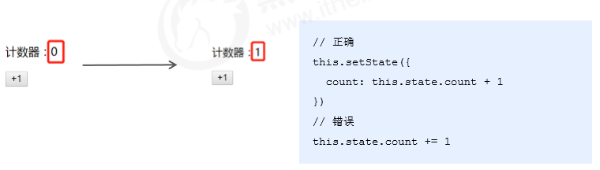

### 表单处理 

#### 6.1 受控组件

##### 定义

- HTML 中的表单元素是可输入的，也就是有自己的可变状态 
-  而React 中可变状态通常保存在 state 中，并且只能通过 setState() 方法来修改 
- React将 state 与表单元素值value绑定到一起，由 state 的值来控制表单元素的值 
- 受控组件：其值受到 React 控制的表单元素 

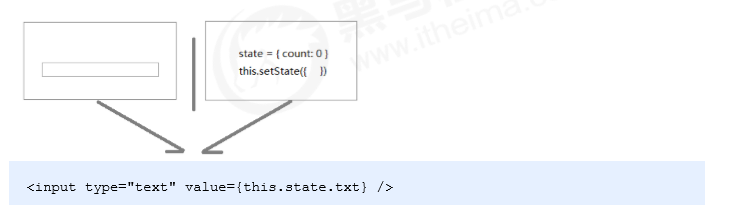

##### 步骤

1. 给表单元素value绑定state状态
3.  在 change 事件处理程序中来修改对应的state 

示例：

```js
class Hello extends React.Component {
  constructor() {
    super();
    // 初始化状态
    this.state = {
      val: 'me'
    }
  }
  changeVal = (e) => {
    // 改变状态
    this.setState({
      val: e.target.value
    })
  }
  render() {

    return (
      <div>
      	// 绑定state状态,注册change事件
        <input type="text" value={this.state.val} onChange={this.changeVal} />
      </div>
    )
  }
}

```


#### 6.2 非受控组件

##### 定义

- 说明：借助于 ref，使用原生 DOM 方式来获取表单元素值 
- ref 的作用：获取 DOM 或组件实例 

##### 步骤

1. 调用 React.createRef() 方法创建一个 ref 对象 

   ```jsx
   constructor() { 
       super() 
       this.txtRef = React.createRef() 
   } 
   ```

2. 将创建好的 ref 对象添加到文本框中 

  ```jsx
  <input type="text" ref={this.txtRef} /> 
  ```

3. 通过 ref 对象获取到文本框的值 

  ```jsx
  console.log(this.txtRef.current.value) 
  ```

##### 注意

- 不能在函数**组件上**使用ref，因为它没有实例。

- 不要过度使用Refs。

适合使用场景：

1. 操作DOM元素
2. 控制元素焦点或媒体播放

### 小结

1. 组件的两种创建方式：函数组件和类组件 
2. 无状态（函数）组件，负责静态结构展示 
3. 有状态（类）组件，负责更新 UI ，让页面动起来 
4. 绑定事件注意 this 指向问题 
5. 推荐使用**受控组件**来处理表单 -> **受控的input**->1. value为state数据2.onChange={修改state}
6. 完全利用 JS 语言的能力创建组件，这是 React 的思想 

## 组建通讯和封装 

### 组件通讯介绍 

#### 1.1 什么是组件通讯

组件是独立且封闭的单元，默认情况下，只能使用组件自己的数据。在组件化过程中，我们将一个完整的功能 拆分成多个组件，以更好的完成整个应用的功能。而在这个过程中，多个组件之间不可避免的要共享某些数据 。为了实现这些功能，就需要打破组件的独立封闭性，让其与外界沟通。这个过程就是组件通讯。 


### 组件的 props 

#### 2.1 props的介绍

- 组件是封闭的，要接收外部数据应该通过 props 来实现  
- props的作用：接收传递给组件的数据 
- 传递数据：给组件标签添加属性  
- 接收数据：函数组件通过参数props接收数据，类组件通过 this.props 接收数据 

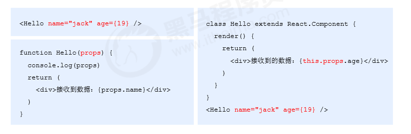

#### 2.2 props特点

1. 可以给组件传递任意类型的数据 
2. props 是只读的对象，只能读取属性的值，无法修改对象 
3. 注意：使用类组件时，如果写了构造函数，应该将 props 传递给 super()，否则，无法在构造函数中获取到 props！ 

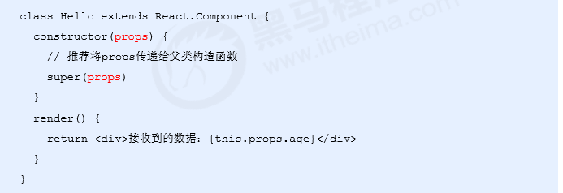

### 组件通讯的三种方式 

#### 3.1 父组件传递数据给子组件 

1. 父组件提供要传递的state数据 
2. 给子组件标签添加属性，值为 state 中的数据 
3. 子组件中通过 props 接收父组件中传递的数据 

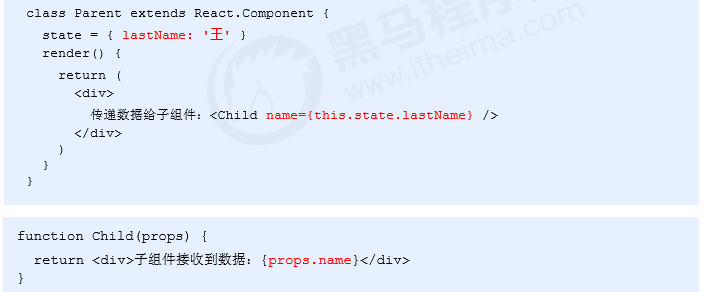

#### 3.2 子组件传递数据给父组件 

思路：利用回调函数，父组件提供回调，子组件调用，将要传递的数据作为回调函数的参数。 

1. 父组件提供一个回调函数（用于接收数据）
2. 将该函数作为属性的值，传递给子组件 
3. 子组件通过 props 调用回调函数 
4. 将子组件的数据作为参数传递给回调函数 

`父组件`

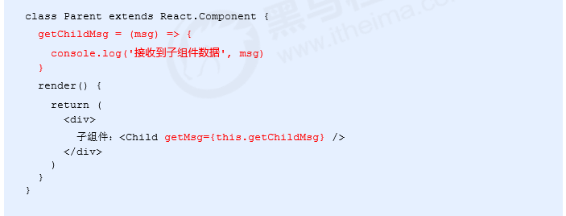

`子组件`

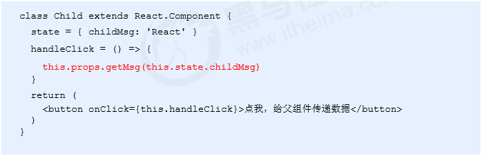

#### 3.3 兄弟组件 

- 将共享状态提升到最近的公共父组件中，由公共父组件管理这个状态 
- 思想：**状态提升**  : 父->子A和子B-> 把A和B共同的state放到父组件中维护
- 公共父组件职责：1. 提供共享状态 2. 提供操作共享状态的方法 
- 要通讯的子组件只需通过 props 接收状态或操作状态的方法 

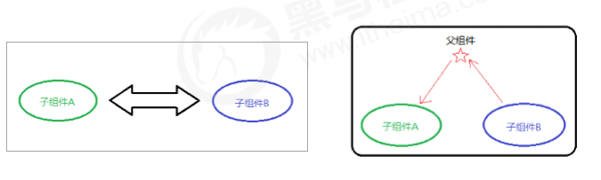

### Context 

#### 4.1 为什么要使用Context

思考：App 组件要传递数据给 Child 组件，该如何处理？ 

- 更好的姿势：使用 Context 
- 作用：Context 提供了一个无需为每层组件手动添加 props，就能在组件树间进行数据传递的方法。 


#### 4.2 步骤

1. 调用 React. createContext() 创建 Provider（提供数据） 和 Consumer（消费数据） 两个组件。 

  ```jsx
  const { Provider, Consumer } = React.createContext() 
  ```

2. 使用 Provider 组件作为父节点。 

  ```jsx
  <Provider> 
    <div className="App"> 
      <Child1 /> 
    </div> 
  </Provider> 
  ```

3. 设置 value 属性，表示要传递的数据。 

   ```jsx
   <Provider value="pink">
   ```

4.  调用 Consumer 组件接收数据

   ```jsx
   <Consumer>{data => <span>data参数表示接收到的数据：{data}</span>}</Consumer> 
   ```

#### 4.3 Context注意

1. 如果两个组件是远方亲戚（比如，嵌套多层）可以使用Context实现组件通讯 
2. Context提供了两个组件：Provider 和 Consumer 
3. Provider组件：用来提供数据 
4. Consumer组件：用来消费数据 

### props 深入 

#### 5.1 children属性

- children 属性：表示组件标签的子节点。当组件标签有子节点时，props 就会有该属性 
- children 属性与普通的props一样，值可以是任意值（文本、React元素、组件，甚至是函数） 

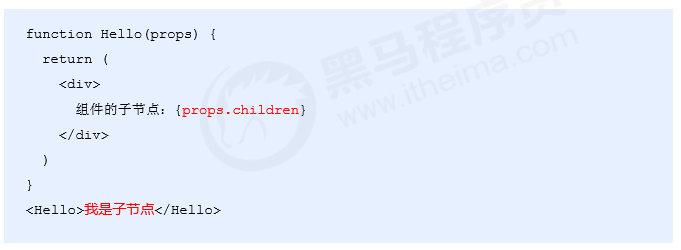

#### 5.2 props校验

- 对于组件来说，props 是外来的，无法保证组件使用者传入什么格式的数据 
- 如果传入的数据格式不对，可能会导致组件内部报错 
- 关键问题：组件的使用者不知道明确的错误原因 

```jsx
// 小明创建的组件Colors 
function Colors(props) { 
  const arr = props.colors 
  const lis = arr.map((item, index) => <li key={index}>{item.name}</li>) 
  return (<ul>{lis}</ul>) 
} 
 
// 小红使用组件Colors<Colors colors={19} /> 
```

- props 校验：允许在创建组件的时候，就指定 props 的类型、格式等 
- 作用：捕获使用组件时因为props导致的错误，给出明确的错误提示，增加组件的健壮性 

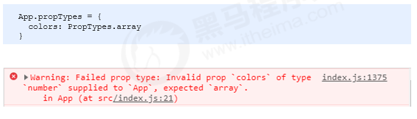

`步骤`

1. 安装包 prop-types （yarn add prop-types / npm i props-types）
2.  导入 prop-types 包 
3. 使用组件名.propTypes = {} 来给组件的props添加校验类型
4. 校验类型通过 PropTypes 对象来指定 

```jsx
import PropTypes from 'prop-types'; 
function App(props) { 
  return (<h1>Hi, {props.colors}</h1>)
} 
// 类型定义
App.propTypes = {   
  // 约定colors属性为array类型   
  // 如果类型不对，则报出明确错误，便于分析错误原因   
  colors: PropTypes.array 
} 

```

`注意`

1. 常见类型：array、bool、func、number、object、string 
2. React元素类型：element 
3. 必填项：isRequired 
4. 特定结构的对象：shape({  })  

```jsx
// 常见类型 
optionalFunc: PropTypes.func, 
// 必选 
requiredFunc: PropTypes.func.isRequired, 
// 特定结构的对象 
optionalObjectWithShape: PropTypes.shape({ 
  color: PropTypes.string, 
  fontSize: PropTypes.number  
}) 

```

#### 5.3 props默认值

- 场景：分页组件 ->  每页显示条数 
- 作用：给 props 设置默认值，在未传入 props 时生效 

```jsx
function App(props) { 
  return ( 
    <div> 
      此处展示props的默认值：{props.pageSize} 
    </div> 
  ) 
} 
// 设置默认值 
App.defaultProps = { 
  pageSize: 10 
} 
// 不传入pageSize属性 <App /> 

```


### 组件的生命周期 

#### 6.1 概述

- 意义：组件的生命周期有助于理解组件的运行方式、完成更复杂的组件功能、分析组件错误原因等 
- 组件的生命周期：组件从被创建到挂载到页面中运行，再到组件不用时卸载的过程 
- 生命周期的每个阶段总是伴随着一些方法调用，这些方法就是生命周期的钩子函数。 
- 钩子函数的作用：为开发人员在不同阶段操作组件提供了时机。 
- 只有 **类组件** 才有生命周期。 

#### 6.2 三个阶段

1. 每个阶段的执行时机 
2. 每个阶段钩子函数的执行顺序 
3. 每个阶段钩子函数的作用 


##### 创建时(挂载阶段)

- 执行时机:组件创建时(页面加载时)
- 执行顺序

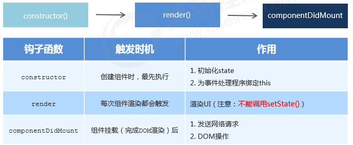

##### 更新时(更新阶段)

- 执行时机：**1. setState()  2. forceUpdate()  3. 组件接收到新的props**  
- 说明：以上三者任意一种变化，组件就会重新渲染 
- 执行顺序： 

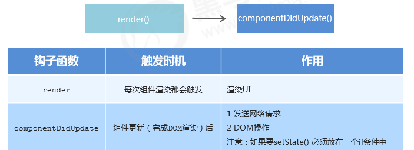

##### 卸载时

- 执行时机：组件从页面中消失 

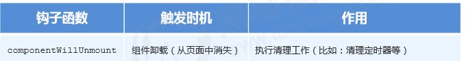

### 组件封装

#### 7.1 组件复用概述

- 思考：如果两个组件中的部分功能相似或相同，该如何处理？ 
- 处理方式：**复用相似**的功能 
- 复用什么？1.  state  2.  操作state的方法 （组件状态逻辑 ） 
- 两种方式：1.  **render props模式**  2.  **高阶组件（HOC）**  
- 注意：这两种方式不是新的API，而是利用React自身特点的编码技巧，演化而成的固定模式（写法） 

#### 7.2 render props模式

> 复用的是组件的状态和功能，传入的是UI要呈现的效果。

- 思路：将要复用的state和操作state的方法封装到一个组件中 
- 问题1：如何渲染任意的UI？  
- 使用该函数的返回值作为要渲染的UI内容（需要组件内部调用渲染）
- 问题2：如何拿到该组件中复用的state？  
- 组件内部调用渲染方法的时候传入实参  

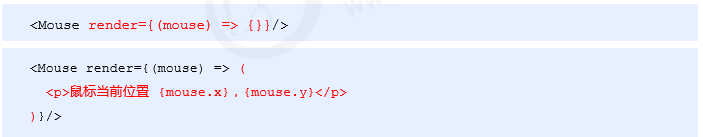

`步骤`

1. 创建Mouse组件，在组件中提供复用的状态逻辑代码（1. 状态  2. 操作状态的方法） 
2. 将要复用的状态作为 props.render(state) 方法的参数，暴露到组件外部 
3. 使用 props.render() 的返回值作为要渲染的内容 

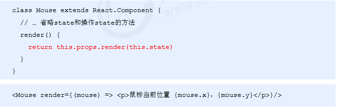

 

#### 7.3 高阶组件

> 高阶函数(形式上):如果一个**函数**的形参或者返回值也是**函数**

* 高阶组件本质上就是高阶函数。

高阶组件：**参数为组件**，返回值为**新组件的函数。**

示例：

```js
// 定义高阶组件方法
const Hoc(WrappedComponent){
    return class extends React.Component{
    		state = {
          a:0
        }	
   
        add=()=> {
          this.setState({
            a: ++this.state.a
          })
        }
      
        render(){
            return (
              <div>
                // 参数是组件
                <WrappedComponent a={this.state.a} fn={this.add} />    
              </div>
            )
        }
    }
}
```

 

`概述`

- 目的：实现状态逻辑复用 
- 采用 包装（装饰）模式 ，比如说：手机壳 
- 手机：获取保护功能 
- 手机壳 ：提供保护功能 
- 高阶组件就相当于手机壳，通过包装组件，增强组件功能 

`分析`

- 高阶组件（HOC，Higher-Order Component）**是一个函数**，接收要包装的组件，返回增强后的组件 
- 高阶组件内部创建一个类组件，在这个类组件中提供复用的状态逻辑代码，通过props将复用的状态传递给被包装组件 WrappedComponent 

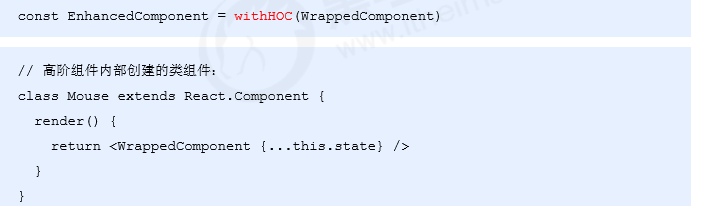

`步骤`

1. 创建一个函数，名称约定以 with 开头 
2. 指定函数参数，参数应该以大写字母开头（作为要渲染的组件）
3. 在函数内部创建一个类组件，提供复用的状态逻辑代码，并返回 
4. 在该组件中，渲染参数组件，同时将状态通过prop传递给参数组件
5. 调用该高阶组件，传入要增强的组件，通过返回值拿到增强后的组件,并将其渲染到页面中 

```jsx
function withMouse(WrappedComponent) { 
  class MouseHoc extends React.Component {
    state = {
      x:0,
      y:0
    }
    
    render() {
      // Mouse组件的render方法
      return <WrappedComponent {...this.state} /> 
    }
  } 
  return Mouse 
} 

// 创建组件 
const MousePosition = withMouse(Position) 
 
// 渲染组件 
<MousePosition /> 
```

`传递props	`

- 问题：props丢失 
- 原因：高阶组件没有往下传递props 
- 解决方式：渲染 WrappedComponent 时，将 state 和 this.props 一起传递给组件  
- 传递方式： 

```jsx
<WrappedComponent {...this.state} {...this.props} />
```

### 小结

1. 组件通讯是构建 React 应用必不可少的一环。 

2. props 的灵活性让组件更加强大。 
3. 状态提升是React组件的常用模式。 
4. 组件生命周期有助于理解组件的运行过程。 
5. 钩子函数让开发者可以在特定的时机执行某些功能。 
6. render props模式和高阶组件都可以实现组件状态逻辑复用。 

---


## 路由

### React路由

#### 1.1 介绍

现代的前端应用大多都是 SPA（单页应用程序），也就是只有一个 HTML 页面的应用程序。因为它的用户体 验更好、对服务器的压力更小，所以更受欢迎。为了有效的使用单个页面来管理原来多页面的功能，前端路由 应运而生。 

- 前端路由的功能：让用户从一个视图（页面）导航到另一个视图（页面） 
- 前端路由是一套映射规则，在React中，是 URL路径 与 组件 的对应关系 
- 使用React路由简单来说，就是配置 路径和组件（配对） 

#### 1.2 安装

> vue-router

> [react-router-dom](https://react-router.docschina.org)(路由5版本的包名) 

```bash
$ npm i react-router-dom 
```


### 路由的基本使用 

#### 2.1 三种基础组件

##### 1. 路由组件（router components）

​	每个 React Router 应用程序的核心是一个 router 组件。对于 Web 项目，react-router-dom 提供了`<BrowserRouter>`(**推荐**)和`<HashRouter>`两种路由组件。

示例：

```jsx
import { BrowserRouter } from "react-router-dom";
ReactDOM.render(
  <BrowserRouter>
    <App />
  </BrowserRouter>,
	document.getElementById('root')
);
```


##### 2. 路由匹配组件（route matching components）

​	有两个路由匹配组件： `<Route>` 和 `<Switch>`。

* 通过`<Route>`组件的path属性匹配当前地址，当匹配成功时就渲染component属性指定的组件。

```jsx 
import { Route, Switch } from "react-router-dom";

...
// 当前路径是'/about'
<Route path='/about' component={About}/> // renders <About/>
<Route path='/contact' component={Contact}/> // renders null
<Route component={Always}/> // renders <Always/>
```

* 可选组件`<Switch>`会遍历其所有的子 `<Route>` 元素，并仅渲染与当前地址匹配的第一个元素，例如可以实现没有匹配到路由显示一个404的组件。

```jsx
import { Route, Switch } from "react-router-dom";

// 当前路径是'/about'
<Switch>
  <Route exact path="/" component={Home} />
  <Route path="/about" component={About} />
  <Route path="/contact" component={Contact} />
  {/* 当什么都没匹配到，<NoMatch> 组件将会渲染 */}
  <Route component={NoMatch} />
</Switch>
```


##### 3. 导航组件（navigation components）

有两个主要的导航组件：`<Link>` 和`<NavLink>` 。

* React Router 提供了一个 `<Link>` 组件来在你的应用程序中创建链接，渲染后为html的`<a>`标签。	

示例：

```jsx
<Link to="/">Home</Link>
```

* 其中`<NavLink>` 是一种特殊类型的`<Link>`， 当它的 `to` 属性与当前地址匹配时，可以自动为其添加`active`的状态。

```jsx
// 当路径是 '/react '时
<NavLink to="/react" activeClassName="active">
  React
</NavLink>
```


#### 2.2 基本使用步骤

1. 安装：npm i react-router-dom 

2. 导入路由的三个核心组件：Router / Route / Link 

   ```jsx
   import { BrowserRouter as Router, Route, Link } from 'react-router-dom' 
   ```

3. 使用 Router 组件包裹整个应用（重要） 

   ```jsx
   <Router>
     <nav className="menu">
   		// ... 			
     </nav>
     <div className="app">
   		// ...路由配置
     </div>
   </Router>
    
   ```

4. 使用 Link 组件作为导航菜单（路由入口） 

   ```jsx
   <Link to="/home">首页</Link> 
   ```

5. 使用 Route 组件配置路由规则和要展示的组件（路由出口） 

   ```jsx
   // 首页组件
   class Home extends Component {
     render() {
       return (
         <div>
           <h1>首页</h1>
         </div>
       );
     }
   }
   
   ...
   // 路由配置和导航
   <Router>
     <nav className="menu">
       <Link to="/home">home</Link>
     </nav>
     <div className="app">
       <Route path="/home" component={Home} />
     </div>
   </Router>
   
   ```

**使用注意**：

- Router 组件：包裹整个应用，一个 React 应用只需要使用一次 


* Route、Link组件：必须在Router 组件内部


### 动态路由和404页面配置

* 动态路由在Route组件的path属性中以：`{/url/:parameter}`

示例：

```jsx
{/* 动态组件配置 */}
<Route path="/about/:id" component={About} />
```

* 使用Switch组件配置404页面


###  默认路由 

- 问题：现在的路由都是点击导航菜单后展示的，如何在进入页面的时候就展示呢？  
- 默认路由：表示进入页面时就会匹配的路由 
- 默认路由path为：/ 

```jsx
<Route path="/" exact component={Home} /> 
```

注意：使用exact属性开启路由的精确匹配模式


### 编程式导航 

> 场景：点击登录按钮，登录成功后，通过代码跳转到后台首页，如何实现？  

编程式导航：通过 JS 代码来实现页面跳转。

1. 通过组件的props的**history属性**获取：

- push(path)：跳转到某个页面，参数 path 表示要跳转的路径 
- go(n)： 前进或后退到某个页面，参数 n 表示前进或后退页面数量（比如：-1 表示后退到上一页） 

示例：

```jsx
class Login extends Component { 
  handleLogin = () => { 
    // ... 
    this.props.history.push('/home') 
  } 
  render() {...省略其他代码} 
} 
```

2. 动态路由的参数获取：

通过组件的props的**match属性**获取：

match.params：获取动态路由的参数值

语法：

```js
// ...
this.props.match
```


### 匹配模式

- 问题：当 Link组件的 to 属性值为 “/first”时，为什么 默认路由 也被匹配成功？ 
- 默认情况下，React 路由是模糊匹配模式 
- 模糊匹配规则：只要 pathname 以 path 开头就会匹配成功 

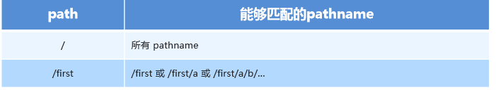

- 问题：默认路由任何情况下都会展示，如何避免这种问题？ 
- 给 Route 组件添加 exact 属性，让其变为精确匹配模式 
- 精确匹配：只有当 path 和 pathname 完全匹配时才会展示该路由 

```jsx
// 此时，该组件只能匹配 pathname=“/” 这一种情况 
// 推荐：给默认路由添加 exact 属性。 
<Route exact path="/" component=... /> 
```


### 路由扩展知识

1. **二级路由**：在匹配到的一级路由组件中使用Link和Route。

示例：

```js
// 路由配置
...
<Route path="/contact" component={Contact} />

// 二级路由页面
const Fna = ()=><div><h3>Contact下a页面</h3></div>

// 一级路由组件
const Contact = () => {
  return (
    <div>
      <h2>黑马程序员</h2>
      <hr />
      <Link to="/contact/a">Contact下a页面</Link>
      <Route path="/contact/a" component={Fna} />
    </div>
  )
}
```


2. **自定义Route**：为了设置访问限制条件，自定义Route。

系统鉴权场景简单示例：

* 自定义Route组件

```js
const Auth = ({ path, component: Component, history }) => {
  console.log('auth：', history);
  let token = sessionStorage.getItem('auth')
  return (
    <Route path={path} render={(props) => {
      console.log('route：', props);
      if (token) {
        return <Component {...props} />
      } else {
        alert('请登录！')
        return <Redirect to="/login" />
      }
    }} />
  )
}
```

* 路由配置

```jsx
{/* <Route path="/" exact component={Home} /> */}
{/* 需要鉴权访问 */}
<Redirect exact from="/" to="/home" />
<Auth path='/home' component={Home} />
```


3. **withRouter**高阶组件：让一个组件的props增加了一些路由属性和方法，history、match、location。

示例：

```js
import { withRouter } from 'react-router-dom'
const 新组件 = withRouter(旧组件)
```


### 小结

1. React 路由可以有效的管理多个视图（组件）实现 SPA 
2. Router组件包裹整个应用，**只需要使用一次** 
3. Link组件是入口，Route组件是出口 
4. 通过 props.history 实现编程式导航 
5. 默认模糊匹配，添加 exact 变精确匹配 
6. React 路由的一切都是组件，可以像思考组件一样思考路由 


## 开发技巧

### 1. setState() 的说明 

#### 1.1 第一个参数

##### 1.1.1 对象语法

```jsx
setState(stateChange[, callback])
```

1. setState() 是**异步**更新数据的 
2. 注意：使用该语法时，后面的 setState() 不要依赖于前面的 setState() ；可以在第二个参数的回调函数中获取更新后的状态
3. 可以多次调用 setState() ，但是react会做批处理和覆盖，且只会触发一次重新渲染 

```jsx
...
state = { count: 0 } 

this.setState({ 
  count: this.state.count + 1 
}) 
// 第二次加一
this.setState({ 
  count: this.state.count + 2 
}) 
console.log(this.state.count) // 0 
```

##### 1.1.2 函数语法

```
setState(updater[, callback])
```

- 推荐：使用 setState((state, props) => {}) 语法，支持异步批量更新 
- 参数state：表示最新的state 
- 参数props：表示最新的props 

```jsx
this.setState((state, props) => { 
  return { 
    count: state.count + 1 
  } 
}) 
```

#### 1.2 第二个参数

- 场景：在状态更新（页面完成重新渲染）后立即执行某个操作 
- 语法： setState(updater[, callback])  

```jsx
this.setState( 
  (state, props) => {}, 
  () => {console.log('这个回调函数会在状态更新后立即执行')} 
) 
```


### 2. JSX 语法的转化过程 

- JSX 仅仅是 createElement() 方法的**语法糖**（简化语法） 
- JSX 语法被 @babel/preset-react 插件编译为 createElement() 方法 
- React 元素：是一个对象，用来描述你希望在屏幕上看到的内容 

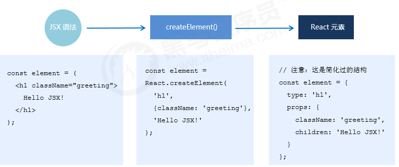

### 3. 组件更新机制 

- setState() 的两个作用： 1. 修改 state 2. 更新组件（UI） 
- 过程：父组件重新渲染时，也会重新渲染子组件。但只会渲染当前组件子树（当前组件及其所有子组件） 


### 4. 组件性能优化 

#### 4.1 轻量state

- 轻量 state：只存储跟组件渲染相关的数据（比如：count / 列表数据 / loading 等） 
- 注意：不用做渲染的数据不要放在 state 中，比如定时器 id等 
- 对于这种需要在多个方法中用到的数据，应该放在 this 中 

```jsx
class Hello extends Component {   
  componentDidMount() {     
    // timerId存储到this中，而不是state中     
    this.timerId = setInterval(() => {}, 2000)   
  }  
  componentWillUnmount() { 
    clearInterval(this.timerId) 
  }   
  render() { … } 
} 
```

#### 4.2 减少不必要的重新渲染

- 组件更新机制：父组件更新会引起子组件也被更新
- 问题：子组件没有任何变化时也会重新渲染 
- 如何避免不必要的重新渲染呢？ 
- 解决方式：使用钩子函数 **shouldComponentUpdate(nextProps, nextState)** 
- 作用：通过返回值决定该组件是否重新渲染，返回 true 表示重新渲染，false 表示不重新渲染 
- 触发时机：更新阶段的钩子函数，组件重新渲染前执行 （shouldComponentUpdate -> render） 

```jsx
class Hello extends Component { 
  // 根据条件，决定是否重新渲染组件
  shouldComponentUpdate(nextProps, nextState) {       
 		return true
    ...
    return false
  } 
  render() {…} 
} 
```

#### 4.3 纯组件

- 纯组件：PureComponent  与 React.Component 功能相似 
- 区别：PureComponent 内部自动实现了 shouldComponentUpdate 钩子，不需要手动比较 
- 原理：纯组件内部通过分别 对比 前后两次 props 和 state 的值，来决定是否重新渲染组件 

```jsx
class Hello extends React.PureComponent {   
  render() { 
    return ( 
      <div>纯组件</div>     
    )   
  } 
} 
```

**注意**

`值类型`

- 对于值类型来说：比较两个值是否相同（直接赋值即可，没有坑） 

```jsx
...
state = {
    count: 0
  }
  updateValue = () => {
    this.setState({
      count: 2
    })
  }
  // PureComponent内部比较
  count !== this.state.count
  // 执行渲染
...  
```

`引用类型` 

- 问题：对于引用类型来说：**只比较对象的引用（地址）是否相同** 

```jsx
...
  state = {
    obj: {
      a: 1,
      b: 2
    }
  }
  updateObj = () => {
    // 错误
    this.state.obj.a = 100;
    // 无法更新视图
    this.setState({
      obj: this.state.obj
    })
  }
...
```

* 解决办法：state 或 props 中属性值为引用类型时，应该创建新数据，不要直接修改原数据！（示例）
  * 说明：纯组件内部的对比是 shallow compare（浅层对比） 
  * 对于引用类型来说：只比较对象的引用（地址）是否相同 

```jsx
...
// 正确！创建新数据 
const newObj = {...state.obj, number: 2} 
setState({ obj: newObj }) 
 
// 正确！创建新数据 
// 不要用数组的push / unshift 等直接修改当前数组的的方法 
// 而应该用 concat 或 slice 等这些返回新数组的方法 
this.setState({ 
  list: [...this.state.list, {新数据}] 
}) 
...
```


### 5. 虚拟 DOM 

- React 更新视图的思想是：**只要 state 变化就重新渲染视图** 
- 问题：组件中只有一个 DOM 元素需要更新时，也得把整个组件的内容重新渲染到页面中？
- 理想状态：部分更新，只更新变化的地方。 
- 问题：React 是如何做到部分更新的？ 

#### 概述

> React.createElement方法创建

- 虚拟 DOM：本质上就是一个 JS 对象，用来描述你希望在屏幕上看到的内容（UI）。 
- 在数据和真实 DOM 之间**建立了一层缓冲区**。

#### 执行过程

1. 初次渲染时，React 会根据初始state（Model）结合jsx元素结构，创建一个虚拟 DOM 对象（树）。 
2. 根据虚拟 DOM 生成真正的 DOM，渲染到页面中。 
3. 当数据**变化后**（setState()），重新根据新的数据，**创建新的虚拟DOM对象**（树）。 
4. 与上一次得到的虚拟 DOM 对象，使用 **Diff 算法** 对比（找不同），得到需要更新的内容。 
5. 最终，React 只将变化的内容更新（**patch**）到 DOM 中，重新渲染到页面。 


### 6. Diff算法说明

#### Diff 算法情况 - 元素类型

- 如果两棵树的根元素类型不同，React 会销毁旧树，创建新树

```jsx
// 旧树
<div>
  <Counter />
</div>

// 新树
<span>
  <Counter />
</span>

执行过程：destory all -> insert new
```

#### Diff 算法情况- 元素属性

- 对于类型相同的 React DOM 元素，React 会对比两者的属性是否相同，只更新不同的属性
- 当处理完这个 DOM 节点，React 就会递归处理子节点。

```jsx
// 旧
<div className="before" title="stuff"></div>
// 新
<div className="after" title="stuff"></div>
只更新：className 属性

// 旧
<div style={{color: 'red', fontWeight: 'bold'}}></div>
// 新
<div style={{color: 'green', fontWeight: 'bold'}}></div>
只更新：color属性
```

#### Diff 算法情况 - 修改元素

##### 索引

- 1 当在子节点的后面添加一个节点，这时候两棵树的转化工作执行的很好

```js
// 旧
<ul>
  <li>first</li>
  <li>second</li>
</ul>

// 新
<ul>
  <li>first</li>
  <li>second</li>
  <li>third</li>
</ul>

执行过程：
React会匹配新旧两个<li>first</li>，匹配两个<li>second</li>，然后添加 <li>third</li> tree
```

- 2 但是如果你在开始位置插入一个元素，那么问题就来了：

```js
// 旧
<ul>
  <li>1</li>
  <li>2</li>
</ul>

// 新
<ul>
  <li>3</li> // 一次  1->3
  <li>1</li> // 一次  2->1
  <li>2</li> // 新增一次
</ul>

执行过程：
React将改变每一个子节点，而非保持 <li>1</li> 和 <li>2</li> 不变
```

##### key 属性

> 为了解决以上问题，React 提供了一个 key 属性。当子节点带有 key 属性，React 会通过 key 来匹配原始树和后来的树。

```js
// 旧
<ul>
  <li key="2015">1</li>
  <li key="2016">2</li>
</ul>

// 新
<ul>
  <li key="2014">3</li>  // 添加
  <li key="2015">1</li>  
  <li key="2016">2</li>  
</ul>

执行过程：
现在 React 知道带有key '2014' 的元素是新的，对于 '2015' 和 '2016' 仅仅移动位置即可
```

- 说明：key 属性在 React 内部使用，但不会传递给你的组件
- 推荐：在遍历数据时，推荐在组件中使用 key 属性：`<li key={item.id}>{item.name}</li>`
- 注意：**key 只需要保持与他的兄弟节点唯一即可，不需要全局唯一**
- 注意：**尽可能的减少数组 index 作为 key，数组中插入元素的等操作时，会使得效率底下**
